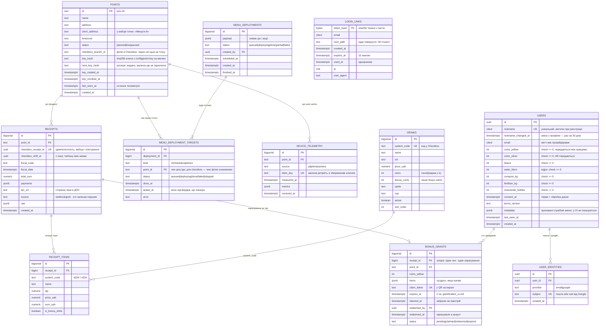
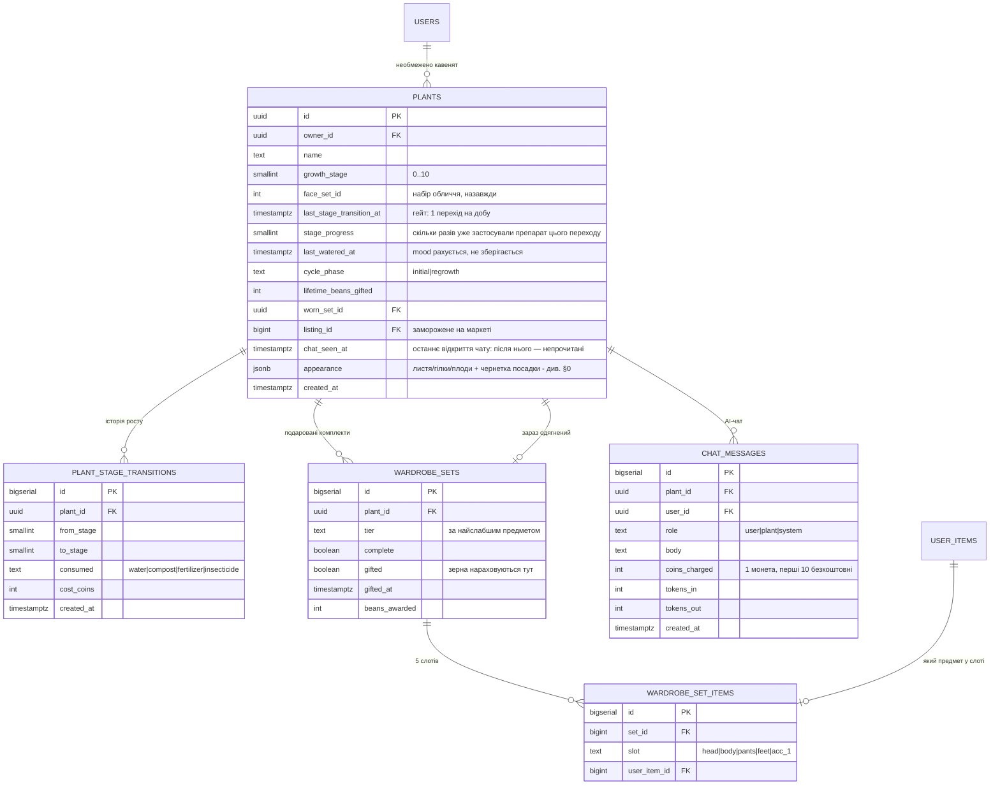

# Схема даних: Postgres і Redis

Стан на 19.09.2026. Це **проєкт схеми**, зведений з усіх чинних доків
(`gamification_economy.md`, `gamification_ui.md`, `bush_graphics_customization.md`,
`admin_panel.md`, `video.md`, `checkbox.md`, `urls.md`). У коді поки нема
жодної таблиці — сервіси стоять заглушками, тому міняти тут дешево, а після
першої міграції на проді вже ні.

Діаграми — mermaid у цьому ж файлі: текст, який рендериться у вектор і
правиться в дифі рядок за рядком. Окремої картинки, яку доведеться
перемальовувати, свідомо немає. Для читання поза редактором цей файл
разом із `services.md` збирається в `docs/data-map.html` — з меню до
окремих таблиць (`bun run docs:map`).

---

## 0. Наскрізні рішення

### Гроші — `numeric(12,2)`, ігрові валюти — `integer`

Гривня ніколи не `float`; монети й зерна цілі за визначенням (економіка
оперує `round(маржа)`, `gamification_economy.md` §7). Checkbox віддає суми
цілими копійками (Еспресо 35 ₴ приходить як `3500`) — ділимо на 100 на
вході в `checkbox`, щоб копійки не розповзлися по схемі.

### Баланси — колонки в `users`, рухи — рядки журналу

Три баланси (`coins_yellow`, `coins_silver`, `beans`) лежать прямо в `users`
з `check (… >= 0)`. Окрема таблиця `wallets` 1:1 до користувача нічого не
давала, крім зайвого join (рішення 17.09.2026).

Там само лежить інвентар догляду — вода у відрі, компост, добриво,
інсектицид (20.09.2026). Це теж баланси: купуються за монети, витрачаються
поштучно й не можуть піти в мінус.

`ledger_entries` — незмінний журнал, де **один рядок — це одна операція з
трьома знаковими дельтами**: `delta_yellow`, `delta_silver`, `delta_beans`.
Обмін зерна на монети — один рядок `delta_beans = -1, delta_yellow = +15`,
а не два, між якими може впасти процес і лишити гравця без зерна й без
монет. Баланс і журнал змінюються в одній транзакції:

```sql
update users set beans = beans - 1, coins_yellow = coins_yellow + 15
 where id = $1 and beans >= 1;             -- 0 рядків = не вистачило, rollback
insert into ledger_entries (user_id, delta_beans, delta_yellow, reason, idem_key)
values ($1, -1, 15, 'exchange', $2);        -- idem_key: повтор запиту не пише вдруге
```

Баланс звіряється з `sum(delta_*)` по журналу; розбіжність — баг, який видно,
а не тихо зіпсовані дані. Адмінка просить «історію транзакцій в справжній та
ігровій валюті» (`admin_panel.md`): ігрова — цей журнал, справжня — чеки
Checkbox і оплати mono pay, на які рядок посилається через `ref_type`/`ref_id`.

### Косметика куща в `jsonb`, економіка в колонках

У `bush_graphics_customization.md` §9 стан кавенятка — великий документ
(листя, гілки, плодові слоти з x/y і `sprite_id`). Він рендериться цілком і
ніколи не питається по полю, тому лежить у `plants.appearance jsonb`. А
стадія росту, лічильники препаратів, таймери й `last_watered_at` — звичайні
колонки: вони гейтять економіку, перевіряються бекендом і потрапляють у
звіти. Саме цю межу найлегше розмити пізніше «за компанію», тому вона
записана явно.

### Форма `plants.appearance` (version 2)

Координати — у сцені зрілого куща 1000×1300 (той самий простір, що й
`frontend/client/public/assets/tree_layout.json`); зростання під стадію клієнт
застосовує на рендері, а не в даних:

```json
{
  "version": 2,
  "leaves_bg": [{ "id": 1, "skin": 3, "x": 512.4, "y": 601.2, "rotation": -12.4, "scale": 1.08, "root": {"x": 500, "y": 590} }],
  "leaves_fg": [ … ],
  "branches":  [{ "id": 1, "skin": 2, "t": 0.31, … }],
  "buds":      [{ "id": 1, "owner": "body|branch:<id>:<крива>", "t": 0.42, … }],
  "draft":     { "kind": "leaves", "phase": "leafBg", "items": { … }, "count": 8 }
}
```

`x/y/rotation/scale` — те, що малює рушій (center-anchored), `root/t/offset` —
авторський запис, з якого воно пораховане (docs/bush_planting_ui.md §2).
`draft` — незавершена посадка: живе тут, поки гравець не натиснув
«Посадити», тому переживає вихід із застосунку й видно з іншого пристрою.
Препарат при цьому не списаний.

### Ідемпотентність на кожному вході ззовні

Вебхуки ПРРО, опитування Checkbox, телеметрія з малини, заливка
відеосегментів — усе має унікальний ключ від джерела: мережа на точці
рветься, і повтор запиту не має подвоювати ні чек, ні бонус.

### Подія пишеться в тій самій транзакції, що й зміна

Між Postgres і Redis — та сама «задача двох генералів»: закомітити чек і
впасти до `PUBLISH` означає бонус, про який кіоск не дізнався. Тому подія
для кіоска чи телефона — рядок в `outbox` (§4) у тій самій транзакції, що й
чек або бонус. Публікатор забирає рядки з `SKIP LOCKED`, шле в Redis і
позначає `published_at`. Упасти між відправкою й позначкою — значить
відправити двічі, тому в кожній події її `outbox.id`, і клієнти відкидають
повтор. Доставка «принаймні раз» + ідемпотентний отримувач — це найближче
до «рівно раз», що взагалі досяжне.

### Точка — текстовий ключ із першого дня

`point_id` відповідає `^[a-z0-9][a-z0-9-]{1,30}$` (`urls.md`). Не uuid: він
їде в URL кіоска й у ключі R2.

---

## 1. Ідентичність і продажі



`BONUS_GRANTS` описує рівно той потік, що в `gamification_ui.md`: на екрані
QR → скан забирає бонус на пристрій (`claimed_at`, з екрана зникає) →
авторизація зараховує в акаунт (`redeemed_at`). Три стани, а не два, бо між
ними користувач може закрити вкладку — і тоді бонус має протухнути за
`expires_at`, а не висіти вічно.

**Змін Checkbox окремою таблицею немає** (прибрано 17.09.2026). Ні адмінка,
ні економіка, ні аналітика не питають нічого «по змінах»: оборот рахується
по чеках за день. `checkbox_shift_id` лишається в чеку як
посилання, щоб знайти зміну в кабінеті Checkbox, якщо колись знадобиться.

**Деплой меню — на всі точки одразу, якщо не вибрано інше.** Статус
тримається на кожній цілі окремо: одна малина офлайн чи портал Jetinno
впав — це `partial`, а не провал усього деплою. На кожну активну точку
створюється ціль `r2` (меню, яке тягне кіоск), ціль `checkbox` (ціна філії
цієї точки через `branches_info`, `checkbox.md`) і, якщо підтвердиться
потреба, `jetinno` на точку (`services.md` §4). `acked_at` ставить сам кіоск, коли
вже показує нові ціни, — «викотили в R2» і «висить на екрані» різні речі.

**Точка і її малина — один рядок** (18.09.2026). Окремої таблиці пристроїв
немає: на точці одна малина, і «пристрій без точки» чи «дві малини на точку»
— стани, яких не буває. Ключ живе у файлі `config/point.key` на малині, у
базі лише його хеш; відкликання — `key_revoked_at`, ротація —
`next_key_hash`, доки малина не підхопила новий (`services.md` §3).

**`users.metadata` — приховані змінні** (18.09.2026). Службове про гравця,
чого він сам не бачить і за чим ніхто не рахує гроші. Перший ключ —
`qr_pos`: ідентифікатор точки з QR-наклейки, через яку людина прийшла
(`qr.extrovert.cafe?p=1` → `{"qr_pos": "1"}`, `urls.md`). Пишеться раз, не
перезаписується. Другий ключ — `dev`: акаунт розробника. Лише такі
акаунти мають право міняти скрипти розробника (`roadmap.md`, крок 0-біс). У jsonb, а не колонкою — за тим самим правилом, що й
косметика куща (§0): по ньому не будують звʼязків і не рахують баланси, а
нові такі змінні не повинні означати міграцію.

**`LOGIN_LINKS` — одноразові посилання для входу поштою** (22.09.2026,
`services.md` §3). Сам токен є лише в листі, у таблиці — його sha256: дамп
не має відкривати чужі акаунти. Звʼязку з `users` немає навмисно: рядок
зʼявляється до того, як ми знаємо, чи є такий гравець, і акаунт за поштою
знаходиться (або заводиться) лише тоді, коли посилання відкрили. Рядок
живе добу — стільки треба для лімітів «лист на хвилину, п'ять на годину»
й розбору скарги «не приходить лист»; прибирає старі сам роут.

---

## 2. Економіка: журнал, крамниця, маркет

```mermaid
erDiagram
    USERS ||--o{ LEDGER_ENTRIES : "кожна операція"
    USERS ||--o{ USER_ITEMS : "склад"
    USERS ||--o{ CRATE_OPENINGS : "відкриття крейтів"
    USERS ||--o{ USER_CRATES : "скриньки на складі"
    USERS ||--o{ PAYMENTS : "оплати гривнями через mono"
    PAYMENTS ||--o| USER_CRATES : "скринька, куплена за гривні"
    USER_CRATES ||--o| CRATE_OPENINGS : "чим відкрилась"
    USERS ||--o{ MARKET_LISTINGS : "продає"
    USERS ||--o{ COIN_TRANSFERS : "переказ жовтих"
    USERS ||--o{ REDEMPTIONS : "доставки Новою Поштою"
    USERS ||--o{ QUIZ_DRINK_RESPONSES : "квіз про напій"
    USERS ||--o| QUIZ_PROFILE_RESPONSES : "анкета, одноразово"
    USERS ||--o{ REPOST_VERIFICATIONS : "репости"
    ITEM_DEFS ||--o{ USER_ITEMS : "каталог"
    USER_ITEMS ||--o| MARKET_LISTINGS : "виставлений предмет"
    MARKET_LISTINGS ||--o| MARKET_TRADES : "угода"
    CRATE_OPENINGS ||--o| USER_ITEMS : "що випало"
    RECEIPT_ITEMS ||--o| QUIZ_DRINK_RESPONSES : "про яке замовлення"
    LEDGER_ENTRIES ||--o| POS_DISCOUNT_CODES : "знижка на POS"
    LEDGER_ENTRIES ||--o| REDEMPTIONS : "списання зерен за доставку"
    REDEMPTIONS ||--o{ REDEMPTION_EVENTS : "історія статусів"
    NP_CITIES ||--o{ NP_WAREHOUSES : "відділення й поштомати"
    NP_WAREHOUSES ||--o{ REDEMPTIONS : "куди везти"

    LEDGER_ENTRIES {
        bigserial id PK
        uuid user_id FK
        int delta_yellow "знакова, 0 якщо не чіпали"
        int delta_silver "знакова"
        int delta_beans "знакова"
        text reason "purchase|quiz|repost|crate|care|chat|transfer|market|exchange|pos_discount|delivery|sapling|admin"
        text ref_type "receipt|crate_opening|market_trade|coin_transfer|redemption|user_crate"
        bigint ref_id
        text idem_key UK "повтор запиту не пише рядок удруге"
        jsonb meta "курс обміну, що саме купили"
        timestamptz created_at
    }
    ITEM_DEFS {
        bigserial id PK
        text code UK
        text name
        text collection "набір із bush_graphics §7.1: групує Склад, на гру не впливає"
        text description_md "опис предмета, markdown; рендерить клієнт"
        text slot "head|body|pants|feet|acc_1"
        text tier "common|uncommon|rare|epic"
        text sprite_id
        int price_coins "пряма покупка, усі тіри: 93/189/425/850 (economy §5.1)"
        bigint season_id "сезонні скіни - лише за грн"
        boolean active
    }
    USER_ITEMS {
        bigserial id PK
        uuid user_id FK
        bigint item_def_id FK
        text acquired_from "crate|drop|shop|market|gift|bonus_drink|admin"
        boolean locked "замкнений у подарованому комплекті"
        bigint set_id FK
        bigint listing_id FK
        timestamptz acquired_at
    }
    CRATE_OPENINGS {
        bigserial id PK
        uuid user_id FK
        text source "coins|cash|bonus_drink|shadow_drop"
        text paid_currency
        numeric paid_amount
        bigint result_item_id FK "завжди є: порожніх крейтів немає"
        int result_coins "5..25, зрізаний нормальний розподіл"
        boolean was_duplicate "такий предмет у гравця вже був"
        text rolled_tier
        timestamptz opened_at
    }
    USER_CRATES {
        bigserial id PK
        uuid user_id FK
        text source "coins|cash|bonus_drink - переходить у crate_openings"
        text paid_currency "yellow|uah"
        numeric paid_amount
        bigint payment_id FK "куплена за гривні: рівно одна на платіж"
        timestamptz acquired_at
        timestamptz opened_at "null - ще на складі"
        bigint opening_id FK
    }
    PAYMENTS {
        bigserial id PK
        uuid user_id FK
        text provider "mono|test"
        text invoice_id UK
        text product "coins|crate"
        text pack_code "набір монет; для скриньки - crate"
        int coins "0 для скриньки"
        numeric amount_uah
        text status "created|processing|success|failure|expired|reversed"
        bigint ledger_entry_id FK
        timestamptz credited_at "нараховано рівно раз"
        jsonb raw
        timestamptz created_at
    }
    MARKET_LISTINGS {
        bigserial id PK
        uuid seller_id FK
        text kind "item|plant"
        bigint user_item_id FK
        uuid plant_id FK
        int price_amount
        text price_currency "yellow|beans"
        numeric commission_pct "10 одяг / до 2 кавенятко"
        text status "active|sold|cancelled"
        int impressions "скільки разів API запропонував лот; з Redis раз на хвилину"
        timestamptz created_at
    }
    MARKET_TRADES {
        bigserial id PK
        bigint listing_id FK
        uuid buyer_id FK
        uuid seller_id FK
        int gross
        int commission "згорає, нікому не йде"
        int net
        text currency
        timestamptz created_at
    }
    COIN_TRANSFERS {
        bigserial id PK
        uuid from_user FK
        uuid to_user FK
        int amount "тільки yellow"
        timestamptz created_at
    }
    REDEMPTIONS {
        bigserial id PK
        uuid user_id FK
        bigint ledger_entry_id FK "списання зерен"
        text product "id з backend/api/data/shop-products.json"
        jsonb options "розмір футболки"
        numeric cost_uah_actual "для 10% ліміту бюджету"
        text recipient_name
        text recipient_phone "без нього НП посилку не видасть"
        text np_warehouse_ref "Ref із довідника"
        text np_warehouse_kind "branch|postomat"
        text np_address_snapshot "довідник міняється, замовлення - ні"
        text np_ttn UK
        text np_status_code "останній код із трекінгу"
        text status "new|printing|packing|shipped|arrived|received|returned|cancelled"
        timestamptz status_changed_at
        timestamptz user_seen_at "лічильник: зміни, яких гравець ще не бачив"
        bigint evidence_event_id FK "доказ з камери"
        timestamptz created_at
    }
    REDEMPTION_EVENTS {
        bigserial id PK
        bigint redemption_id FK
        text status
        text source "admin|np|system"
        text note
        timestamptz created_at
    }
    NP_CITIES {
        text ref PK "Ref із довідника НП"
        text name
        text area
        text settlement_type
        timestamptz synced_at
    }
    NP_WAREHOUSES {
        text ref PK
        text city_ref FK
        int number
        text category "branch|postomat"
        text type_ref "з getWarehouseTypes, не хардкод"
        text description
        text short_address
        int place_max_weight_kg
        jsonb dimension_limits "поштомат: чи влізе товар"
        jsonb schedule
        text status "неробочі не показуємо"
        timestamptz synced_at
    }
    POS_DISCOUNT_CODES {
        bigserial id PK
        bigint ledger_entry_id FK
        uuid user_id FK
        text code UK
        numeric amount_uah
        timestamptz issued_at
        timestamptz used_at
        bigint receipt_id FK
    }
    QUIZ_PROFILE_RESPONSES {
        bigserial id PK
        uuid user_id FK "unique: анкета одноразова"
        jsonb answers
        text free_text "відкрите питання в кінці, може бути порожнім"
        int coins_awarded
        timestamptz created_at
    }
    QUIZ_DRINK_RESPONSES {
        bigserial id PK
        uuid user_id FK
        bigint receipt_item_id FK
        jsonb answers "оцінки складників + чистота"
        text free_text "те саме поле, що в анкеті профіля"
        int coins_awarded
        timestamptz created_at
    }
    REPOST_VERIFICATIONS {
        bigserial id PK
        uuid user_id FK
        text network "з Referer першого переходу, часто null"
        text redirect_token UK "слаг у посиланні extrovert.cafe/r/…"
        timestamptz clicked_at
        timestamptz verified_at "null = посилання видали, перехід ще не зарахував"
        int coins_awarded
        timestamptz created_at
    }
```



Два правила економіки, які **мають жити в схемі, а не лише в коді**:

- `coins_silver` не можна переказати. У `COIN_TRANSFERS` немає колонки
  валюти взагалі — таблиця за визначенням тільки про жовті. Спроба
  переказати срібні тоді не «валідація, яку забули», а неможливий стан.
- Предмет у подарованому комплекті не продається. `USER_ITEMS.locked` +
  часткові індекси: виставити можна лише те, де `locked = false`.

**`redemptions` — лише те, що їде Новою Поштою** (17.09.2026). Раніше таблиця
дублювала журнал: знижка на POS, саджанець, обмін на монети — це просто
рядки `ledger_entries` з відповідним `reason` (для знижки ще й код у
`pos_discount_codes`). Окремий рядок потрібен лише там, де є фізичний світ:
отримувач, відділення, ТТН і статуси, які змінюють адмін і трекінг НП.
`redemption_events` — історія цих статусів: з неї екран «Мої замовлення»
малює стрічку, а `user_seen_at` дає лічильник на кнопці (`gamification_ui.md`).

**Довідник НП — локальна копія, оновлюється щоночі** (`services.md` §4). У
замовлення знімається текстова адреса відділення: довідник живе своїм
життям, а замовлення має показувати, куди насправді відправили.

**Опис кожного предмета одягу — markdown в `item_defs.description_md`**
(19.09.2026). Гравець бачить його в картці предмета (`gamification_ui.md`,
Склад). Прототипи текстів для всіх 75 предметів — у `db/seeds/item_defs.json` (§7). У базі лежить вихідний markdown, а не HTML: рендерить клієнт, без
сирого HTML і картинок, тож бекенду нема чого чистити, а опис лишається
текстом, який видно в дифі. Колонка `not null default ''`, і
`check (not active or description_md <> '')`: предмет без опису можна
завести в каталог, але не пустити в гру.

---

## 3. Кавенятка: ріст, догляд, гардероб



`PLANT_STAGE_TRANSITIONS` виглядає надлишковою поруч із
`plants.last_stage_transition_at`, але саме вона робить перевіряємим
головний гейт економіки — «не більше одного переходу на добу»
(`gamification_economy.md` §3.1) — і дає адмінці історію без реконструкції
з журналу валют. `unique (plant_id, to_stage)` заразом робить подвійний
перехід неможливим, а не лише незручним.

**Крейт завжди дає і предмет, і монети** (20.09.2026). Тому в
`crate_openings` немає `result_type`: `result_item_id` і `result_coins`
заповнені обидва завжди, а `rolled_tier` каже, з якого тіру прийшов
предмет. Монети того ж відкриття йдуть і рядком у `ledger_entries` з
`reason = 'crate'` — баланс і журнал як завжди в одній транзакції (§0).
`was_duplicate` не виводиться з інших таблиць заднім числом (інвентар до
моменту відкриття вже не відновити), а частка дублів — перше, на що
подивишся, коли вирішуватимеш, чи потрібен pity-захист.

**Купівля й відкриття скриньки — два кроки** (22.09.2026). Куплена
скринька, за монети чи за гривні, лягає рядком у `user_crates` і чекає на
Складі («Щасливі скриньки · Відкрити»); рол відбувається лише при
відкритті. Гривнева оплата приходить вебхуком або опитуванням невідомо
коли, тож відкривати «одразу» там і не було б кому, а два різні шляхи для
монет і гривень означали б два різні відчуття від тієї самої скриньки.
Списання монет пишеться в журнал у момент купівлі (`ref_type =
'user_crate'`), монети зі скриньки — при відкритті, як і раніше. Ціна
купівлі переходить у `crate_openings.paid_*`, тож аналітика відкриттів не
змінилась. `payments.product` каже, що купили за гривні: набір монет чи
скриньку.

**Інвентар догляду — у гравця, не в куща** (20.09.2026). Відро з водою,
компост, добриво й інсектицид — колонки `users`. Кавенят у гравця може бути
скільки завгодно, а відро й поличка на головному екрані одні: тримати
лічильники на кущі означало б пʼять відер на пʼять кущів і питання «кому
саме» на кожній купівлі води. На кущі лишається те, що справді його:
`last_watered_at`, з якого рахується настрій, і лічильники стадій. Що саме
витратили на конкретний кущ, видно з `plant_stage_transitions.consumed` —
там же й ціна того переходу.

`WARDROBE_SET_ITEMS` окремою таблицею, а не пʼятьма колонками: слоти
перелічені в доку як 5, але «acc_3» коштуватиме міграції даних, а не
рядка в enum.

---

## 4. Операційка: відео, здоровʼя, адмінка

```mermaid
erDiagram
    POINTS ||--o{ VIDEO_SEGMENTS : "запис"
    VIDEO_SEGMENTS ||--o{ VIDEO_EVENTS : "що знайшов воркер"
    RECEIPTS ||--o| VIDEO_EVENTS : "ймовірний чек події"
    POINTS ||--o{ PROBLEM_REPORTS : "скарги з форми"
    ADMIN_USERS ||--o{ MENU_DEPLOYMENTS : "хто викотив ціни"
    ADMIN_USERS ||--o{ NEWS_BROADCASTS : "розсилка в чат кавенятка"

    VIDEO_SEGMENTS {
        bigserial id PK
        text point_id FK
        text camera_id
        text r2_key UK "ідемпотентність заливки"
        timestamptz started_at
        int duration_ms
        bigint bytes
        text status "pending|processing|done|failed|expired"
        smallint attempts
        timestamptz locked_at "черга через SKIP LOCKED"
        timestamptz processed_at
        text error
    }
    VIDEO_EVENTS {
        bigserial id PK
        text point_id FK
        text kind "approach|queue|idle"
        timestamptz started_at
        timestamptz ended_at
        bigint segment_id FK
        bigint likely_receipt_id FK "ймовірний чек: зведено за часом, не з обличчя"
        jsonb evidence "ключі кадрів і кліпа в R2; null - воркер нічого не зберіг"
        jsonb meta "GIN-індекс"
    }
    HEALTH_SAMPLES {
        bigserial id PK
        text target "service:api|frontend:client|check:webhook|point:kyiv-01"
        timestamptz bucket_start "півгодини, тиждень історії"
        boolean ok
        text detail "тултіп в адмінці"
        int samples
    }
    PROBLEM_REPORTS {
        bigserial id PK
        uuid user_id FK
        text point_id FK
        text categories "масив: кавомашина, монітор, сайт, матеріали, ідея"
        text body
        text image_r2_key
        text status "new|read|closed"
        timestamptz created_at
    }
    NEWS_BROADCASTS {
        bigserial id PK
        uuid created_by FK
        text title
        text body
        text audience
        timestamptz sent_at
    }
    ADMIN_USERS {
        uuid id PK
        citext email UK
        text role "owner|ops"
        text password_hash "scrypt, PHC-рядок; null - входу ще немає"
        timestamptz password_set_at
        timestamptz disabled_at "вимкнений; рядок лишається заради історії"
        timestamptz last_login_at
    }
    OUTBOX {
        bigserial id PK
        text channel "point:kyiv-01|user:uuid"
        text event "sale|bonus.claimed|menu.deployed|order.updated"
        jsonb payload "з outbox.id, щоб клієнт відкинув повтор"
        timestamptz created_at
        timestamptz published_at "null - ще не в Redis"
        smallint attempts
    }
    WEBHOOK_KEYS {
        text provider PK "checkbox"
        text key "секрет підпису, виданий провайдером"
        text url "куди провайдер шле вебхук"
        timestamptz registered_at
    }
    SYNC_CURSORS {
        text name PK "checkbox:receipts|np:directory|np:tracking"
        timestamptz cursor_at "до якого моменту все забрано"
        timestamptz run_at
        text last_error
    }
    SUPPORT_THREADS {
        bigserial id PK
        text telegram_chat_id UK "один чат - один тред"
        uuid user_id FK "якщо прийшов за кодом із застосунку"
        text telegram_username
        text status "open|closed"
        timestamptz last_user_at "остання репліка гравця"
        timestamptz last_admin_at "остання наша"
        timestamptz created_at
    }
    SUPPORT_MESSAGES {
        bigserial id PK
        bigint thread_id FK
        text direction "in|out"
        bigint telegram_update_id UK "ідемпотентність вебхука"
        bigint telegram_message_id
        text body
        jsonb attachments "file_id, тип; файл лишається в Telegram"
        uuid admin_id FK "хто відповів"
        timestamptz created_at
    }
```



`VIDEO_SEGMENTS`/`VIDEO_EVENTS` — дослівно зі схеми у `video.md`, включно з
чергою через `SKIP LOCKED`.

**Чек у події — гіпотеза, і колонка так і зветься** (20.09.2026).
`likely_receipt_id` — не «чий це чек», а «чек, який за часом найкраще
підходить під цей підхід до автомата». Зводить його воркер один раз, при
розборі сегмента, і записує; запит потім не збігає таймстемпи наново — з
двох підходів у те саме вікно вийшли б різні відповіді на різних прогонах.
Якщо у вікно потрапило кілька чеків і жоден не виграє впевнено, колонка
лишається `null`, а кандидати — у `meta`. Правило, яке з цього випливає:
на `likely_receipt_id` не вішається нічого, що рухає гроші чи бонуси —
бонус нараховує сам чек (§1), а відео дає лише конверсію «підійшов →
купив».

**Докази — ключі в самій події.** `evidence` містить ключі кадрів і кліпа,
які воркер поклав у `extrovert-evidence`. Раніше звʼязок існував лише як
домовленість про імена (`<point>/<event_id>/…` у `video.md`), а з неї не
відповісти на просте «чи є докази до цієї події» — довелося б лістити
бакет. Кадрів до того ж буває різна кількість, а бакет приватний: адмінці
потрібні точні ключі, щоб видати на них підписане посилання. `HEALTH_SAMPLES` одразу зберігається
півгодинними відрами: адмінка просить тиждень історії з такою
гранулярністю, і зберігати сирі проби, щоб потім їх агрегувати, немає
навіщо — старше за тиждень усе одно затирається.

**Адміна не видаляють, а вимикають** (20.09.2026). На `admin_users`
посилаються деплої цін, розсилки в чат кавенятка й відповіді підтримки —
видалений рядок забрав би з історії того, хто це зробив. `disabled_at` гасить
вхід негайно, а рядок лишається. Пароль лежить як `scrypt`-хеш у
PHC-рядку — параметри поруч із самим хешем, щоб підняти їх пізніше й не
зламати старі. Заводить адмінів і міняє паролі `scripts/admin.mjs`
(`roadmap.md`, крок 0-біс); `password_hash = null` означає, що рядок є, а
зайти ним ще не можна.

`OUTBOX` — пошта для подій: рядок у неї пишеться в тій самій транзакції, що
й сама зміна, а публікатор у `scheduler` уже потім шле його в Redis, звідки
подію бере `ws` (§0 «Подія пишеться в тій самій транзакції»).

`SYNC_CURSORS` — де зупинилось кожне фонове забирання: опитування чеків
Checkbox (пише `checkbox`), нічна синхронізація довідника й трекінг
відправлень НП (пише `scheduler`). Таблиця одна на два сервіси свідомо:
рядки розділені ключем `name`, і жодному з них нема чого робити в чужому.
Курсор у базі, а не в памʼяті процесу: перезапуск не має ні пропустити
вікно, ні перечитати тиждень.

`SUPPORT_THREADS` і `SUPPORT_MESSAGES` — уся підтримка (`services.md` §4):
тред на чат у Telegram, повідомлення в обидва боки. `user_id` заповнюється
лише тоді, коли гравець прийшов із застосунку за одноразовим кодом: акаунт
у нас пошта чи Google, а в боті Telegram, і спільного ідентифікатора немає.
Лічильник в адмінці — треди, де `last_user_at > last_admin_at`.

`WEBHOOK_KEYS` — секрети підпису, які видає сам провайдер у відповідь на
реєстрацію вебхука (зараз Checkbox, 22.09.2026). Значення похідне, а не
налаштування, тож у `.env` його немає: інакше програмі довелося б писати
у власний конфіг. Кладе ключ `checkbox webhook:register --set`, читає
приймач `checkbox` — з кешем на хвилину й перечитуванням на першому
неспівпадінні підпису, тож перереєстрація не вимагає рестарту.

---

## 5. Redis: що саме там лежить

Redis тут — **не база**. Втрата всього кейспейсу має коштувати
перевідкриття сесій і холодний кеш, і нічого більше. Усе, втрата чого
означала б втрачений продаж або бонус, живе в Postgres.

### Ключі

| Ключ | Тип | TTL | Хто пише | Хто читає | Навіщо |
|---|---|---|---|---|---|
| `sess:<id>` | string JSON | 180 діб, ковзний | api | api | refresh-сесія гравця; кожне оновлення токена відсуває TTL (`services.md` §3). Сам доступ — JWT на 15 хв, у Redis його немає |
| `sess:user:<user_id>` | set id сесій | 180 діб, ковзний | api | api | усі сесії гравця: видалення акаунта гасить вхід на кожному пристрої |
| `sess:admin:<id>` | hash | 12 год | api | api | refresh-сесія адміна, коротша |
| `admin:login:fail:<email>` | string `INCR` | 15 хв | api | api | перебір пароля адміна впирається в лічильник, а не в базу (`services.md` §3) |
| `revoked:point:<id>` | string | 1 год | api | api, ws | відкликаний ключ малини діє одразу, а не коли спливе її JWT |
| `market:impressions` | hash `listing_id → n` | до перенесення | api (`HINCRBY`) | scheduler, раз на хвилину | покази лотів без запису в Postgres на кожен запит (`services.md` §4) |
| `rl:<scope>:<id>` | string лічильник | 60 с | api | api | rate limit (чат — без ліміту, решта — є) |
| `bonus:claim:<token>` | hash | 120 с | api | api | вікно сканування QR, дзеркало `bonus_grants` |
| `support:start:<code>` | string → user_id | 1 год | api (кнопка «Підтримка») | api (вебхук бота) | одноразовий код у `t.me/<бот>?start=`: привʼязує тред до акаунта, після використання видаляється |
| `idem:<scope>:<key>` | string | 24 год | api | api | ідемпотентність телеметрії й заливок |
| `lock:<job>` | string `SET NX PX` | за роботою | scheduler, checkbox, overseer, worker | вони ж | щоб дві копії фонової роботи не робили одне й те саме |
| `health:last:<target>` | hash | 1 год | overseer | api (адмінка) | останній стан без запиту в Postgres |

### Канали pub/sub

Доставка «в кращому разі», без збереження.

| Канал | Публікує | Слухає | Подія |
|---|---|---|---|
| `point:<id>` | публікатор `outbox` у `scheduler` | ws → кіоск | `sale` (QR бонусу), `bonus.claimed`, `bonus.expired`, `menu.deployed`, `promo.deployed` |
| `user:<uuid>` | публікатор `outbox` у `scheduler` | ws → телефон | бонус зарахований, продаж на маркеті, срібні монети, розсилка, `order.updated` |
| `admin:health` | overseer | ws | зміна стану сервісу для живої адмінки |

### Чому pub/sub, а не Streams

Втрата повідомлення тут не втрачає дані:
і кіоск, і застосунок при (пере)підключенні витягують свій стан із `api`
одним запитом, а джерело істини — Postgres. Між базою й Redis подію не
губить `outbox` (§0); pub/sub відповідає лише за «доставити тим, хто зараз
на звʼязку». Там, де втрата була б дірою в
архіві (відеосегменти), черга свідомо зроблена таблицею з `SKIP LOCKED`
(`video.md`), а не Redis-ом. Окремий брокер на цих обсягах — залежність,
яку доведеться доглядати, без задачі, яку вона вирішує.

---

## 6. Міграції: окремий інструмент, не сервіс

Вимога: міграції **не всередині жодного сервісу**. Причина не смак:
зараз `api`, `ws`, `checkbox` і `overseer` стартують одночасно в
docker-compose, і якщо міграції живуть у котромусь із них, то (а) порядок
старту вирішує, хто першим накотить схему, (б) два екземпляри одного
сервісу накочують паралельно, (в) відкотити сервіс означає відкотити
міграції разом із ним.

### Рішення: **dbmate**, 15.09.2026

Один статичний Go-бінарник, чистий SQL, нічого не знає про Node.
Запускається окремим одноразовим контейнером, виходить — і все. Спокуси
імпортнути щось із коду сервісу не виникає, бо поруч немає ні
`package.json`, ні спільних модулів.

**Коли:** після того, як затвердимо діаграми — ER вище й потоки в
`services.md`. Поки схема рухається, правка діаграми коштує рядок тексту, а
кожна правка вже накоченої схеми — окрема міграція з `up` і `down`.

### Розкладка

```
db/
├── migrations/
│   ├── 20260915120000_points_and_users.sql
│   ├── 20260915120500_receipts_from_checkbox.sql
│   └── …                       -- -- migrate:up / -- migrate:down у кожному
├── schema.sql                  -- дамп, що комітиться: диф схеми видно в рев'ю
└── Dockerfile                  -- FROM ghcr.io/amacneil/dbmate
```

```yaml
# docker-compose.yml
  migrate:
    build: ./db
    env_file: [.env]
    environment:
      DATABASE_URL: postgres://…@postgres:5432/extrovert?sslmode=disable
    depends_on:
      postgres: { condition: service_healthy }
    command: ["up"]
    restart: "no"          # одноразова робота, не сервіс

  api:
    depends_on:
      migrate: { condition: service_completed_successfully }
```

### Правила, які дешевше прийняти зараз

1. **Expand → migrate → contract.** Нова колонка додається `nullable`,
   код навчається її писати, дані добиваються, і лише наступним релізом
   вона стає `not null`. Одночасна зміна схеми й коду означає, що відкат
   коду ламає базу.
2. **Жодного `drop`/`rename` у тому ж релізі, що й код, який це потребує.**
   Видалення — окремим, пізнішим релізом, коли відкочуватись уже нема куди.
3. **`schema.sql` комітиться — і містить лише структуру.** Рев'ю читає диф
   схеми, а не перебирає міграції очима. Жодних рядків таблиць: контент
   живе в `db/seeds` (§7), дані гравців — тільки в базі. Єдиний виняток
   ставить сам dbmate: у кінці дампа є
   `INSERT INTO schema_migrations (version)` з версіями накочених
   міграцій — без них відновлена база не знає, на чому спинилась. Будь-який
   інший `INSERT` чи `COPY` у дифі означає, що хтось дампив із даними.
   **Прав у дампі теж немає:** перевірено 20.09.2026 на dbmate 2.36.0 —
   `grant` на роль `seeder` (§7) у `schema.sql` не потрапляє, бо dbmate
   дампить без привілеїв і власників. Отже, роль і її права накочуються
   міграцією, а `dbmate load` підіймає структуру без них — цей шлях
   годиться для тестів, а не для відтворення стейджа.
4. **CI: чиста база → `dbmate up` → диф `schema.sql` порожній → `dbmate
   rollback` → `dbmate up`.** Повторний `up` сам по собі нічого не
   перевіряє: dbmate памʼятає накочені версії й просто нічого не робить.
   Порожній диф ловить забутий дамп, а `rollback` + `up` — зламаний `down`,
   який інакше знайдеться лише тоді, коли відкочуватись уже треба.
5. **Перший тестовий відкат — одразу**, як і з бекапами (`video.md`):
   `dbmate rollback` на стейджі до того, як він знадобиться на проді.

---

## 7. Сіди: контент — JSON у репозиторії

Контентні таблиці — це каталоги, які пишемо ми, а не гравці: предмети
одягу, напої, опис точок. Поки керувати ними з адмінки
нікому, **джерело правди для них — git** (19.09.2026): папка `db/seeds/`, по
JSON на таблицю. Інструмент уміє рівно дві речі — **скачати** таблиці з
бази в JSON і **застосувати** JSON до бази — у вибраному оточенні. Коли
зʼявиться кому вести каталог в адмінці, формат лишиться той самий,
зміниться лише напрямок (нижче).

### Що є контентом

| Таблиця | Натуральний ключ | Не потрапляє в JSON |
|---|---|---|
| `points` | `id` | `status`, ключі, `last_seen_at`: це стан точки, а не її опис |
| `drinks` | `system_code` | `id` |
| `item_defs` | `code` | `id` |

Точний перелік колонок — у `manifest.json`. Не контент і в сіди не
потрапляє ніколи: усе, що створюють гравці й події (чеки, журнал,
інвентар, кавенятка, маркет), довідник НП (його щоночі синхронізує
`scheduler`), `admin_users` і будь-які секрети.

**Параметри економіки в базі не лежать взагалі** (20.09.2026). Множник
монет, курс зерен, таблиця рідкості, ціна крейта, `market_offer_bias` — це
`backend/api/data/economy.json` поруч із `shop-products.json`, який `api` читає на
старті. Змінити курс — коміт і реліз, а не рядок у базі: крутити ці числа
однаково нікому, крім нас, а таблиця під них означала б ще й екран в
адмінці, аудит і сід — три шари навколо десятка констант.

Таблиця може бути контентною, лише якщо в неї є **натуральний ключ** і код
посилається на нього, а не на `id`. Сурогатні `id` в різних оточеннях
різні, тому в JSON їх немає; посилання між контентними таблицями теж іде
натуральним ключем, а в `id` його перекладає `apply`.

### Розкладка

```
db/seeds/
├── manifest.json        -- таблиці, ключі, колонки, власник; порядок = порядок apply
├── points.json
├── drinks.json
└── item_defs.json
```

```json
{
  "points":         { "key": "id",          "owner": "git", "columns": ["id", "name", "address", "short_address", "timezone"] },
  "drinks":         { "key": "system_code", "owner": "git", "columns": ["system_code", "name", "vol", "price_uah", "coins", "bonus_coins", "sprite", "cup", "active", "sort_order"] },
  "item_defs":      { "key": "code",        "owner": "git", "columns": ["code", "name", "collection", "description_md", "slot", "tier", "sprite_id", "price_coins", "active"] }
}
```

Рядок у файлі — обʼєкт із рівно цими колонками. Текст із переносами рядків
пишеться **масивом рядків**, щоб диф markdown-опису був порядковим, а не
одним довгим рядком із `\n`:

```json
{
  "code": "cowboy_head",
  "name": "Крислатий капелюх",
  "collection": "Ковбой",
  "description_md": [
    "Під такими крисами кавенятко переживе будь-яку спеку.",
    "",
    "*А ранкову сонливість вони сховають від сторонніх очей.*"
  ],
  "slot": "head",
  "tier": "common",
  "sprite_id": "cowboy_head",
  "price_coins": 93,
  "active": true
}
```

Перший файл уже є: `db/seeds/item_defs.json` — 75 предметів із 15 наборів
(`bush_graphics_customization.md` §7.1) з прототипами назв і описів. Код —
`<набір>_<слот>`, `sprite_id` поки збігається з кодом.

Сам інструмент — `scripts/seed.mjs` (запуск `bun`) у корені, поруч із `build-data-map.mjs`:
у `db/` навмисно немає `package.json` (§6). Його ще немає.

### Команди

```bash
bun run seed:pull  --env prod             # база → db/seeds/*.json, далі git diff
bun run seed:apply --env stage            # показати, що зміниться; нічого не пише
bun run seed:apply --env stage --apply    # записати
bun run seed:apply --env prod --apply --table item_defs
```

Оточення — `DATABASE_URL_LOCAL`, `DATABASE_URL_STAGE`, `DATABASE_URL_PROD` у
`.env`, поруч, як і решта тестових і справжніх ключів. Без `--env` — це
`local`; до проду лише явним `--env prod`. База проду слухає тільки петлю
на дроплеті, тож іде через SSH-тунель
(`ssh -N -L 15432:127.0.0.1:5432 <дроплет>`), і `DATABASE_URL_PROD` дивиться
на `localhost:15432`.

### `apply`

1. Читає manifest і файли. У кожному рядку мають бути рівно колонки з
   manifest: зайва чи відсутня — помилка, а не тихе ігнорування. Ключі в
   межах файла унікальні. Масиви рядків склеюються через `\n`.
2. Порівнює з базою за натуральним ключем і друкує: нові, змінені (з
   переліком полів), без змін і **є в базі, але немає в JSON**.
3. Без `--apply` на цьому зупиняється — це і є диф між git і оточенням.
4. З `--apply` — одна транзакція на все: `insert … on conflict (<ключ>) do
   update`, і лише для рядків, що справді змінились. Будь-яка помилка —
   тип, `check`, FK — і не записано нічого.

**Нічого не видаляє.** Рядок, якого немає в JSON, лишається в базі й
потрапляє у звіт. На контент посилаються дані гравців — `user_items` на
`item_defs`, позиції чеків на `drinks`, — тож видалення або впало б на FK,
або потягло б їх за собою. Прибрати з гри — `"active": false` у JSON. Це
правило тримає й сама база: роль `seeder`, якою ходить інструмент, має на
контентні таблиці `select, insert, update` — без `delete` і без доступу до
решти. Роль і ці права заводяться **міграцією**: у `schema.sql` привілеїв
немає (§6, правило 3).

### `pull`

Вибирає колонки з manifest, сортує за натуральним ключем і пише файли
завжди однаково: відступ 2 пробіли, ключі в порядку manifest, текст із
переносами — масивом рядків, у кінці перенос. Тоді `git diff db/seeds`
показує рівно те, чим оточення відрізняється від git, — наприклад, правку,
яку хтось зробив у проді руками.

### Коли зʼявиться адмінка

Таблиця, для якої зʼявився екран в адмінці, отримує в manifest
`"owner": "admin"`. Відтоді:

- `apply` на stage і prod її пропускає (старий JSON затер би правки з
  адмінки), хіба що з `--force`;
- `pull --env prod` — спосіб забрати зроблене в адмінці в git: для історії
  й щоб локальна та стейдж-база отримали той самий каталог.

Локально й на стейджі такі таблиці далі заливаються з JSON.

### Разом із міграціями

Спершу `dbmate up`, потім `seed apply`: міграції задають форму, сіди —
значення. Колонка, якої ще немає в схемі, валить `apply` на першому ж
кроці, тож нова колонка йде так: міграція (nullable або з `default`) →
колонка в manifest і JSON → `apply`. Дані, які треба **перетворити**, —
перейменувати код, розбити поле, — це міграція, а не сід.

Каталог напоїв — таблиця `drinks`, у git вона лежить сідом
`db/seeds/drinks.json` (21.09.2026). Меню кіоска збирається з неї:
`pos/scripts/push-prices.mjs` бере активні напої, додає оформлення з
`pos/data/menu-chrome.json` (тема, бренд, стакани, акція — те, що напоями не
є) і кладе готовий `points/<point>/menu.json` у R2. Звідти ж беруться ціни
для звірки каталогу каси (`checkbox.md`).

До цього поруч жив `pos/data/prices.json` із тими самими напоями, і два
списки розходились: база знала монети, файл — ціну, каса могла не знати ні
того, ні того. Колір картки й наявність піни переїхали в таблицю саме тому —
це властивості напою, а не файла. Коли зʼявиться адмінка, вона мінятиме ті
самі рядки, а не ще один файл (`services.md` §4).
