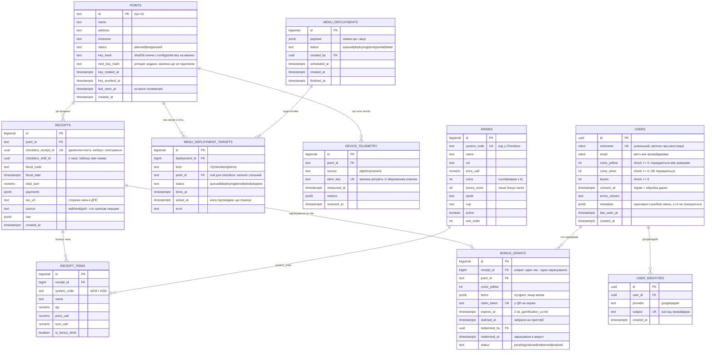
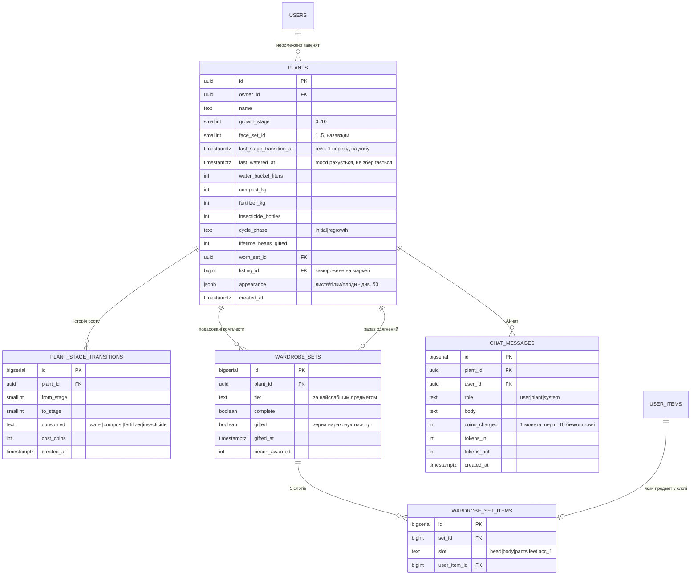

# Схема даних: Postgres і Redis

Стан на 17.09.2026. Це **проєкт схеми**, зведений з усіх чинних доків
(`gamification_economy.md`, `gamification_ui.md`, `bush_graphics_customization.md`,
`admin_panel.md`, `video.md`, `checkbox.md`, `urls.md`). У коді поки нема
жодної таблиці — сервіси стоять заглушками, тому міняти тут дешево, а після
першої міграції на проді вже ні.

Діаграми — mermaid у цьому ж файлі: текст, який рендериться у вектор і
правиться в дифі рядок за рядком. Окремої картинки, яку доведеться
перемальовувати, свідомо немає. Для читання поза редактором цей файл
разом із `services.md` збирається в `docs/data-map.html` — з меню до
окремих таблиць (`npm run docs:map`).

---

## 0. Наскрізні рішення

### Гроші — `numeric(12,2)`, ігрові валюти — `integer`

Гривня ніколи не `float`; монети й зерна цілі за визначенням (економіка
оперує `round(маржа)`, `gamification_economy.md` §7). Checkbox віддає суми
цілими копійками (Еспресо 35 ₴ приходить як `3500`) — ділимо на 100 на
вході в `checkbox`, щоб копійки не розповзлися по схемі.

### Баланси — колонки в `users`, рухи — рядки журналу

Три баланси (`coins_yellow`, `coins_silver`, `beans`) лежать прямо в `users`
з `check (… >= 0)`. Окрема таблиця `wallets` 1:1 до користувача нічого не
давала, крім зайвого join (рішення 17.09.2026).

`ledger_entries` — незмінний журнал, де **один рядок — це одна операція з
трьома знаковими дельтами**: `delta_yellow`, `delta_silver`, `delta_beans`.
Обмін зерна на монети — один рядок `delta_beans = -1, delta_yellow = +15`,
а не два, між якими може впасти процес і лишити гравця без зерна й без
монет. Баланс і журнал змінюються в одній транзакції:

```sql
update users set beans = beans - 1, coins_yellow = coins_yellow + 15
 where id = $1 and beans >= 1;             -- 0 рядків = не вистачило, rollback
insert into ledger_entries (user_id, delta_beans, delta_yellow, reason, idem_key)
values ($1, -1, 15, 'exchange', $2);        -- idem_key: повтор запиту не пише вдруге
```

Баланс звіряється з `sum(delta_*)` по журналу; розбіжність — баг, який видно,
а не тихо зіпсовані дані. Адмінка просить «історію транзакцій в справжній та
ігровій валюті» (`admin_panel.md`): ігрова — цей журнал, справжня — чеки
Checkbox і оплати mono pay, на які рядок посилається через `ref_type`/`ref_id`.

### Косметика куща в `jsonb`, економіка в колонках

У `bush_graphics_customization.md` §9 стан кавенятка — великий документ
(листя, гілки, плодові слоти з x/y і `sprite_id`). Він рендериться цілком і
ніколи не питається по полю, тому лежить у `plants.appearance jsonb`. А
стадія росту, лічильники препаратів, таймери й `last_watered_at` — звичайні
колонки: вони гейтять економіку, перевіряються бекендом і потрапляють у
звіти. Саме цю межу найлегше розмити пізніше «за компанію», тому вона
записана явно.

### Ідемпотентність на кожному вході ззовні

Вебхуки ПРРО, опитування Checkbox, телеметрія з малини, заливка
відеосегментів — усе має унікальний ключ від джерела: мережа на точці
рветься, і повтор запиту не має подвоювати ні чек, ні бонус.

### Подія пишеться в тій самій транзакції, що й зміна

Між Postgres і Redis — та сама «задача двох генералів»: закомітити чек і
впасти до `PUBLISH` означає бонус, про який кіоск не дізнався. Тому подія
для кіоска чи телефона — рядок в `outbox` (§4) у тій самій транзакції, що й
чек або бонус. Публікатор забирає рядки з `SKIP LOCKED`, шле в Redis і
позначає `published_at`. Упасти між відправкою й позначкою — значить
відправити двічі, тому в кожній події її `outbox.id`, і клієнти відкидають
повтор. Доставка «принаймні раз» + ідемпотентний отримувач — це найближче
до «рівно раз», що взагалі досяжне.

### Точка — текстовий ключ із першого дня

`point_id` відповідає `^[a-z0-9][a-z0-9-]{1,30}$` (`urls.md`). Не uuid: він
їде в URL кіоска й у ключі R2.

---

## 1. Ідентичність і продажі



`BONUS_GRANTS` описує рівно той потік, що в `gamification_ui.md`: на екрані
QR → скан забирає бонус на пристрій (`claimed_at`, з екрана зникає) →
авторизація зараховує в акаунт (`redeemed_at`). Три стани, а не два, бо між
ними користувач може закрити вкладку — і тоді бонус має протухнути за
`expires_at`, а не висіти вічно.

**Змін Checkbox окремою таблицею немає** (прибрано 17.09.2026). Ні адмінка,
ні економіка, ні аналітика не питають нічого «по змінах»: оборот рахується
по чеках за день. `checkbox_shift_id` лишається в чеку як
посилання, щоб знайти зміну в кабінеті Checkbox, якщо колись знадобиться.

**Деплой меню — на всі точки одразу, якщо не вибрано інше.** Статус
тримається на кожній цілі окремо: одна малина офлайн чи портал Jetinno
впав — це `partial`, а не провал усього деплою. На кожну активну точку
створюється ціль `r2` (меню, яке тягне кіоск), одна `checkbox` (каталог
спільний на організацію, `checkbox.md`) і, якщо підтвердиться потреба,
`jetinno` на точку (`services.md` §4). `acked_at` ставить сам кіоск, коли
вже показує нові ціни, — «викотили в R2» і «висить на екрані» різні речі.

**Точка і її малина — один рядок** (18.09.2026). Окремої таблиці пристроїв
немає: на точці одна малина, і «пристрій без точки» чи «дві малини на точку»
— стани, яких не буває. Ключ живе у файлі `config/point.key` на малині, у
базі лише його хеш; відкликання — `key_revoked_at`, ротація —
`next_key_hash`, доки малина не підхопила новий (`services.md` §3).

**`users.metadata` — приховані змінні** (18.09.2026). Службове про гравця,
чого він сам не бачить і за чим ніхто не рахує гроші. Перший ключ —
`qr_pos`: ідентифікатор точки з QR-наклейки, через яку людина прийшла
(`qr.extrovert.cafe?p=1` → `{"qr_pos": "1"}`, `urls.md`). Пишеться раз, не
перезаписується. У jsonb, а не колонкою — за тим самим правилом, що й
косметика куща (§0): по ньому не будують звʼязків і не рахують баланси, а
нові такі змінні не повинні означати міграцію.

---

## 2. Економіка: журнал, крамниця, маркет

```mermaid
erDiagram
    USERS ||--o{ LEDGER_ENTRIES : "кожна операція"
    USERS ||--o{ USER_ITEMS : "склад"
    USERS ||--o{ CRATE_OPENINGS : "відкриття крейтів"
    USERS ||--o{ MARKET_LISTINGS : "продає"
    USERS ||--o{ COIN_TRANSFERS : "переказ жовтих"
    USERS ||--o{ REDEMPTIONS : "доставки Новою Поштою"
    USERS ||--o{ QUIZ_DRINK_RESPONSES : "квіз про напій"
    USERS ||--o| QUIZ_PROFILE_RESPONSES : "анкета, одноразово"
    USERS ||--o{ REPOST_VERIFICATIONS : "репости"
    ITEM_DEFS ||--o{ USER_ITEMS : "каталог"
    USER_ITEMS ||--o| MARKET_LISTINGS : "виставлений предмет"
    MARKET_LISTINGS ||--o| MARKET_TRADES : "угода"
    CRATE_OPENINGS ||--o| USER_ITEMS : "що випало"
    RECEIPT_ITEMS ||--o| QUIZ_DRINK_RESPONSES : "про яке замовлення"
    LEDGER_ENTRIES ||--o| POS_DISCOUNT_CODES : "знижка на POS"
    LEDGER_ENTRIES ||--o| REDEMPTIONS : "списання зерен за доставку"
    REDEMPTIONS ||--o{ REDEMPTION_EVENTS : "історія статусів"
    NP_CITIES ||--o{ NP_WAREHOUSES : "відділення й поштомати"
    NP_WAREHOUSES ||--o{ REDEMPTIONS : "куди везти"

    LEDGER_ENTRIES {
        bigserial id PK
        uuid user_id FK
        int delta_yellow "знакова, 0 якщо не чіпали"
        int delta_silver "знакова"
        int delta_beans "знакова"
        text reason "purchase|quiz|repost|crate|care|chat|transfer|market|exchange|pos_discount|delivery|sapling|admin"
        text ref_type "receipt|crate_opening|market_trade|coin_transfer|redemption"
        bigint ref_id
        text idem_key UK "повтор запиту не пише рядок удруге"
        jsonb meta "курс обміну, що саме купили"
        timestamptz created_at
    }
    ITEM_DEFS {
        bigserial id PK
        text code UK
        text name
        text slot "head|body|pants|feet|acc_1"
        text tier "common|uncommon|rare|epic"
        text sprite_id
        int price_coins "лише Common, gamification_ui.md"
        bigint season_id "сезонні скіни - лише за грн"
        boolean active
    }
    USER_ITEMS {
        bigserial id PK
        uuid user_id FK
        bigint item_def_id FK
        text acquired_from "crate|drop|shop|market|gift|bonus_drink"
        boolean locked "замкнений у подарованому комплекті"
        bigint set_id FK
        bigint listing_id FK
        timestamptz acquired_at
    }
    CRATE_OPENINGS {
        bigserial id PK
        uuid user_id FK
        text source "coins|cash|bonus_drink|shadow_drop"
        text paid_currency
        numeric paid_amount
        text result_type "item|coins"
        bigint result_item_id FK
        int result_coins
        text rolled_tier
        timestamptz opened_at
    }
    MARKET_LISTINGS {
        bigserial id PK
        uuid seller_id FK
        text kind "item|plant"
        bigint user_item_id FK
        uuid plant_id FK
        int price_amount
        text price_currency "yellow|beans"
        numeric commission_pct "10 одяг / до 2 кавенятко"
        text status "active|sold|cancelled"
        timestamptz created_at
    }
    MARKET_TRADES {
        bigserial id PK
        bigint listing_id FK
        uuid buyer_id FK
        uuid seller_id FK
        int gross
        int commission "згорає, нікому не йде"
        int net
        text currency
        timestamptz created_at
    }
    COIN_TRANSFERS {
        bigserial id PK
        uuid from_user FK
        uuid to_user FK
        int amount "тільки yellow"
        timestamptz created_at
    }
    REDEMPTIONS {
        bigserial id PK
        uuid user_id FK
        bigint ledger_entry_id FK "списання зерен"
        text product "id з api/data/shop-products.json"
        jsonb options "розмір футболки"
        numeric cost_uah_actual "для 10% ліміту бюджету"
        text recipient_name
        text recipient_phone "без нього НП посилку не видасть"
        text np_warehouse_ref "Ref із довідника"
        text np_warehouse_kind "branch|postomat"
        text np_address_snapshot "довідник міняється, замовлення - ні"
        text np_ttn UK
        text np_status_code "останній код із трекінгу"
        text status "new|printing|packing|shipped|arrived|received|returned|cancelled"
        timestamptz status_changed_at
        timestamptz user_seen_at "лічильник: зміни, яких гравець ще не бачив"
        bigint evidence_event_id FK "доказ з камери"
        timestamptz created_at
    }
    REDEMPTION_EVENTS {
        bigserial id PK
        bigint redemption_id FK
        text status
        text source "admin|np|system"
        text note
        timestamptz created_at
    }
    NP_CITIES {
        text ref PK "Ref із довідника НП"
        text name
        text area
        text settlement_type
        timestamptz synced_at
    }
    NP_WAREHOUSES {
        text ref PK
        text city_ref FK
        int number
        text category "branch|postomat"
        text type_ref "з getWarehouseTypes, не хардкод"
        text description
        text short_address
        int place_max_weight_kg
        jsonb dimension_limits "поштомат: чи влізе товар"
        jsonb schedule
        text status "неробочі не показуємо"
        timestamptz synced_at
    }
    POS_DISCOUNT_CODES {
        bigserial id PK
        bigint ledger_entry_id FK
        uuid user_id FK
        text code UK
        numeric amount_uah
        timestamptz issued_at
        timestamptz used_at
        bigint receipt_id FK
    }
    QUIZ_PROFILE_RESPONSES {
        bigserial id PK
        uuid user_id FK "unique: анкета одноразова"
        jsonb answers
        int coins_awarded
        timestamptz created_at
    }
    QUIZ_DRINK_RESPONSES {
        bigserial id PK
        uuid user_id FK
        bigint receipt_item_id FK
        jsonb answers "оцінки складників + чистота"
        text free_text
        int coins_awarded
        timestamptz created_at
    }
    REPOST_VERIFICATIONS {
        bigserial id PK
        uuid user_id FK
        text network
        text redirect_token UK
        timestamptz clicked_at
        timestamptz verified_at
        int coins_awarded
    }
```



Два правила економіки, які **мають жити в схемі, а не лише в коді**:

- `coins_silver` не можна переказати. У `COIN_TRANSFERS` немає колонки
  валюти взагалі — таблиця за визначенням тільки про жовті. Спроба
  переказати срібні тоді не «валідація, яку забули», а неможливий стан.
- Предмет у подарованому комплекті не продається. `USER_ITEMS.locked` +
  часткові індекси: виставити можна лише те, де `locked = false`.

**`redemptions` — лише те, що їде Новою Поштою** (17.09.2026). Раніше таблиця
дублювала журнал: знижка на POS, саджанець, обмін на монети — це просто
рядки `ledger_entries` з відповідним `reason` (для знижки ще й код у
`pos_discount_codes`). Окремий рядок потрібен лише там, де є фізичний світ:
отримувач, відділення, ТТН і статуси, які змінюють адмін і трекінг НП.
`redemption_events` — історія цих статусів: з неї екран «Мої замовлення»
малює стрічку, а `user_seen_at` дає лічильник на кнопці (`gamification_ui.md`).

**Довідник НП — локальна копія, оновлюється щоночі** (`services.md` §4). У
замовлення знімається текстова адреса відділення: довідник живе своїм
життям, а замовлення має показувати, куди насправді відправили.

---

## 3. Кавенятка: ріст, догляд, гардероб



`PLANT_STAGE_TRANSITIONS` виглядає надлишковою поруч із
`plants.last_stage_transition_at`, але саме вона робить перевіряємим
головний гейт економіки — «не більше одного переходу на добу»
(`gamification_economy.md` §3.1) — і дає адмінці історію без реконструкції
з журналу валют. `unique (plant_id, to_stage)` заразом робить подвійний
перехід неможливим, а не лише незручним.

`WARDROBE_SET_ITEMS` окремою таблицею, а не пʼятьма колонками: слоти
перелічені в доку як 5, але «acc_3» коштуватиме міграції даних, а не
рядка в enum.

---

## 4. Операційка: відео, здоровʼя, адмінка

```mermaid
erDiagram
    POINTS ||--o{ VIDEO_SEGMENTS : "запис"
    VIDEO_SEGMENTS ||--o{ VIDEO_EVENTS : "що знайшов воркер"
    RECEIPTS ||--o| VIDEO_EVENTS : "звід за таймстемпом"
    POINTS ||--o{ PROBLEM_REPORTS : "скарги з форми"
    ADMIN_USERS ||--o{ MENU_DEPLOYMENTS : "хто викотив ціни"
    ADMIN_USERS ||--o{ NEWS_BROADCASTS : "розсилка в чат кавенятка"

    VIDEO_SEGMENTS {
        bigserial id PK
        text point_id FK
        text camera_id
        text r2_key UK "ідемпотентність заливки"
        timestamptz started_at
        int duration_ms
        bigint bytes
        text status "pending|processing|done|failed|expired"
        smallint attempts
        timestamptz locked_at "черга через SKIP LOCKED"
        timestamptz processed_at
        text error
    }
    VIDEO_EVENTS {
        bigserial id PK
        text point_id FK
        text kind "approach|queue|idle"
        timestamptz started_at
        timestamptz ended_at
        bigint segment_id FK
        bigint receipt_id FK "ідентичність з чека, не з обличчя"
        jsonb meta "GIN-індекс"
    }
    HEALTH_SAMPLES {
        bigserial id PK
        text target "service:api|frontend:client|check:webhook|point:kyiv-01"
        timestamptz bucket_start "півгодини, тиждень історії"
        boolean ok
        text detail "тултіп в адмінці"
        int samples
    }
    PROBLEM_REPORTS {
        bigserial id PK
        uuid user_id FK
        text point_id FK
        text categories "масив: кавомашина, монітор, сайт, матеріали, ідея"
        text body
        text image_r2_key
        text status "new|read|closed"
        timestamptz created_at
    }
    NEWS_BROADCASTS {
        bigserial id PK
        uuid created_by FK
        text title
        text body
        text audience
        timestamptz sent_at
    }
    ADMIN_USERS {
        uuid id PK
        citext email UK
        text role "owner|ops"
        timestamptz last_login_at
    }
    ECONOMY_PARAMS {
        text key PK "k_coins|bean_rate|rarity|crate_price"
        jsonb value
        uuid updated_by FK
        timestamptz updated_at
    }
    OUTBOX {
        bigserial id PK
        text channel "point:kyiv-01|user:uuid"
        text event "sale|bonus.claimed|menu.deployed|order.updated"
        jsonb payload "з outbox.id, щоб клієнт відкинув повтор"
        timestamptz created_at
        timestamptz published_at "null - ще не в Redis"
        smallint attempts
    }
    SYNC_CURSORS {
        text name PK "checkbox:receipts|np:directory|np:tracking"
        timestamptz cursor_at "до якого моменту все забрано"
        timestamptz run_at
        text last_error
    }
    SUPPORT_THREADS {
        bigserial id PK
        text telegram_chat_id UK "один чат - один тред"
        uuid user_id FK "якщо прийшов за кодом із застосунку"
        text telegram_username
        text status "open|closed"
        timestamptz last_user_at "остання репліка гравця"
        timestamptz last_admin_at "остання наша"
        timestamptz created_at
    }
    SUPPORT_MESSAGES {
        bigserial id PK
        bigint thread_id FK
        text direction "in|out"
        bigint telegram_update_id UK "ідемпотентність вебхука"
        bigint telegram_message_id
        text body
        jsonb attachments "file_id, тип; файл лишається в Telegram"
        uuid admin_id FK "хто відповів"
        timestamptz created_at
    }
```



`VIDEO_SEGMENTS`/`VIDEO_EVENTS` — дослівно зі схеми у `video.md`, включно з
чергою через `SKIP LOCKED`. `HEALTH_SAMPLES` одразу зберігається
півгодинними відрами: адмінка просить тиждень історії з такою
гранулярністю, і зберігати сирі проби, щоб потім їх агрегувати, немає
навіщо — старше за тиждень усе одно затирається.

`OUTBOX` — див. §0 «Подія пишеться в тій самій транзакції». `SYNC_CURSORS` —
де зупинилось кожне фонове забирання: опитування чеків Checkbox, нічна
синхронізація довідника й трекінг НП. Курсор у базі, а не в памʼяті
процесу: перезапуск не має ні пропустити вікно, ні перечитати тиждень.

`SUPPORT_THREADS` і `SUPPORT_MESSAGES` — уся підтримка (`services.md` §4):
тред на чат у Telegram, повідомлення в обидва боки. `user_id` заповнюється
лише тоді, коли гравець прийшов із застосунку за одноразовим кодом: акаунт
у нас Google/Apple, а в боті Telegram, і спільного ідентифікатора немає.
Лічильник в адмінці — треди, де `last_user_at > last_admin_at`.

---

## 5. Redis: що саме там лежить

Redis тут — **не база**. Втрата всього кейспейсу має коштувати
перевідкриття сесій і холодний кеш, і нічого більше. Усе, втрата чого
означала б втрачений продаж або бонус, живе в Postgres.

### Ключі

| Ключ | Тип | TTL | Хто пише | Хто читає | Навіщо |
|---|---|---|---|---|---|
| `sess:<id>` | hash | 30 діб | api | api | refresh-сесія гравця; сам доступ — JWT на 15 хв, у Redis його немає |
| `sess:admin:<id>` | hash | 12 год | api | api | refresh-сесія адміна, коротша |
| `revoked:point:<id>` | string | 1 год | api | api, ws | відкликаний ключ малини діє одразу, а не коли спливе її JWT |
| `rl:<scope>:<id>` | string лічильник | 60 с | api | api | rate limit (чат — без ліміту, решта — є) |
| `bonus:claim:<token>` | hash | 120 с | api | api | вікно сканування QR, дзеркало `bonus_grants` |
| `idem:<scope>:<key>` | string | 24 год | api | api | ідемпотентність телеметрії й заливок |
| `lock:<job>` | string `SET NX PX` | за роботою | scheduler, checkbox, overseer, worker | вони ж | щоб дві копії фонової роботи не робили одне й те саме |
| `health:last:<target>` | hash | 1 год | overseer | api (адмінка) | останній стан без запиту в Postgres |

### Канали pub/sub

Доставка «в кращому разі», без збереження.

| Канал | Публікує | Слухає | Подія |
|---|---|---|---|
| `point:<id>` | публікатор `outbox` у `scheduler` | ws → кіоск | `sale` (QR бонусу), `bonus.claimed`, `bonus.expired`, `menu.deployed`, `promo.deployed` |
| `user:<uuid>` | публікатор `outbox` у `scheduler` | ws → телефон | бонус зарахований, продаж на маркеті, срібні монети, розсилка, `order.updated` |
| `admin:health` | overseer | ws | зміна стану сервісу для живої адмінки |

### Чому pub/sub, а не Streams

Втрата повідомлення тут не втрачає дані:
і кіоск, і застосунок при (пере)підключенні витягують свій стан із `api`
одним запитом, а джерело істини — Postgres. Між базою й Redis подію не
губить `outbox` (§0); pub/sub відповідає лише за «доставити тим, хто зараз
на звʼязку». Там, де втрата була б дірою в
архіві (відеосегменти), черга свідомо зроблена таблицею з `SKIP LOCKED`
(`video.md`), а не Redis-ом. Окремий брокер на цих обсягах — залежність,
яку доведеться доглядати, без задачі, яку вона вирішує.

---

## 6. Міграції: окремий інструмент, не сервіс

Вимога: міграції **не всередині жодного сервісу**. Причина не смак:
зараз `api`, `ws`, `checkbox` і `overseer` стартують одночасно в
docker-compose, і якщо міграції живуть у котромусь із них, то (а) порядок
старту вирішує, хто першим накотить схему, (б) два екземпляри одного
сервісу накочують паралельно, (в) відкотити сервіс означає відкотити
міграції разом із ним.

### Рішення: **dbmate**, 15.09.2026

Один статичний Go-бінарник, чистий SQL, нічого не знає про Node.
Запускається окремим одноразовим контейнером, виходить — і все. Спокуси
імпортнути щось із коду сервісу не виникає, бо поруч немає ні
`package.json`, ні спільних модулів.

**Коли:** після того, як затвердимо діаграми — ER вище й потоки в
`services.md`. Поки схема рухається, правка діаграми коштує рядок тексту, а
кожна правка вже накоченої схеми — окрема міграція з `up` і `down`.

### Розкладка

```
db/
├── migrations/
│   ├── 20260915120000_points_and_users.sql
│   ├── 20260915120500_receipts_from_checkbox.sql
│   └── …                       -- -- migrate:up / -- migrate:down у кожному
├── schema.sql                  -- дамп, що комітиться: диф схеми видно в рев'ю
└── Dockerfile                  -- FROM ghcr.io/amacneil/dbmate
```

```yaml
# docker-compose.yml
  migrate:
    build: ./db
    env_file: [.env]
    environment:
      DATABASE_URL: postgres://…@postgres:5432/extrovert?sslmode=disable
    depends_on:
      postgres: { condition: service_healthy }
    command: ["up"]
    restart: "no"          # одноразова робота, не сервіс

  api:
    depends_on:
      migrate: { condition: service_completed_successfully }
```

### Правила, які дешевше прийняти зараз

1. **Expand → migrate → contract.** Нова колонка додається `nullable`,
   код навчається її писати, дані добиваються, і лише наступним релізом
   вона стає `not null`. Одночасна зміна схеми й коду означає, що відкат
   коду ламає базу.
2. **Жодного `drop`/`rename` у тому ж релізі, що й код, який це потребує.**
   Видалення — окремим, пізнішим релізом, коли відкочуватись уже нема куди.
3. **`schema.sql` комітиться.** Рев'ю читає диф схеми, а не перебирає
   міграції очима.
4. **CI: чиста база → `dbmate up` → диф `schema.sql` порожній → `dbmate
   rollback` → `dbmate up`.** Повторний `up` сам по собі нічого не
   перевіряє: dbmate памʼятає накочені версії й просто нічого не робить.
   Порожній диф ловить забутий дамп, а `rollback` + `up` — зламаний `down`,
   який інакше знайдеться лише тоді, коли відкочуватись уже треба.
5. **Перший тестовий відкат — одразу**, як і з бекапами (`video.md`):
   `dbmate rollback` на стейджі до того, як він знадобиться на проді.
