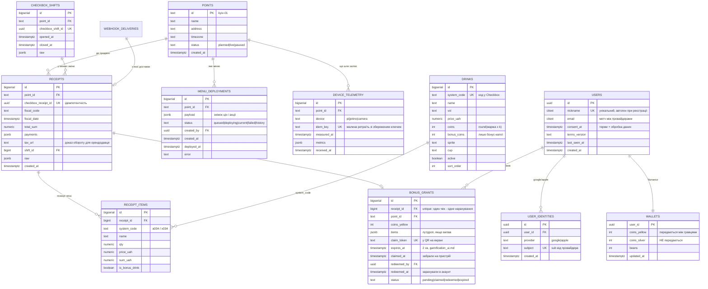
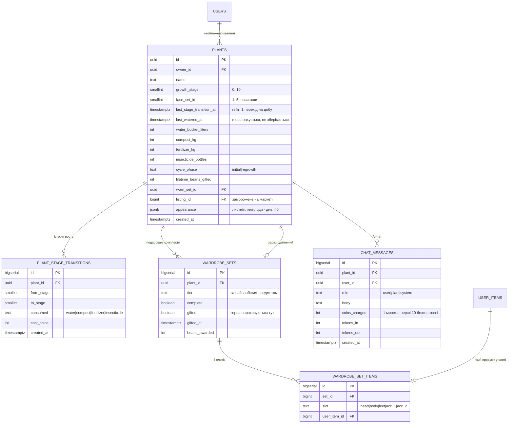
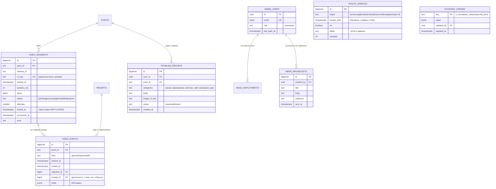

# Схема даних: Postgres і Redis

Стан на 15.09.2026. Це **проєкт схеми**, зведений з усіх чинних доків
(`gamification_economy.md`, `gamification_ui.md`, `bush_graphics_customization.md`,
`admin_panel.md`, `video.md`, `checkbox.md`, `urls.md`). У коді поки нема
жодної таблиці — сервіси стоять заглушками, тому міняти тут дешево, а після
першої міграції на проді вже ні.

Діаграми — mermaid у цьому ж файлі: текст, який рендериться у вектор і
правиться в дифі рядок за рядком. Окремої картинки, яку доведеться
перемальовувати, свідомо немає. Для читання поза редактором цей файл
разом із `services.md` збирається в `docs/data-map.html` — з меню до
окремих таблиць (`npm run docs:map`).

---

## 0. Наскрізні рішення

### Гроші — `numeric(12,2)`, ігрові валюти — `integer`

Гривня ніколи не `float`; монети й зерна цілі за визначенням (економіка
оперує `round(маржа)`, `gamification_economy.md` §7). Checkbox віддає суми
цілими копійками (Еспресо 35 ₴ приходить як `3500`) — ділимо на 100 на
вході в `checkbox`, щоб копійки не розповзлися по схемі.

### Баланс і журнал одночасно

`wallets` — швидкий баланс для UI, `ledger_entries` — незмінний журнал усіх
рухів. Баланс завжди похідний і звіряється з журналом; розбіжність — це
баг, який видно, а не тихо зіпсовані дані. Адмінка вимагає «історію
транзакцій в справжній та ігровій валюті» (`admin_panel.md`) — саме журнал
це й дає.

### Косметика куща в `jsonb`, економіка в колонках

У `bush_graphics_customization.md` §9 стан кавенятка — великий документ
(листя, гілки, плодові слоти з x/y і `sprite_id`). Він рендериться цілком і
ніколи не питається по полю, тому лежить у `plants.appearance jsonb`. А
стадія росту, лічильники препаратів, таймери й `last_watered_at` — звичайні
колонки: вони гейтять економіку, перевіряються бекендом і потрапляють у
звіти. Саме цю межу найлегше розмити пізніше «за компанію», тому вона
записана явно.

### Ідемпотентність на кожному вході ззовні

Вебхуки ПРРО, телеметрія з малини, заливка відеосегментів — усе має
унікальний ключ від джерела: мережа на точці рветься, і повтор запиту не
має подвоювати ні чек, ні бонус.

### Точка — текстовий ключ із першого дня

`point_id` відповідає `^[a-z0-9][a-z0-9-]{1,30}$` (`urls.md`). Не uuid: він
їде в URL кіоска й у ключі R2.

---

## 1. Ідентичність і продажі



`BONUS_GRANTS` описує рівно той потік, що в `gamification_ui.md`: на екрані
QR → скан забирає бонус на пристрій (`claimed_at`, з екрана зникає) →
авторизація зараховує в акаунт (`redeemed_at`). Три стани, а не два, бо між
ними користувач може закрити вкладку — і тоді бонус має протухнути за
`expires_at`, а не висіти вічно.

---

## 2. Економіка: журнал, крамниця, маркет

```mermaid
erDiagram
    USERS ||--o{ LEDGER_ENTRIES : "кожен рух валюти"
    USERS ||--o{ USER_ITEMS : "склад"
    USERS ||--o{ CRATE_OPENINGS : "відкриття крейтів"
    USERS ||--o{ MARKET_LISTINGS : "продає"
    USERS ||--o{ COIN_TRANSFERS : "переказ жовтих"
    USERS ||--o{ REDEMPTIONS : "витрата зерен"
    USERS ||--o{ QUIZ_DRINK_RESPONSES : "квіз про напій"
    USERS ||--o| QUIZ_PROFILE_RESPONSES : "анкета, одноразово"
    USERS ||--o{ REPOST_VERIFICATIONS : "репости"
    ITEM_DEFS ||--o{ USER_ITEMS : "каталог"
    USER_ITEMS ||--o| MARKET_LISTINGS : "виставлений предмет"
    MARKET_LISTINGS ||--o| MARKET_TRADES : "угода"
    CRATE_OPENINGS ||--o| USER_ITEMS : "що випало"
    RECEIPT_ITEMS ||--o| QUIZ_DRINK_RESPONSES : "про яке замовлення"
    REDEMPTIONS ||--o| POS_DISCOUNT_CODES : "знижка на POS"

    LEDGER_ENTRIES {
        bigserial id PK
        uuid user_id FK
        text currency "yellow|silver|beans"
        int delta "+ нарахування, - витрата"
        int balance_after "звірка з wallets"
        text reason "purchase|quiz|repost|crate|care|transfer|market|redeem|convert|admin"
        text ref_type
        bigint ref_id
        timestamptz created_at
    }
    ITEM_DEFS {
        bigserial id PK
        text code UK
        text name
        text slot "head|body|feet|acc_1|acc_2"
        text tier "common|uncommon|rare|epic"
        text sprite_id
        int price_coins "лише Common, gamification_ui.md"
        bigint season_id "сезонні скіни - лише за грн"
        boolean active
    }
    USER_ITEMS {
        bigserial id PK
        uuid user_id FK
        bigint item_def_id FK
        text acquired_from "crate|drop|shop|market|gift|bonus_drink"
        boolean locked "замкнений у подарованому комплекті"
        bigint set_id FK
        bigint listing_id FK
        timestamptz acquired_at
    }
    CRATE_OPENINGS {
        bigserial id PK
        uuid user_id FK
        text source "coins|cash|bonus_drink|shadow_drop"
        text paid_currency
        numeric paid_amount
        text result_type "item|coins"
        bigint result_item_id FK
        int result_coins
        text rolled_tier
        timestamptz opened_at
    }
    MARKET_LISTINGS {
        bigserial id PK
        uuid seller_id FK
        text kind "item|plant"
        bigint user_item_id FK
        uuid plant_id FK
        int price_amount
        text price_currency "yellow|beans"
        numeric commission_pct "10 одяг / до 2 кавенятко"
        text status "active|sold|cancelled"
        timestamptz created_at
    }
    MARKET_TRADES {
        bigserial id PK
        bigint listing_id FK
        uuid buyer_id FK
        uuid seller_id FK
        int gross
        int commission "згорає, нікому не йде"
        int net
        text currency
        timestamptz created_at
    }
    COIN_TRANSFERS {
        bigserial id PK
        uuid from_user FK
        uuid to_user FK
        int amount "тільки yellow"
        timestamptz created_at
    }
    REDEMPTIONS {
        bigserial id PK
        uuid user_id FK
        text kind "coffee|merch|print|pos_discount|sapling|coins"
        int beans_spent
        numeric cost_uah_actual "для 10% ліміту бюджету"
        text status "requested|approved|shipped|delivered|cancelled"
        text np_branch
        text np_ttn
        bigint evidence_event_id FK
        timestamptz created_at
    }
    POS_DISCOUNT_CODES {
        bigserial id PK
        bigint redemption_id FK
        uuid user_id FK
        text code UK
        numeric amount_uah
        timestamptz issued_at
        timestamptz used_at
        bigint receipt_id FK
    }
    QUIZ_PROFILE_RESPONSES {
        bigserial id PK
        uuid user_id FK "unique: анкета одноразова"
        jsonb answers
        int coins_awarded
        timestamptz created_at
    }
    QUIZ_DRINK_RESPONSES {
        bigserial id PK
        uuid user_id FK
        bigint receipt_item_id FK
        jsonb answers "оцінки складників + чистота"
        text free_text
        int coins_awarded
        timestamptz created_at
    }
    REPOST_VERIFICATIONS {
        bigserial id PK
        uuid user_id FK
        text network
        text redirect_token UK
        timestamptz clicked_at
        timestamptz verified_at
        int coins_awarded
    }
```



Два правила економіки, які **мають жити в схемі, а не лише в коді**:

- `coins_silver` не можна переказати. У `COIN_TRANSFERS` немає колонки
  валюти взагалі — таблиця за визначенням тільки про жовті. Спроба
  переказати срібні тоді не «валідація, яку забули», а неможливий стан.
- Предмет у подарованому комплекті не продається. `USER_ITEMS.locked` +
  часткові індекси: виставити можна лише те, де `locked = false`.

---

## 3. Кавенятка: ріст, догляд, гардероб



`PLANT_STAGE_TRANSITIONS` виглядає надлишковою поруч із
`plants.last_stage_transition_at`, але саме вона робить перевіряємим
головний гейт економіки — «не більше одного переходу на добу»
(`gamification_economy.md` §3.1) — і дає адмінці історію без реконструкції
з журналу валют. `unique (plant_id, to_stage)` заразом робить подвійний
перехід неможливим, а не лише незручним.

`WARDROBE_SET_ITEMS` окремою таблицею, а не пʼятьма колонками: слоти
перелічені в доку як 5, але «acc_3» коштуватиме міграції даних, а не
рядка в enum.

---

## 4. Операційка: відео, здоровʼя, адмінка



`VIDEO_SEGMENTS`/`VIDEO_EVENTS` — дослівно зі схеми у `video.md`, включно з
чергою через `SKIP LOCKED`. `HEALTH_SAMPLES` одразу зберігається
півгодинними відрами: адмінка просить тиждень історії з такою
гранулярністю, і зберігати сирі проби, щоб потім їх агрегувати, немає
навіщо — старше за тиждень усе одно затирається.

---

## 5. Redis: що саме там лежить

Redis тут — **не база**. Втрата всього кейспейсу має коштувати
перевідкриття сесій і холодний кеш, і нічого більше. Усе, втрата чого
означала б втрачений продаж або бонус, живе в Postgres.

### Ключі

| Ключ | Тип | TTL | Хто пише | Хто читає | Навіщо |
|---|---|---|---|---|---|
| `sess:<token>` | hash | 30 діб | api | api | сесія гравця після OAuth |
| `sess:admin:<token>` | hash | 12 год | api | api | окремий, коротший строк для адмінки |
| `ws:ticket:<uuid>` | string | 60 с | api | ws | одноразовий квиток: вебсокет не бачить кук |
| `rl:<scope>:<id>` | string лічильник | 60 с | api | api | rate limit (чат — без ліміту, решта — є) |
| `bonus:claim:<token>` | hash | 120 с | api | api | вікно сканування QR, дзеркало `bonus_grants` |
| `menu:<point>` | string (JSON) | 60 с | api | api, pos-worker | кеш меню, щоб кіоск не бив у Postgres |
| `idem:<scope>:<key>` | string | 24 год | api | api | ідемпотентність телеметрії й заливок |
| `lock:<job>` | string `SET NX PX` | за роботою | overseer, worker | вони ж | щоб дві копії крона не робили те саме |
| `health:last:<target>` | hash | 1 год | overseer | api (адмінка) | останній стан без запиту в Postgres |

### Канали pub/sub

Доставка «в кращому разі», без збереження.

| Канал | Публікує | Слухає | Подія |
|---|---|---|---|
| `point:<id>` | checkbox, api | ws | чек фіскалізовано, бонус нарахований, оновлення меню |
| `user:<uuid>` | api | ws | бонус зарахований, продаж на маркеті, срібні монети, розсилка |
| `admin:health` | overseer | ws | зміна стану сервісу для живої адмінки |

### Чому pub/sub, а не Streams

Втрата повідомлення тут не втрачає дані:
і кіоск, і застосунок при (пере)підключенні витягують свій стан із `api`
одним запитом, а джерело істини — Postgres. Там, де втрата була б дірою в
архіві (відеосегменти), черга свідомо зроблена таблицею з `SKIP LOCKED`
(`video.md`), а не Redis-ом. Окремий брокер на цих обсягах — залежність,
яку доведеться доглядати, без задачі, яку вона вирішує.

---

## 6. Міграції: окремий інструмент, не сервіс

Вимога: міграції **не всередині жодного сервісу**. Причина не смак:
зараз `api`, `ws`, `checkbox` і `overseer` стартують одночасно в
docker-compose, і якщо міграції живуть у котромусь із них, то (а) порядок
старту вирішує, хто першим накотить схему, (б) два екземпляри одного
сервісу накочують паралельно, (в) відкотити сервіс означає відкотити
міграції разом із ним.

### Рішення: **dbmate**, 15.09.2026

Один статичний Go-бінарник, чистий SQL, нічого не знає про Node.
Запускається окремим одноразовим контейнером, виходить — і все. Спокуси
імпортнути щось із коду сервісу не виникає, бо поруч немає ні
`package.json`, ні спільних модулів.

**Коли:** після того, як затвердимо діаграми — ER вище й потоки в
`services.md`. Поки схема рухається, правка діаграми коштує рядок тексту, а
кожна правка вже накоченої схеми — окрема міграція з `up` і `down`.

### Розкладка

```
db/
├── migrations/
│   ├── 20260915120000_points_and_users.sql
│   ├── 20260915120500_receipts_from_checkbox.sql
│   └── …                       -- -- migrate:up / -- migrate:down у кожному
├── schema.sql                  -- дамп, що комітиться: диф схеми видно в рев'ю
└── Dockerfile                  -- FROM ghcr.io/amacneil/dbmate
```

```yaml
# docker-compose.yml
  migrate:
    build: ./db
    env_file: [.env]
    environment:
      DATABASE_URL: postgres://…@postgres:5432/extrovert?sslmode=disable
    depends_on:
      postgres: { condition: service_healthy }
    command: ["up"]
    restart: "no"          # одноразова робота, не сервіс

  api:
    depends_on:
      migrate: { condition: service_completed_successfully }
```

### Правила, які дешевше прийняти зараз

1. **Expand → migrate → contract.** Нова колонка додається `nullable`,
   код навчається її писати, дані добиваються, і лише наступним релізом
   вона стає `not null`. Одночасна зміна схеми й коду означає, що відкат
   коду ламає базу.
2. **Жодного `drop`/`rename` у тому ж релізі, що й код, який це потребує.**
   Видалення — окремим, пізнішим релізом, коли відкочуватись уже нема куди.
3. **`schema.sql` комітиться.** Рев'ю читає диф схеми, а не перебирає
   міграції очима.
4. **CI: чиста база → `dbmate up` → диф `schema.sql` порожній → `dbmate
   rollback` → `dbmate up`.** Повторний `up` сам по собі нічого не
   перевіряє: dbmate памʼятає накочені версії й просто нічого не робить.
   Порожній диф ловить забутий дамп, а `rollback` + `up` — зламаний `down`,
   який інакше знайдеться лише тоді, коли відкочуватись уже треба.
5. **Перший тестовий відкат — одразу**, як і з бекапами (`video.md`):
   `dbmate rollback` на стейджі до того, як він знадобиться на проді.
