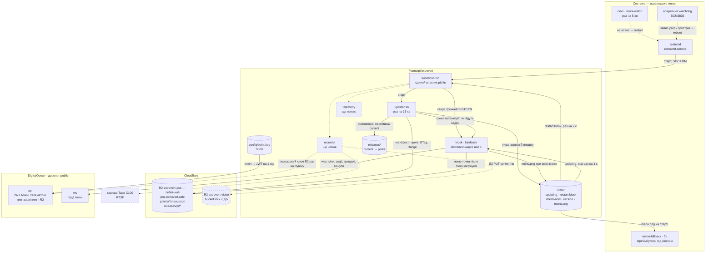

# Raspberry Pi на точці: що крутиться і як туди потрапляє нова версія

Стан на 21.09.2026. Малина стоїть у публічному коридорі, точка працює 24/7.
**Керований стек стоїть на пристрої й працює з 21.09.2026** (§4). Бакет R2
ще не привʼязаний до домену, тому оновлення поки везуться по SSH (§3), а
все, що впирається в бакет, лишається неперевіреним — §7.

Цей документ — карта й порядок дій. Подробиці живуть поруч:

| Де | Що |
|---|---|
| `raspberry/pi/README.md` | стан пристрою, заміри, граблі |
| `raspberry/pi/stack/README.md` | нутрощі стеку: розкладка, кроки апдейтера, overlap-підміна |
| `raspberry/kiosk/` | сам кіоск (C, Cairo, GLES2, dispmanx) і контейнер, що його збирає |

Кіоск на точці один — нативний `kiosk`. Браузера на пристрої немає:
ні як прод, ні як запасний варіант, ні як сторінка, яку можна відкрити.
Запасний варіант — статична картинка (§6).

---

## 1. Залізо й система

| | |
|---|---|
| Плата | Raspberry Pi 1 Model B rev 2 — ARMv6, 512 МБ, один 700 МГц |
| ОС | Raspbian 9 Stretch, ядро 4.14.79, **systemd 232**, gcc 6.3 / glibc 2.24 |
| Монітор | Asus VP227HF, 1080p (`display-hardware.md`) |
| Графіка | **без X**: `systemctl set-default multi-user.target`, кіоск малює в dispmanx-шар |
| Мережа | `ssh pi@192.168.5.45`, ключ `raspberry/kiosk/.deploy/id_ed25519` (у `.gitignore`) |

`/boot/config.txt` (`raspberry/pi/config.txt.snippet`) — кожен рядок тут через
конкретну поломку:

- `hdmi_group=1`, `hdmi_mode=16` — 1080p60, як монітор віддає в EDID;
- `hdmi_pixel_encoding=2` — повний RGB, інакше чорний виїздить сірим;
- `disable_overscan=1` — без нього кадр менший за екран;
- `gpu_mem=128` — **не знижувати**: на дефолтних 64 МБ кіоску забракло
  GPU-памʼяті під 1080p-поверхню, і на екрані був білий фон при живому
  процесі (постмортем 18.08.2026 у `roadmap.md`). Під overlap-підміну
  потрібно дві такі поверхні одночасно — §7.

**Watchdog.** `dtparam=watchdog=on` + systemd тримає апаратний BCM2835:
`RuntimeWatchdogSec=14` у `/etc/systemd/system.conf`
(`raspberry/pi/watchdog.conf.snippet`). Ключ саме `…Sec` — `RuntimeWatchdogUSec`
лише так його показує `systemctl show`, а невідомий ключ systemd мовчки
ігнорує. Перевірено 21.09.2026: у `dmesg` — `Set hardware watchdog to 14s`.

**Тихе завантаження** (зроблено 21.09.2026). Між подачею живлення і меню
клієнт не має бачити ні логів ядра, ні райдужного квадрата прошивки, ні
курсора, що блимає. Три місця:

| Де | Що | Що гасить |
|---|---|---|
| `/boot/cmdline.txt` (один рядок! копія — `raspberry/pi/cmdline.txt`) | дописано `quiet loglevel=3 logo.nologo vt.global_cursor_default=0 consoleblank=0 systemd.show_status=false`, прибрано `splash plymouth.ignore-serial-consoles` | потік ядра, малину в кутку, курсор, засинання консолі, рядки `[ OK ]` від systemd, заставку plymouth |
| `/boot/config.txt` | `disable_splash=1` | райдужний квадрат прошивки |
| `menu-fallback.service` | `fbi` зі статичним меню (§6) | чорний екран до першого кадру кіоска |

Запасну картинку від живого рендера відрізняють **чотири білі крапки 2 px по
кутах** (24.09.2026): намальовані вони тим самим кодом, на стіні не
відрізниш, а різниця в тому, що під картинкою кіоск може бути мертвий
годину, і ціни на ній застигли.

> ⚠️ **Квадрат лишався попри `disable_splash=1` — розібрано на пристрої
> 24.09.2026.** Причина: картка розмічена **NOOBS**, і прошивка вантажиться
> не з `/boot`, а з розділу **RECOVERY (p1)**: `bootcode.bin` → `recovery.elf`
> → і лише потім система з p7 разом із `/boot` (p6). Квадрат малює перша
> прошивка, а `config.txt` на RECOVERY **не існувало взагалі** — тож наш
> рядок у `/boot/config.txt` вона просто не читала.
>
> Лікування: такий самий `disable_splash=1` покласти на RECOVERY
> (`raspberry/pi/recovery-config.txt` — дамп того, що там тепер лежить):
>
> ```sh
> sudo mkdir -p /mnt/rec && sudo mount /dev/mmcblk0p1 /mnt/rec
> sudo sh -c 'echo disable_splash=1 > /mnt/rec/config.txt' && sudo sync
> sudo umount /mnt/rec && sudo reboot
> ```
>
> **Другий, зовсім інший квадрат** — маленький, у правому верхньому кутку,
> зʼявляється під час роботи. Це попередження про просідання живлення, і
> ховати його (`avoid_warnings=1`) не можна: запис на картку при просіданні —
> найчастіша причина її смерті (§6-тер). Тепер воно видно й у телеметрії
> (`throttled`) і приходить алертом. Відрізнити два квадрати без здогадок:
> `vcgencmd get_throttled` — `0x0` означає, що живлення в нормі й квадрат
> таки заставка (саме так і було 24.09.2026).

`splash` прибрано, бо з ним plymouth показував на весь екран свою заставку з
малиною — рівно те, чого клієнт бачити не мав. `consoleblank=0` тут не про
тишу, а про вітрину: за замовчанням консоль гасить екран через 10 хвилин.

Getty на `tty1` лишається — це єдині двері з клавіатурою, якщо мережа
відвалилась: Ctrl+Alt+F1. Активна консоль після завантаження — `tty7`, на
якій `fbi` тримає запасну картинку (§6). Видно консоль усе одно не буде:
кіоск малює у dispmanx-шар **поверх** фреймбуфера.

**Флешка-буфер.** USB-флешка 29 ГБ, ext4 з міткою `buf`, змонтована в
`/mnt/buf` через fstab з `nofail` (`raspberry/pi/fstab`). Без `nofail` відсутня
флешка кидала малину в emergency mode — постмортем у `raspberry/pi/README.md`.
Нова флешка: `sudo mkfs.ext4 -L buf -m 0 /dev/sda1`, fstab не чіпати. Перед
форматуванням безіменні флешки варто перевірити на справжню ємність (вони
буває брешуть, а для кільцевого буфера це тихе затирання) — як це зроблено
21.09.2026, у `raspberry/pi/README.md`.

**Що вимкнено.** `apache2` (стояв з 2019-го, віддавав на порт 80 стандартну
сторінку — зайва відкрита поверхня на пристрої в публічному коридорі),
`ModemManager`, `hciuart` і `bluetooth` (у Pi 1 Bluetooth немає, `hciuart`
щоразу 90 с чекав `/dev/serial1`). Не видалено — `systemctl enable` повертає.
Назовні слухає лише SSH.

**Логи.** `/etc/logrotate.d/extrovert` (`raspberry/pi/logrotate-extrovert`):
`logs/*.log` стеку ротуються по 1 МБ, щоб не рости на SD безкінечно.

**Годинник.** RTC немає, після знеструмлення час береться з `fake-hwclock`.
Дата, що зʼїхала, ламає HTTPS — і меню, і апдейтер виглядатимуть як
«немає мережі». Лікується `raspberry/pi/fix-clock.sh`.

**apt.** Stretch — EOL, репозиторії в архіві: `deb.debian.org` →
`archive.debian.org` у `/etc/apt/sources.list` і
`Acquire::Check-Valid-Until "false";` в `/etc/apt/apt.conf.d/99no-check-valid`.

---

## 2. Що крутиться на точці

Усе наше — в **`/home/pi/extrovert`** і керується **одним** процесом.
systemd знає лише супервізора; склад стеку, версії й перезапуски — у нашій
теці, куди можна писати без root.



### Хто є хто

| Процес | Роль | Стан |
|---|---|---|
| `extrovert.service` | підняти супервізора й більше нічого не знати | **на пристрої з 21.09.2026** |
| `supervisor.sh` | піднімає компоненти з `components.conf`, ловить падіння, виконує запити на перезапуск | **на пристрої**; overlap-підміну перевірено на залізі (§7) |
| `bin/kiosk` (`kiosk`) | меню на екрані; попап і QR бонусів за подіями з `ws`; плашка «Оновлення» в шапці; запасна картинка `state/menu.png`; `--selftest` без дисплея | **прод**; до 21.09.2026 звався `pos-native-pi` і жив під `pos-native.service`. Токена точки ще немає, тож бонуси емулюються |
| `updater.sh` | раз на 15 хв питає маніфест, привозить, перевіряє, підміняє, відкочує | **на пристрої**, але маніфест у бакеті — 404 (домен не привʼязаний), тож апдейтер тихо чекає |
| `menu-fallback.service` | `fbi` малює `state/menu.png` у фреймбуфер під шаром кіоска (§6) | **на пристрої з 21.09.2026** |
| `recorder` | буфер відео з камери, вивантаження в R2 тимчасовим ключем (`video.md`) | рядок у `components.conf` вимкнено |
| `telemetry` | здоровʼя точки для адмінки (`admin_panel.md`) | рядок у `components.conf` вимкнено |

Телеметрія пишеться на **POSIX sh + curl**, як і решта стеку. Не на Python:
інтерпретатор на цьому залізі — це 30+ МБ RSS і секунди на старт заради
трьох `cat` з `/proc`, а pip на Stretch давно поза підтримкою. Усе, що
треба, віддають `vcgencmd` (температура, тротлінг, вільна GPU-памʼять),
`/proc/loadavg`, `/proc/meminfo`, `df`, `uptime` і сокет кіоска
(`frames_total`, fps). JSON збирається `printf`, летить одним
`curl -X POST` з JWT точки; не долетів — і добре, наступний цикл везе
свіжий знімок, а не чергу застарілих.

### Як процеси говорять між собою

| Канал | Хто пише → хто читає | Чому саме так |
|---|---|---|
| `state/restart.<компонент>` (`overlap` / `plain`) | апдейтер → супервізор | pid-ами володіє лише супервізор. Якби апдейтер гасив кіоск сам, двоє процесів билися б за одну дитину |
| `state/updating` (перший рядок — підпис) | апдейтер → кіоск | файл переживає перезапуск обох сторін, а сигнал процесу, якого саме рестартують, губиться |
| `state/check-now` | людина → апдейтер | перевірити оновлення зараз, а не через 15 хв |
| `/tmp/kiosk-<слот>.sock` | кіоск → апдейтер, супервізор | «живий» означає «кадри йдуть» (`frames_total`), а не «процес існує» |
| `DISPMANX_LAYER`, `TELEMETRY_SOCK` | супервізор → кіоск (оточення) | нова копія стартує на сусідньому шарі поруч зі старою |
| `WS_URL`, `WS_TOKEN_FILE` | супервізор → кіоск (оточення) | адреса подій прошита в збірку (`wss://ws.extrovert.cafe` для малинової цілі), але лишається перебивною; токен — файлом (`config/point.key`, якщо він є), бо його міняють без перевикочування. До 21.09.2026 супервізор їх не передавав: `config/env` підключається без `export` |
| `URL` у `config/env` | людина → кіоск | звідки брати меню. Поки домен не на бакеті — адреса старого Worker (`…/api/v1/points/kyiv-01/menu`); прибрати рядок разом із Worker'ом, інакше меню зникне |
| `FALLBACK_PNG` → `state/menu.png` | кіоск → `fbi` | статична картинка меню для запасного варіанта; кіоск перезаписує її сам при зміні меню (§6) |
| `config/point.key` | адмінка → малина (ротація через обмін токена, перший ключ — по SSH) → кіоск, recorder | ключ можна відкликати й замінити без поїздки; у релізі й `config/env` його немає, бо релізи публічні (`services.md` §3) |
| вебсокет `point:<id>` | `ws` → кіоск | ціни, акції, QR бонусу й його зникнення приходять одразу, а після обриву кіоск бере знімок стану (`services.md` §4). Клієнт — `raspberry/kiosk/src/ws.c`, токен у `config/point.key` |

### Що лежить поза `/home/pi/extrovert`

Лише системне, і змінюється вручну, а не релізом. Копія кожного файла — у
`raspberry/pi/` (дампи з пристрою 21.09.2026, не реконструкції):

- `/etc/systemd/system/extrovert.service` і `menu-fallback.service`;
- рядок крон-сторожа `stack-watch` (`crontab`); root-крон порожній;
- `/boot/config.txt`, `/boot/cmdline.txt`, `/etc/systemd/system.conf` (§1);
- `/etc/fstab` — рядок флешки `/mnt/buf`;
- `/etc/logrotate.d/extrovert`;
- `~/scripts/start.sh` — гасить світлодіоди мережевого чипа, юніт викликає
  його перед стартом від root (`ExecStartPre=-+`).

⚠️ Новий рядок у `components.conf` і правки в `supervisor.sh` приїжджають
релізом, але **діють з наступного старту юніта** (ребут або
`systemctl restart extrovert`). Супервізор не може перезапустити себе, не
погасивши кіоск. `updater.sh` цього обмеження не має — він `exec`-ає себе з
нового релізу.

---

## 3. Деплой: від коміту до екрана

Малина не компілює нічого. ARM-бінарник збирає контейнер на ПК
(`raspberry/kiosk/docker/pi.Dockerfile`): усередині той самий Raspbian Stretch
під armv6, тобто ті самі gcc 6.3 і glibc 2.24, що на пристрої. Там же
пакується архів релізу, звідти ж він їде в R2. Точці лишається завантажити,
перевірити й перемкнути симлінк.

Чому не на самій малині, як було до 18.09.2026: `make pi` на цьому процесорі —
80 секунд при 100 % завантаження, і всі 80 секунд меню смикається на очах
у клієнта. Чому не крос-компіляція хостовим gcc: розбіжність хедерів і
символів glibc — рівно те, через що крос-sysroot свого часу й відхилили
(`roadmap.md`). QEMU повільніший за крос-тулчейн, але це **чужий** процесор,
не той, що показує меню.

Заливає в R2 теж ПК: на пристрої в коридорі немає і не має бути ключів до
сховища релізів (recorder отримує лише тимчасовий ключ на префікс відео
своєї точки, `services.md` §3). Точка **сама забирає** реліз — ніхто не
заходить на неї по SSH, щоб оновити.


### Один раз перед першим релізом

Нашого коду між точкою й релізом немає: бакет `extrovert-pos` привʼязаний до
`pos.extrovert.cafe` і публічний на читання. `ETag` → `304` і `Range` → `206`
дає сам Cloudflare: без першого апдейтер качав би маніфест щоразу, без
другого `curl -C -` не докачав би обірваний архів.

- старий Worker `extrovert-pos` **досі відповідає** на `pos.extrovert.cafe`
  (`/` → 302 на `/p/kyiv-01`, перевірено 18.09.2026): код прибрано з
  репозиторію, але не з Cloudflare. Видалити Worker разом із його доменом і
  лише потім привʼязувати домен до бакета — інакше відповідатиме й далі він;
- ключі на **запис** — у `pos/.env` (`R2_ENDPOINT`, `R2_BUCKET`,
  `R2_ACCESS_KEY_ID`, `R2_SECRET_ACCESS_KEY`); на малині їх немає й не буде;
- на пристрої — рантайм-бібліотеки, проти яких злінкований бінарник:
  `libcairo2`, `libpango1.0-0`, `librsvg2-2`, `libcurl3`, `libpng16-16`,
  `libfontconfig1`. Пакети `-dev` і gcc там більше не потрібні взагалі;
- на ПК — `docker` з binfmt під armv6 (Docker Desktop вмикає його сам; на
  голому Linux — `qemu-user-static`).

```bash
curl -sI https://pos.extrovert.cafe/releases/pi/manifest.json   # до першого релізу — 404
```

### Кроки

Усе з `code/` на ПК. Малина в кроках 1–3 не бере участі взагалі.

**1. Зібрати ARM-бінарник у контейнері.** Перший запуск ще й збирає образ
(кілька хвилин), далі лишається тільки сам gcc під QEMU.

```bash
./raspberry/kiosk/docker/make-pi.sh        # → raspberry/kiosk/bin/kiosk (ARM)
```

**2. Запакувати реліз.** Версію задає ПК — на малині немає git.
`make-release.sh` перевіряє, що бінарник справді ARM (сплутати з десктопним
легко: обидва лежать у `bin/`), і пише плаский маніфест, який апдейтер
читає без `jq`.

```bash
./raspberry/pi/stack/make-release.sh            # → dist/<дата>-<хеш>.tar.gz + manifest.json
```

**3. Залити в R2 — архів першим, маніфест останнім.** Навпаки — і точка
прочитає маніфест, піде по архів, якого ще немає, а після трьох таких кіл
занесе реліз у `bad-releases` назавжди. Порядок зашитий у скрипт; він же
звіряє sha256 архіву з маніфестом **до** заливки — обірваний файл дешевше
зловити тут, ніж на точці.

```bash
make release-push
curl -s https://pos.extrovert.cafe/releases/pi/manifest.json
```

**4. Дочекатись або підштовхнути.** Точка сама перевірить протягом 15 хв
плюс до хвилини джитера. Щоб не чекати, якщо є SSH:

```bash
PI=pi@192.168.5.45; KEY=raspberry/kiosk/.deploy/id_ed25519
ssh -i $KEY $PI "touch /home/pi/extrovert/state/check-now"   # підхопить за ≤ 5 с
ssh -i $KEY $PI "tail -f /home/pi/extrovert/logs/updater.log"
```

**5. Переконатись.** `state/version` має показати новий реліз, у лозі —
`нова версія жива (кадри йдуть)`. Якщо там `ВІДКОТ`, реліз уже в
`state/bad-releases` і повторно не ставитиметься: виправлення їде **новим**
релізом з новою назвою, а не перезаливкою старого.

### Поки бакет не привʼязаний — той самий архів по SSH

Кроки 3–4 зараз неможливі: маніфест у бакеті — 404 (§7). Так викочено всі
релізи 21.09.2026. Архів той самий, що й для бакета, і перевірки ті самі —
selftest нової версії до перемикання, overlap-перезапуск:

```bash
./raspberry/kiosk/docker/make-pi.sh
./raspberry/pi/stack/make-release.sh 2026.09.21-ssh4      # назва — довільна, але нова
PI=pi@192.168.5.45
scp dist/2026.09.21-ssh4.tar.gz raspberry/pi/stack/install.sh $PI:/tmp/
ssh $PI "/tmp/install.sh --release /tmp/2026.09.21-ssh4.tar.gz && echo overlap > /home/pi/extrovert/state/restart.kiosk"
```

`install.sh --release` сам записує поточний реліз як `state/previous` — ціль
ручного відкату. Правки в `supervisor.sh`/`components.conf` діють лише з
`sudo systemctl restart extrovert` (§2).

### Що саме відбувається на точці

| Крок | Якщо не вийшло |
|---|---|
| маніфест, `If-None-Match` | тиша до наступного кола |
| архів у `.part`, до 5 спроб із докачкою | нічого не змінено; наступне коло пробує знову, після 3 невдалих кіл — `bad-releases` |
| `sha256`, розпакування в `.tmp`, атомарний `mv` | реліз одразу в `bad-releases`: архів битий, повтор не допоможе |
| **`--selftest`**: нова версія малює меню, попап, QR і плашку в памʼять | стара працює далі, реліз у `bad-releases` |
| плашка «Оновлення», 6 с | — |
| атомарна підміна симлінка `current` | — |
| **overlap**: нова копія на сусідньому шарі, стара гасне після першого кадру | тихий перехід на послідовну заміну |
| **health**: кадри за 90 с | автоматичний відкат на попередній реліз |

Selftest і health ловлять різне, і потрібні обидва. Selftest — неповний
архів, битий SVG, незлінковану бібліотеку — ще до того, як щось зачеплено:
дисплей зайнятий старою версією, тому він малює в памʼять. Health — те, що
видно лише на живому екрані: GL, dispmanx, нестачу GPU-памʼяті.

### Відкат

1. **Автоматичний** — див. таблицю вище, нічого робити не треба.
2. **Руками на попередній реліз**, якщо health пройшов, а на екрані щось не те:

   ```bash
   cd /home/pi/extrovert
   ls releases/                                  # тримаються 3 останні
   ln -sfn /home/pi/extrovert/releases/<старий> current.new && mv -Tf current.new current
   echo plain > state/restart.kiosk
   ```

   Сам апдейтер назад не перескочить, поки маніфест у R2 не зміниться: на
   `If-None-Match` він отримує `304`. Але щоб поганий реліз не повернувся
   з першою ж зміною маніфесту, допишіть його в `state/bad-releases`, а
   виправлення викотіть новим релізом.
3. **На кіоск, який був до стеку** — реліз `0000-adopted-20260921`: це
   бінарник і ассети з 18.08.2026, забрані `install.sh --adopt` при
   переході. Відкочується так само, як пункт 2. Старого однокомпонентного
   юніта на пристрої більше немає: його файли — у `~/backup-2026-09-21/` і в
   git-історії.
4. **Якщо не піднімається жоден кіоск** — статична картинка, §6. Це не
   відкат коду, а спосіб не лишити вітрину чорною, поки їдеш на точку.
   Вона ж видна й без нічого робити: `menu-fallback.service` тримає її під
   шаром кіоска постійно.

---

## 4. Перехід на стек — зроблено 21.09.2026

До переходу на пристрої працював `pos-native.service` + `kiosk-native.sh` із
`/home/pi/pos-native` (бінарник ще звався `pos-native-pi`, меню він брав зі
старого Worker'а). Що зроблено, по порядку, — щоб повторити на наступній
точці:

1. **Стек і перший реліз по SSH** (§3, «Поки бакет не привʼязаний»):
   ```bash
   ./install.sh --adopt /home/pi/pos-native --release /tmp/<реліз>.tar.gz
   ```
   `--adopt` забрав старий кіоск як реліз `0000-adopted-20260921` — він
   лишився ціллю відкату (`state/previous`), а `--release` одразу поставив
   новий з selftest-ом. Першим екраном стеку став уже новий кіоск, а не
   усиновлений, як планувалось: інакше попап і перейменування їхали б окремим
   колом, а бакета, щоб це коло проїхало само, ще немає.
2. **`config/env`**: `URL` старого Worker'а (домен ще не на бакеті — §2),
   `POPUP=0` (без токена ws кіоск і так показує попап на емульовані бонуси).
3. **Старий автозапуск прибрано повністю**, а не лише вимкнено:
   `systemctl disable --now pos-native.service`, файл юніта видалено, крон
   `kiosk-watch` → `stack-watch`. Інакше `systemctl restart pos-native` з
   крона підняв би й вимкнений юніт — і поруч зі стеком стартував би другий
   кіоск, який не дістане шару. Копії старих файлів — `~/backup-2026-09-21/`.
4. `extrovert.service` встановлено й увімкнено. Дві граблі, яких не було видно
   на десктопі:
   - `~/scripts/start.sh` не мав `#!/bin/sh` — bash такий запускав, а systemd
     відмовляв (`Exec format error`);
   - `llctl` усередині нього без root мовчки нічого не робить: світлодіоди
     насправді гасив root-крон `@reboot`. Тепер `ExecStartPre=-+…` (запуск від
     root, systemd ≥ 231), а root-крон порожній.
5. Перевірено: кадри (`nc -U /tmp/kiosk-<слот>.sock`), overlap-підміна,
   запасна картинка, повний ребут — §7.

Лишилось: ключ точки. Коли зʼявиться `api`, ключ з адмінки покласти по SSH у
`/home/pi/extrovert/config/point.key` з правами `0600` — це єдиний раз, коли
ключ їде не через ротацію; супервізор сам передасть його кіоску
(`WS_TOKEN_FILE`), і емуляція бонусів вимкнеться. Прогнати §3 з битим
релізом через бакет — коли бакет буде привʼязаний.

---

## 5. Живлення, overlay і самооновлення

Раптове знеструмлення — штатна ситуація для точки в коридорі. Звична
відповідь — overlay FS, коли корінь стає read-only, а записи живуть у RAM
до ребуту. **Наївний overlay на все — пастка:** усе, що апдейтер пише в
`/home/pi/extrovert`, зникало б при першому ж ребуті. Точка щоразу
прокидалася б на старому релізі, наново качала оновлення й губила
`bad-releases`, тобто могла б по колу ставити реліз, від якого вже
відкотилась.

**Рішення (18.09.2026): overlay на корінь, `/home/pi/extrovert` — окремий
розділ, змонтований rw.** Системне стає незмінним і переживає будь-яке
висмикування шнура; наше лишається записуваним рівно в одному місці — саме
там живуть релізи, `state/` і ключ точки.

Як робиться (один раз, при налаштуванні картки):

1. Окремий розділ на тій самій SD (ext4; 4 ГБ вистачає: три релізи по ~11 МБ,
   логи, `state/`) — або USB-флешка, якщо вона однаково стоятиме під буфер
   відео (`video.md`).
2. Рядок у `/etc/fstab`:
   `/dev/mmcblk0p3  /home/pi/extrovert  ext4  defaults,noatime  0  2`.
   ⚠️ `p3` — приклад для стокового образу. Картка kyiv-01 розмічена NOOBS:
   p1 RECOVERY, p5 SETTINGS, p6 `/boot`, p7 корінь (перевірено 21.09.2026),
   тож новий розділ матиме інший номер — брати з `lsblk`, а краще писати в
   fstab `LABEL=`, як для флешки.
   Якщо це USB-флешка — додати `nofail,x-systemd.device-timeout=10s`: без
   `nofail` відсутня флешка кидає малину в emergency mode на кожному
   завантаженні (21.09.2026, `../raspberry/pi/README.md`).
3. `sudo raspi-config nonint enable_overlayfs` (у меню — Performance →
   Overlay FS), ребут. Корінь стає read-only, `/boot` теж — це навмисно:
   `config.txt` і `cmdline.txt` міняються рідко й лише руками.
4. Перевірка, що наш розділ справді не під overlay:
   `mount | grep extrovert` має показати `ext4 (rw`, а не `overlay`.

Що це міняє в експлуатації: правка системного файла (юніт, крон, `fstab`)
тепер вимагає `disable_overlayfs` + ребут, правку, `enable_overlayfs` +
ребут. Релізів це не стосується — вони їдуть у rw-розділ і ставляться, поки
корінь замкнений. Саме тому системного поза `/home/pi/extrovert` тримаємо
мінімум, і все воно — одноразове налаштування заліза, а не код (перелік і
копії — §2): що рідше туди лізти, то дешевше overlay. Запасна картинка
(`state/menu.png`) і логи вже зараз пишуться в нашу теку, а не в систему.

Атомарність самого оновлення від overlay не залежить: `mv` симлінка — одна
операція, а обірване завантаження лишається `.part` поза `releases/`.

Перед встановленням: п'ять разів висмикнути живлення посеред роботи — і
один раз **посеред оновлення**. Щоразу точка має піднятись у меню сама.

---

## 6. Запасний варіант — статична картинка

Один, і це не кіоск: якщо `kiosk` не піднімається взагалі, екран
показує PNG з меню. Браузерного запасного кіоска немає — на цьому залізі
він коштував дорожче, ніж давав (`roadmap.md`).

Як зроблено (21.09.2026):

- **Картинку пише сам кіоск.** Щоразу, як змінюється меню, він зберігає
  меню з рекламою в `state/menu.png` (змінна `FALLBACK_PNG`, її виставляє
  супервізор) — без панелі бонусів і попапів: вигадані QR у статичній
  картинці нікому не потрібні. Через `.tmp` і `rename`, щоб знеструмлення
  посеред запису не лишило битий PNG. Отже ціни в запасній картинці ті, що
  кіоск показував останніми, і возити її `scp`-ом не треба.
- **`menu-fallback.service`** (`raspberry/pi/menu-fallback.service`) запускає
  `fbi` на `tty7` після виходу plymouth. Картинка малюється у фреймбуфер,
  кіоск — у dispmanx-шар **поверх** нього, тож вона постійно лежить під
  кіоском.
- **Кіоск прозорий, поки немає меню.** До першого вдалого запиту кадр
  кіоска порожній і прозорий, а запит повторюється раз на 5 с
  (`MENU_RETRY_S`), а не раз на хвилину. Після знеструмлення кіоск стартує
  раніше, ніж піднімається мережа, — і весь цей час видно запасну картинку з
  останніми цінами, а не порожній кадр.

Чому не `/etc/rc.local`, як планувалось: `getty@tty1` стартує після нього й
робить vhangup свого tty — `fbi` на `tty1` вмирав на кожному завантаженні.
`After=getty@tty1` не рятує: getty має `Type=idle`, systemd вважає його
запущеним раніше, ніж agetty справді стартує. На `tty7` getty немає зовсім.

Та сама картинка робить три роботи: до першого кадру кіоска заповнює екран
замість чорноти (§1, тихе завантаження), видна між копіями на
overlap-підміні, а якщо кадру так і не буде — лишається вітриною, уже без QR
і акцій.

---

## 6-біс. Режими відмови: що ми бачимо, а що ні

Складено 24.09.2026 на прохання власника: пройтись по всіх способах, якими
точка може зламатись, і для кожного знати, звідки про це дізнаємось. Три
стовпці — це рівно те, що відрізняє «у нас є моніторинг» від «ми справді
дізнаємось».

Телеметрія йде **раз на хвилину** (`TELEMETRY_PERIOD_S=60` у `config/env`
на точці, виставлено 24.09.2026), overseer обходить перевірки теж раз на
хвилину, а поріг мовчання сервер бере з РЕАЛЬНОГО ритму точки — три
заміряні періоди (`checks.js`, `silenceLimit`). Фіксоване число на сервері
вже підвело: три хвилини проти пʼятихвилинних проб дали маятник «мовчить —
знову на звʼязку» кожні пʼять хвилин. Типова затримка від поломки до
повідомлення в Telegram — **1–5 хвилин**.

**Одна поломка — один рядок, один обхід — одне повідомлення** (24.09.2026).
Коли точку знеструмлюють, одночасно міняються пʼять-шість станів: живлення,
картка, монітор, кіоск, флешка. Раніше кожен стан слав свій алерт, і в чат
падало шість повідомлень підряд, схожих на шість різних поломок. Тепер
обхід збирає всі зміни й шле їх одним списком, поганим догори:

```
⚡ Кіберклуб «Арена»: просідає живлення — це вбиває картку памʼяті…
💾 Кіберклуб «Арена»: картка стала read-only…
🖥 Кіберклуб «Арена»: монітор не відповідає — перевір кабель…
🖼 Кіберклуб «Арена»: меню не малюється (0 fps)
🔌 Кіберклуб «Арена»: флешка не пишеться…
```

Правило списку перевірок (`overseer/src/checks.js`): **на кожен показник,
який шле малина, є або перевірка, або записана причина, чому її немає**.
Без алерту свідомо лишились `video_ok` (камери немає — алерт був би
вічним), `cpu` (100 % на Pi 1 — це звичайна збірка меню, поломку видно по
fps) і `release` (щоб судити про «не оновлюється», треба знати маніфест, а
не лише встановлений реліз).

Шумні показники — температуру, втрати пакетів, памʼять — підтверджуємо
трьома пробами поспіль. Одна загублена пінг-пачка з пʼяти буває щодня, і
алерт на неї став би тим самим маятником, що й фіксований поріг мовчання.

| Відмова | Як імітувати | Звідки дізнаємось | Що прийде |
|---|---|---|---|
| Кіоск упав чи завис | `pkill kiosk` | супервізор підніме сам; якщо не вийшло — `kiosk_fps` нуль або сокет мовчить | 🖼 меню не малюється |
| Монітор вимкнули **кнопкою** | натиснути кнопку | **лише CEC**; без нього — ніяк, див. нижче | 🖥 монітор у режимі очікування |
| Кабель HDMI вийняли / монітор знеструмили | вийняти кабель | EDID більше не читається (`tvservice -n`) | 🖥 монітор не відповідає |
| Знеструмлення точки | вимкнути живлення | телеметрія мовчить | 🔌 точка мовчить 3 хв |
| Немає інтернету | вимкнути роутер | те саме мовчання; проби не гинуть, а накопичуються в черзі й доїжджають потім | 🔌 точка мовчить 3 хв |
| Просідає живлення (слабкий БЖ, тонкий кабель) | увімкнути щось у той самий USB | `vcgencmd get_throttled`, біт 0x1 | ⚡ просідає живлення |
| Картка стала read-only | `sudo mount -o remount,ro /` | `/proc/mounts` + пробний запис у `state/` | 💾 картка стала read-only |
| Флешка під відео відвалилась | вийняти USB | `/mnt/buf` зник із `/proc/mounts` або не пишеться | 🔌 флешка не пишеться |
| Місце на картці скінчилось | `fallocate -l 20G /home/pi/big` | `disk_free_mb` | 💽 лишилось менше 300 МБ |
| Оновлення зламало кіоск | викотити биту збірку | selftest нового релізу не проходить → апдейтер відкочується сам (§3) | ↩️ відкат у логах, точка жива |
| Оновлення зламало систему («брікнули») | — | ніяк: мовчить так само, як знеструмлена | 🔌 точка мовчить |
| Перегрів | затулити корпус | `temp_c` ≥ 80 °C три проби поспіль | 🌡 перегрів NN °C |
| Інтернет ледве живий (не обрив) | зіпсувати вайфай | `loss_pct` ≥ 50 % три проби поспіль | 📶 втрати NN % |
| Витік памʼяті | — | `mem_used_mb / mem_total_mb` > 92 % три проби поспіль | 🧠 памʼять майже скінчилась |
| Раптовий ребут (моргнуло світло) | висмикнути й увімкнути | аптайм пішов назад між двома пробами | 🔁 точка перезавантажилась |

**Монітор: перевірено на живому залізі 24.09.2026.** Власник вимкнув екран
кнопкою, а дашборд писав «працює». Заміряно з увімкненою й вимкненою
панеллю Asus VP227HF:

| Що питаємо | Монітор увімкнений | Монітор вимкнений кнопкою |
|---|---|---|
| `tvservice -s` | `HDMI CEA (16) 1920x1080` | **те саме** |
| `tvservice -n` | `device_name=AUS-VP227HF` | **те саме** |
| `vcgencmd display_power` | `1` | **`1`** |
| EDID (`tvservice -d`) | 256 байт | **256 байт** |
| `cec-client`, `pow 0` | `power status: on` | **`power status: standby`** |

Тобто по HDMI видно лише те, що видає сама малина; правду каже **тільки
CEC** — і цей монітор його вміє (не всі вміють). Тому на точці поставлено
`cec-utils`, і телеметрія питає `pow 0`. Немає CEC — у метриці чесне
`null` і жодного алерту: «не знаю» краще за вигадане «увімкнено».

**І той самий CEC уміє його ввімкнути.** `echo "on 0" | cec-client -s -d 1`
розбудив панель за секунди — перевірено там же. Телеметрія робить це сама на
кожній пробі, де бачить standby (`MONITOR_AUTOWAKE=0` у `config/env`
вимикає — це і є спосіб лишити екран темним навмисно), і позначає в пробі
`monitor_woke`. Сама проба однаково йде як «вимкнено»: інакше в історії не
лишилось би сліду, а одне таке спостереження на кожен випадок там має бути.
Тобто «вимкнули екран» тепер не лише видно, а й лікується без виїзду.

Окремого швидкого циклу опитування немає навмисно: один опит CEC коштує
**5,7 с** (заміряно на точці), і ганяти його щопівхвилини на Pi 1 означає
відбирати час у кіоска. Якщо колись знадобиться реакція за секунди, дешевий
шлях уже перевірений там же: тримати `cec-client` відкритим через fifo і
писати в нього `pow 0` — відповідь приходить за **50–230 мс**.

Так само не побачимо: розбите скло, вимкнений автомат Jetinno (поки немає
його телеметрії), зависле зображення при живому кіоску (fps рахує кадри,
а не їх вміст).

## 6-тер. Скільки проживе картка памʼяті

Питання власника 24.09.2026. Порядок загроз саме такий, а не «скільки
гігабайтів на добу»:

1. **Просідання живлення під час запису** вбиває картки частіше за знос.
   Саме тому телеметрія тепер шле `throttled`, а overseer лається одразу:
   райдужний квадрат у кутку екрана — це те саме попередження, і його
   треба лікувати блоком живлення, а не `avoid_warnings=1`.
2. **Записи там, де їх можна не робити.** Уже зроблено: `noatime` на обох
   розділах (`fstab`), логи обмежені logrotate до 1 МБ×4 (`logrotate-extrovert`),
   відео пишеться **тільки на USB-флешку** (`video.md`), swap на картці
   вимкнений (`dphys-swapfile` знятий, §1).
3. **Overlay на корінь** (§5): системний розділ незмінний, тож будь-яке
   висмикування шнура не псує файлову систему — псувати нема що.
4. **Вільне місце — це ресурс зносу.** Контролер розкидає записи по вільних
   блоках; картка, забита під зав'язку, зношується в рази швидше. Тому
   алерт на «менше 300 МБ» — не про місце, а про ресурс.
5. **Сама картка.** Наступну брати з серії high endurance (вони на
   pSLC-режимі й тримають на порядок більше перезаписів), 32 ГБ замість
   16: половина простору просто ніколи не використовується й іде в запас
   wear-leveling.

Чого ми **не** можемо: SD не віддає SMART, тож «скільки лишилось» не
дізнатись. Непрямий показник — швидкість запису: коли `dd` на 64 МБ
просідає вдвічі проти нової картки, картку міняють.

**Прибрано на точці 24.09.2026.** Зайняте на картці: **5,2 → 3,5 ГБ**
(вільно 8,3 з 13). Що саме:

| Що | Скільки | Чому воно там було |
|---|---|---|
| `wolfram-engine`, `oracle-java8-jdk`, `sonic-pi`, `scratch`/`scratch2`, `nodered`, `golang`, `chromium-browser`, `gnome-user-guide` | ~1,4 ГБ | стоковий десктопний Raspbian; ми не запускаємо навіть X |
| кеш `apt` | 204 МБ | лишається після кожного `apt-get install` |

Наша власна тека — **48 МБ**, з них 45 МБ три-чотири релізи по 11 МБ
(`KEEP_RELEASES=3`, апдейтер чистить сам), логи обмежені logrotate, стан —
2,7 МБ. Тобто «сміття в extrovert» не було: місце їли не ми.

Щоб не заростало знову, у root-крон додано два рядки:
`apt-get clean` раз на тиждень і прибирання файлів у `/tmp` старших за добу
(туди падають дебажні знімки кадру `DUMP_PNG`). Журнал systemd і так живе в
`/run`, тобто в памʼяті, і картку не чіпає.

### Overlay: чому ще не ввімкнено

У `raspi-config` цієї збірки пункту overlayfs **немає** (зʼявився пізніше),
тож це ручний initramfs + `boot=overlay` у `cmdline.txt`. Це єдина зміна з
усього списку, помилка в якій лишає точку **без завантаження** — і лікується
вона лише клавіатурою з монітором або карткою в рідері.

Плюс до цього наша тека `/home/pi/extrovert` лежить на тому самому розділі,
що й корінь: під overlay усе, що пише апдейтер — релізи, `state/`, ключ
точки — зникало б на кожному ребуті. Спершу її треба перенести на флешку
(`/mnt/buf`, 29 ГБ, зайнято 1 %) з `nofail` у fstab, і лише потім вмикати
overlay. Новий розділ на самій SD не зробити на живій системі: корінь
змонтований і займає весь залишок.

Тому порядок такий: перенесення теки на флешку й перемикання overlay
робимо тоді, коли біля точки є людина. Решта захисту від знеструмлення вже
працює: ext4 із журналом, симлінк релізу підміняється атомарно, запасна
картинка пишеться через `.tmp` + `rename`.

## 6-кватер. Вигоряння монітора

Меню стоїть цілодобово, тож 24.09.2026 додано **зсув сцени на 2 px по колу
з чотирьох позицій, раз на 5 хвилин** (`config.h`, `BURNIN_SHIFT_*`;
застосовується одним uniform у `gl.c`, тобто безкоштовно). Для LCD ризик
менший, ніж для OLED — там це «залипання», яке зазвичай минає, — але
статична картинка без жодного руху 24/7 його таки заробляє, а зсув не
коштує нічого. Попап на весь екран, що зʼявляється десятки разів на добу,
працює в той самий бік.

## 7. Чого ще не знаємо

Заміряно на залізі 21.09.2026:

1. ~~**GPU-памʼять на overlap**~~ — у найгірший момент підміни (дві копії
   кіоска з 1080p-поверхнями й попапом) вільно 24 МБ із 57 (`vcgencmd
   get_mem reloc`). Запас є.
2. ~~**Скільки триває вікно підміни на Pi 1**~~ — від запиту до «нова версія
   малює» ~45 с настінного часу: нова копія рендерить меню (на Pi 1 це
   ~8 с чистого CPU, а тут ще й ділить процесор зі старою, що малює 60 fps)
   і основу попапу (~2 с). Весь цей час на екрані стара копія, чорного кадру
   немає. `OVERLAP_HEALTH_S=25` рахує ітерації перевірки, а не секунди, тож
   не спрацьовує завчасно; health апдейтера (90 с) теж укладається.
3. ~~**Пастка `bcm_host_init` при двох dispmanx-клієнтах**~~ — не спрацювала:
   дві копії поруч жили штатно, і втретє, з ручною копією на шарі 5, теж.
4. ~~**Watchdog**~~ — увімкнений, 14 с (§1).

Лишилось, і все впирається в бакет:

5. **Реальний `curl` 7.52 на Stretch** проти публічного бакета. Логіку
   апдейтера (selftest, відкат, успіх, повтор після обриву, `304`, битий
   sha) прогнано в Linux-контейнері, але `curl` там підміняла заглушка;
   справжній `curl` проти бакета перевірено лише з ПК.
6. **Доба з кількома оновленнями поспіль**, включно з битим релізом і
   висмикнутим живленням посеред підміни. Висмикування живлення взагалі
   (§5, п'ять разів) — лише наживо, на точці.

Помічено по дорозі, окремими задачами:

- **Кадр стоїть, поки рендериться меню.** `render_menu` на Pi 1 — ~8 с, і
  робиться в кадровому циклі при кожній зміні меню: стільки завмирає екран
  (смуги прогресу, попап). Рішення — рендер у фоновому потоці й підміна
  текстури готовим.
- **~43 fps замість 60, коли в панелі три бонуси.** Смуги прогресу
  перемальовуються й перезаливаються в текстури щокадру (`bonus.c`,
  `redraw_bar`). Дешевше малювати один раз намальований градієнт квадом з
  обрізаними UV.
