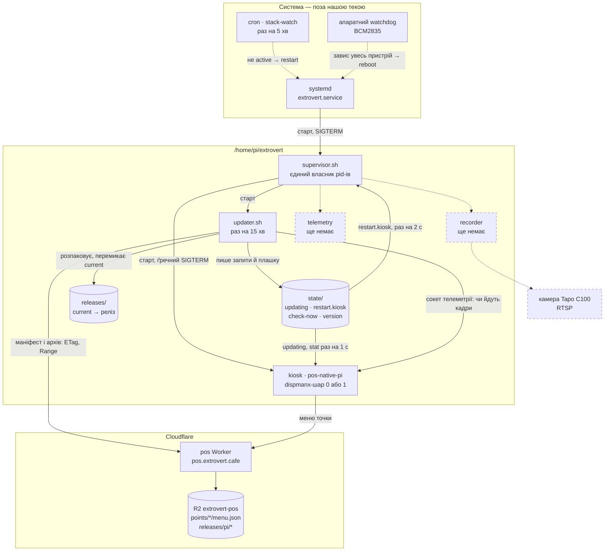
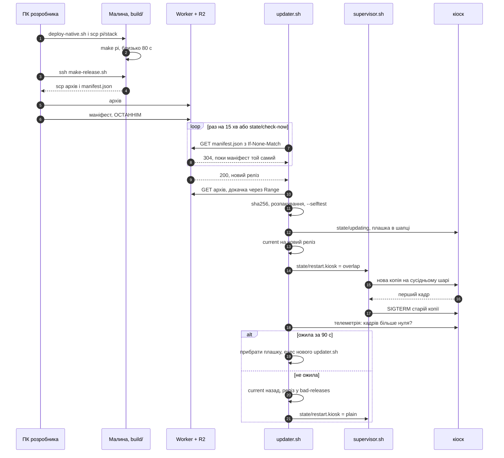

# Raspberry Pi на точці: що крутиться і як туди потрапляє нова версія

Стан на 15.09.2026. Малина стоїть у публічному коридорі й зараз **offline**,
тому все, що стосується керованого стеку, перевірено на десктопі й у
Linux-контейнері, але **не на самому пристрої** — список неперевіреного в §7.

Цей документ — карта й порядок дій. Подробиці живуть поруч:

| Де | Що |
|---|---|
| `pi/README.md` | стан пристрою, заміри, граблі, відкат на Chromium |
| `pi/stack/README.md` | нутрощі стеку: розкладка, кроки апдейтера, overlap-підміна |
| `pos-native/` | сам кіоск (C, Cairo, GLES2, dispmanx) |

Попередня редакція цього файла описувала Chromium-кіоск у 720p з
автозапуском через LXDE. Прод відтоді перейшов на `pos-native` без X
(18.08.2026); той текст лишився в історії git, а Chromium-варіант —
робочим запасним у `pi/archive/`.

---

## 1. Залізо й система

| | |
|---|---|
| Плата | Raspberry Pi 1 Model B rev 2 — ARMv6, 512 МБ, один 700 МГц |
| ОС | Raspbian 9 Stretch, ядро 4.14.79, **systemd 232**, gcc 6.3 / glibc 2.24 |
| Монітор | Asus VP227HF, 1080p (`display-hardware.md`) |
| Графіка | **без X**: `systemctl set-default multi-user.target`, кіоск малює в dispmanx-шар |
| Мережа | `ssh pi@192.168.5.45`, ключ `pos-native/.deploy/id_ed25519` (у `.gitignore`) |

`/boot/config.txt` (`pi/config.txt.snippet`) — кожен рядок тут через
конкретну поломку:

- `hdmi_group=1`, `hdmi_mode=16` — 1080p60, як монітор віддає в EDID;
- `hdmi_pixel_encoding=2` — повний RGB, інакше чорний виїздить сірим;
- `disable_overscan=1` — без нього кадр менший за екран;
- `gpu_mem=128` — **не знижувати**: на дефолтних 64 МБ кіоску забракло
  GPU-памʼяті під 1080p-поверхню, і на екрані був білий фон при живому
  процесі (постмортем 18.08.2026 у `roadmap.md`). Під overlap-підміну
  потрібно дві такі поверхні одночасно — §7.

**Watchdog.** `dtparam=watchdog=on` + systemd тримає апаратний BCM2835.
⚠️ У `pi/watchdog.conf.snippet` записано `RuntimeWatchdogUSec=14s` — саме так
параметр показує `systemctl show`, а ключ у `/etc/systemd/system.conf`
зветься `RuntimeWatchdogSec`. Невідомий ключ systemd мовчки ігнорує.
Звірити на пристрої: `systemctl show -p RuntimeWatchdogUSec` має віддати
не `0`.

**Годинник.** RTC немає, після знеструмлення час береться з `fake-hwclock`.
Дата, що зʼїхала, ламає HTTPS — і меню, і апдейтер виглядатимуть як
«немає мережі». Лікується `pi/fix-clock.sh`.

**apt.** Stretch — EOL, репозиторії в архіві: `deb.debian.org` →
`archive.debian.org` у `/etc/apt/sources.list` і
`Acquire::Check-Valid-Until "false";` в `/etc/apt/apt.conf.d/99no-check-valid`.

---

## 2. Що крутиться на точці

Усе наше — в **`/home/pi/extrovert`** і керується **одним** процесом.
systemd знає лише супервізора; склад стеку, версії й перезапуски — у нашій
теці, куди можна писати без root.



### Хто є хто

| Процес | Роль | Стан |
|---|---|---|
| `extrovert.service` | підняти супервізора й більше нічого не знати | написано |
| `supervisor.sh` | піднімає компоненти з `components.conf`, ловить падіння, виконує запити на перезапуск | написано, перевірено на десктопі |
| `pos-native-pi` (`kiosk`) | меню на екрані; плашка «Оновлення» в шапці; `--selftest` без дисплея | **прод із 18.08.2026**, поки під старим `pos-native.service` |
| `updater.sh` | раз на 15 хв питає маніфест, привозить, перевіряє, підміняє, відкочує | написано, перевірено в контейнері |
| `recorder` | буфер відео з камери (`video.md`) | рядок у `components.conf` вимкнено |
| `telemetry` | здоровʼя точки для адмінки (`admin_panel.md`) | рядок у `components.conf` вимкнено |

### Як процеси говорять між собою

| Канал | Хто пише → хто читає | Чому саме так |
|---|---|---|
| `state/restart.<компонент>` (`overlap` / `plain`) | апдейтер → супервізор | pid-ами володіє лише супервізор. Якби апдейтер гасив кіоск сам, двоє процесів билися б за одну дитину |
| `state/updating` (перший рядок — підпис) | апдейтер → кіоск | файл переживає перезапуск обох сторін, а сигнал процесу, якого саме рестартують, губиться |
| `state/check-now` | людина → апдейтер | перевірити оновлення зараз, а не через 15 хв |
| `/tmp/pos-native-<слот>.sock` | кіоск → апдейтер, супервізор | «живий» означає «кадри йдуть» (`frames_total`), а не «процес існує» |
| `DISPMANX_LAYER`, `TELEMETRY_SOCK` | супервізор → кіоск (оточення) | нова копія стартує на сусідньому шарі поруч зі старою |

### Що лежить поза `/home/pi/extrovert`

Лише системне, і змінюється вручну, а не релізом:

- `/etc/systemd/system/extrovert.service`;
- рядок крон-сторожа `stack-watch` (`pi/crontab`);
- `/boot/config.txt`, `/etc/systemd/system.conf` (§1);
- `~/scripts/start.sh` — гасить світлодіоди, юніт викликає його перед стартом.

⚠️ Новий рядок у `components.conf` і правки в `supervisor.sh` приїжджають
релізом, але **діють з наступного старту юніта** (ребут або
`systemctl restart extrovert`). Супервізор не може перезапустити себе, не
погасивши кіоск. `updater.sh` цього обмеження не має — він `exec`-ає себе з
нового релізу.

---

## 3. Деплой: від коміту до екрана

Архів збирається **на малині** (ARM, gcc 6.3), бо крос-компіляцію під
Stretch свідомо відхилено (`roadmap.md`). Заливає в R2 **ПК**: на пристрої
в коридорі немає і не має бути ключів до сховища. Точка **сама забирає**
реліз — ніхто не заходить на неї по SSH, щоб оновити.



### Один раз перед першим релізом

Роут `/releases/pi/*` у `pos/src/index.js` віддає файли з R2 і вміє
`If-None-Match` → `304` і `Range` → `206` — без першого апдейтер качав би
маніфест щоразу, без другого `curl -C -` не докачав би обірваний архів.
Перевірено на локальному `wrangler dev`, але **на прод ще не викочено**:

```bash
npm run deploy -w pos
curl -sI https://pos.extrovert.cafe/releases/pi/manifest.json   # до першого релізу — 404
```

### Кроки

Усе з `code/` на ПК. Версію релізу задає ПК, бо на малині немає git.

```bash
PI=pi@192.168.5.45
KEY=pos-native/.deploy/id_ed25519
B=/home/pi/extrovert/build
REL=$(date +%Y.%m.%d)-$(git rev-parse --short HEAD)
```

**1. Зібрати на малині.** Вихідники їдуть у `build/`, а не в `releases/` —
збірка нічого не підміняє. Поки складальна малина й кіоск — один пристрій,
`make pi` на 80 с забирає процесор, і анімації на екрані смикаються.

```bash
DEST=$B/pos-native ./pi/deploy-native.sh $PI
ssh -i $KEY $PI "mkdir -p $B/pi" && scp -r -i $KEY pi/stack $PI:$B/pi/
```

**2. Запакувати реліз.** `make-release.sh` перевіряє, що бінарник справді
ARM, і пише плаский маніфест, який апдейтер читає без `jq`.

```bash
ssh -i $KEY $PI "cd $B/pi/stack && ./make-release.sh $REL"
```

**3. Забрати на ПК і звірити.** Дешева перевірка до заливки ловить обірваний
`scp` раніше, ніж його зловить точка.

```bash
mkdir -p dist
scp -i $KEY "$PI:$B/dist/$REL.tar.gz" "$PI:$B/dist/manifest.json" dist/
grep -q "$(sha256sum dist/$REL.tar.gz | cut -d' ' -f1)" dist/manifest.json && echo "sha збігається"
```

**4. Залити в R2 — архів першим, маніфест останнім.** Навпаки — і точка
прочитає маніфест, спробує скачати архів, якого ще немає, а після трьох
таких кіл занесе реліз у `bad-releases` назавжди.

```bash
cd pos
npx wrangler r2 object put extrovert-pos/releases/pi/$REL.tar.gz --file ../dist/$REL.tar.gz --content-type application/gzip
npx wrangler r2 object put extrovert-pos/releases/pi/manifest.json --file ../dist/manifest.json --content-type application/json
cd ..
curl -s https://pos.extrovert.cafe/releases/pi/manifest.json
```

На wrangler 3 `r2 object` за замовчанням пише у справжнє сховище, на
wrangler 4 — у локальне, і там потрібен `--remote`.

**5. Дочекатись або підштовхнути.** Точка сама перевірить протягом 15 хв
плюс до хвилини джитера. Щоб не чекати, якщо є SSH:

```bash
ssh -i $KEY $PI "touch /home/pi/extrovert/state/check-now"   # підхопить за ≤ 5 с
ssh -i $KEY $PI "tail -f /home/pi/extrovert/logs/updater.log"
```

**6. Переконатись.** `state/version` має показати `$REL`, у лозі —
`нова версія жива (кадри йдуть)`. Якщо там `ВІДКОТ`, реліз уже в
`state/bad-releases` і повторно не ставитиметься: виправлення їде **новим**
релізом з новою назвою, а не перезаливкою старого.

### Що саме відбувається на точці

| Крок | Якщо не вийшло |
|---|---|
| маніфест, `If-None-Match` | тиша до наступного кола |
| архів у `.part`, до 5 спроб із докачкою | нічого не змінено; наступне коло пробує знову, після 3 невдалих кіл — `bad-releases` |
| `sha256`, розпакування в `.tmp`, атомарний `mv` | реліз одразу в `bad-releases`: архів битий, повтор не допоможе |
| **`--selftest`**: нова версія малює меню, попап, QR і плашку в памʼять | стара працює далі, реліз у `bad-releases` |
| плашка «Оновлення», 6 с | — |
| атомарна підміна симлінка `current` | — |
| **overlap**: нова копія на сусідньому шарі, стара гасне після першого кадру | тихий перехід на послідовну заміну |
| **health**: кадри за 90 с | автоматичний відкат на попередній реліз |

Selftest і health ловлять різне, і потрібні обидва. Selftest — неповний
архів, битий SVG, незлінковану бібліотеку — ще до того, як щось зачеплено:
дисплей зайнятий старою версією, тому він малює в памʼять. Health — те, що
видно лише на живому екрані: GL, dispmanx, нестачу GPU-памʼяті.

### Відкат

1. **Автоматичний** — див. таблицю вище, нічого робити не треба.
2. **Руками на попередній реліз**, якщо health пройшов, а на екрані щось не те:

   ```bash
   cd /home/pi/extrovert
   ls releases/                                  # тримаються 3 останні
   ln -sfn /home/pi/extrovert/releases/<старий> current.new && mv -Tf current.new current
   echo plain > state/restart.kiosk
   ```

   Сам апдейтер назад не перескочить, поки маніфест у R2 не зміниться: на
   `If-None-Match` він отримує `304`. Але щоб поганий реліз не повернувся
   з першою ж зміною маніфесту, допишіть його в `state/bad-releases`, а
   виправлення викотіть новим релізом.
3. **Зі стеку на старий однокомпонентний юніт** — зворотний §4:
   `systemctl disable --now extrovert`, повернути `pos-native.service.off` на
   місце, `daemon-reload`, `enable --now pos-native`, крон-рядок `kiosk-watch`.
4. **На Chromium** — `pi/README.md`, «Відкат на Chromium-кіоск».

---

## 4. Перехід на стек — один раз, коли малина буде онлайн

Сьогодні на пристрої працює `pos-native.service` + `kiosk-native.sh` із
`/home/pi/pos-native`. Перехід забирає цей бінарник як реліз `0000-adopted-…`,
тож першим екраном стеку буде рівно те, що вже висить.

1. Поставити `pi/stack` на малину, як у кроці 1 §3.
2. Розкладка й юніт:
   ```bash
   cd /home/pi/extrovert/build/pi/stack
   ./install.sh --adopt /home/pi/pos-native
   sudo install -m 0644 extrovert.service /etc/systemd/system/
   ```
3. **Прибрати старий автозапуск повністю**, а не лише вимкнути:
   ```bash
   sudo systemctl disable --now pos-native.service
   sudo mv /etc/systemd/system/pos-native.service /etc/systemd/system/pos-native.service.off
   sudo systemctl daemon-reload
   crontab -e        # kiosk-watch → stack-watch з pi/crontab
   ```
   Чому так: крон-рядок `kiosk-watch` робить `systemctl restart pos-native`, а
   `restart` піднімає й вимкнений юніт — поруч зі стеком стартував би другий
   кіоск, який не дістане шару. `mask` тут не спрацює: файл юніта лежить у
   `/etc/systemd/system`, і systemd відмовиться підміняти його симлінком.
4. `sudo systemctl enable --now extrovert.service`, далі
   `journalctl -u extrovert -f` і `cat /home/pi/extrovert/state/version`.
5. Перевірити кадри: `nc -U /tmp/pos-native-0.sock`.
6. Прогнати §3 двічі: з навмисно битим релізом (прибраний шрифт з
   `assets/` — selftest має відмовити) і з нормальним (плашка, підміна
   без чорного екрана). Заодно закрити пункти §7.

---

## 5. Живлення, overlay і самооновлення

Раптове знеструмлення — штатна ситуація для точки в коридорі. Звична
відповідь — overlay FS, коли корінь стає read-only, а записи живуть у RAM
до ребуту. **Для самооновлення це пастка:** усе, що апдейтер пише в
`/home/pi/extrovert`, під overlay зникає при першому ж ребуті. Точка
щоразу прокидалася б на старому релізі, наново качала оновлення й губила
`bad-releases`, тобто могла б по колу ставити реліз, від якого вже
відкотилась.

Варіанти, рішення ще не прийняте (`roadmap.md`, відкриті питання):

| | Плюс | Мінус |
|---|---|---|
| Без overlay: журнал ext4, watchdog, `fsck` при старті | нічого не міняти | картка зношується, а биту FS після блекаута лікувати на місці |
| Overlay на корінь, `/home/pi/extrovert` — окремий rw-розділ або USB-флешка | системне незмінне, наше живе | ще одна точка відмови; флешку однаково планують під буфер відео (крок 1-біс) |

Атомарність самого оновлення від цього не залежить: `mv` симлінка — одна
операція, а обірване завантаження лишається `.part` поза `releases/`.
Питання лише в тому, чи переживе ребут те, що вже записано.

Перед встановленням: п'ять разів висмикнути живлення посеред роботи — і
один раз **посеред оновлення**. Щоразу точка має піднятись у меню сама.

---

## 6. Запасні варіанти

- **Chromium-кіоск** — `pi/archive/kiosk-chromium.sh`, `pi/deploy.sh`,
  порядок відкату в `pi/README.md`. На Pi 1 він тягне лише одноразові
  анімації: нескінченна `transform`-анімація дає 0,5 fps (`CLAUDE.md`).
- **Статична картинка без X і без браузера**, якщо не підніметься жоден
  кіоск: `sudo apt install fbi`, у `/etc/rc.local` перед `exit 0` —
  `fbi -T 1 -d /dev/fb0 -noverbose -a /home/pi/menu.png &`. Ціни тоді
  лишаються картинкою, але міняються по `scp`, без поїздки.

---

## 7. Чого ще не знаємо

Перевірити, щойно малина буде онлайн:

1. **GPU-памʼять на overlap** — дві 1080p-поверхні при `gpu_mem=128`.
   Не вистачить — спрацює перехід на послідовну заміну з коротким чорним
   екраном. Міряти `vcgencmd get_mem malloc` під час підміни.
2. **Скільки триває вікно підміни на Pi 1.** На десктопі до першого кадру
   ~0,5 с, на малині EGL і шрифти помітно довші. Від цього залежить, чи
   вкладається overlap у свої 25 с.
3. **Пастка `bcm_host_init` при двох dispmanx-клієнтах одночасно.** Теоретично
   це штатний режим (так живе omxplayer), але саме на цьому залізі зупинка X
   на живій сесії вже вішала VideoCore до ребуту.
4. **Watchdog** — чи справді ввімкнений (§1).
5. **Реальний `curl` 7.52 на Stretch** проти роуту `/releases/pi/*`. Логіку
   апдейтера (selftest, відкат, успіх, повтор після обриву, `304`, битий
   sha) прогнано в Linux-контейнері, але `curl` там підміняла заглушка;
   справжній `curl` проти роуту перевірено лише з ПК.
6. **Доба з кількома оновленнями поспіль**, включно з битим релізом і
   висмикнутим живленням посеред підміни.
