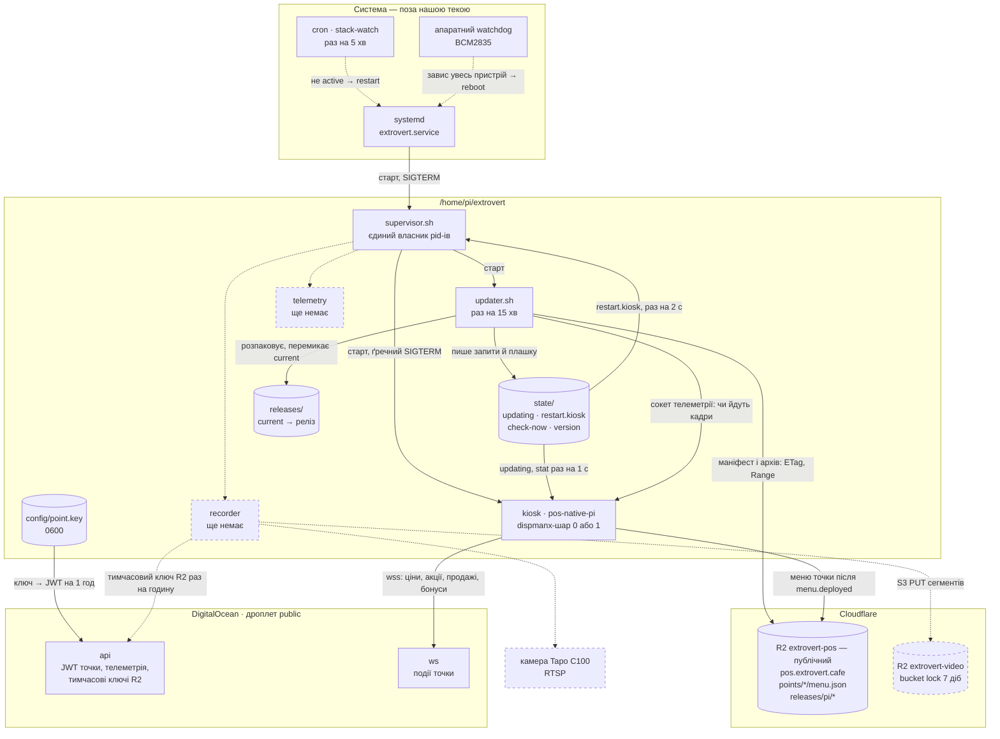
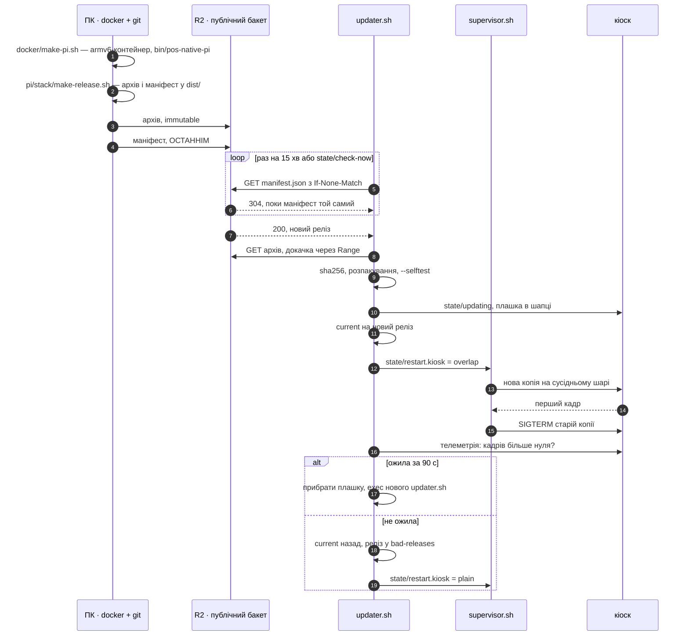

# Raspberry Pi на точці: що крутиться і як туди потрапляє нова версія

Стан на 17.09.2026. Малина стоїть у публічному коридорі й зараз **offline**,
тому все, що стосується керованого стеку, перевірено на десктопі й у
Linux-контейнері, але **не на самому пристрої** — список неперевіреного в §7.

Цей документ — карта й порядок дій. Подробиці живуть поруч:

| Де | Що |
|---|---|
| `pi/README.md` | стан пристрою, заміри, граблі |
| `pi/stack/README.md` | нутрощі стеку: розкладка, кроки апдейтера, overlap-підміна |
| `pos-native/` | сам кіоск (C, Cairo, GLES2, dispmanx) і контейнер, що його збирає |

Кіоск на точці один — нативний `pos-native`. Браузера на пристрої немає:
ні як прод, ні як запасний варіант, ні як сторінка, яку можна відкрити.
Запасний варіант — статична картинка (§6).

---

## 1. Залізо й система

| | |
|---|---|
| Плата | Raspberry Pi 1 Model B rev 2 — ARMv6, 512 МБ, один 700 МГц |
| ОС | Raspbian 9 Stretch, ядро 4.14.79, **systemd 232**, gcc 6.3 / glibc 2.24 |
| Монітор | Asus VP227HF, 1080p (`display-hardware.md`) |
| Графіка | **без X**: `systemctl set-default multi-user.target`, кіоск малює в dispmanx-шар |
| Мережа | `ssh pi@192.168.5.45`, ключ `pos-native/.deploy/id_ed25519` (у `.gitignore`) |

`/boot/config.txt` (`pi/config.txt.snippet`) — кожен рядок тут через
конкретну поломку:

- `hdmi_group=1`, `hdmi_mode=16` — 1080p60, як монітор віддає в EDID;
- `hdmi_pixel_encoding=2` — повний RGB, інакше чорний виїздить сірим;
- `disable_overscan=1` — без нього кадр менший за екран;
- `gpu_mem=128` — **не знижувати**: на дефолтних 64 МБ кіоску забракло
  GPU-памʼяті під 1080p-поверхню, і на екрані був білий фон при живому
  процесі (постмортем 18.08.2026 у `roadmap.md`). Під overlap-підміну
  потрібно дві такі поверхні одночасно — §7.

**Watchdog.** `dtparam=watchdog=on` + systemd тримає апаратний BCM2835.
⚠️ У `pi/watchdog.conf.snippet` записано `RuntimeWatchdogUSec=14s` — саме так
параметр показує `systemctl show`, а ключ у `/etc/systemd/system.conf`
зветься `RuntimeWatchdogSec`. Невідомий ключ systemd мовчки ігнорує.
Звірити на пристрої: `systemctl show -p RuntimeWatchdogUSec` має віддати
не `0`.

**Тихе завантаження.** Між подачею живлення і меню клієнт не має бачити ні
логів ядра, ні райдужного квадрата прошивки, ні курсора, що блимає. Три
місця:

| Де | Що дописати | Що гасить |
|---|---|---|
| `/boot/cmdline.txt` (один рядок!) | `quiet loglevel=3 logo.nologo vt.global_cursor_default=0 consoleblank=0 systemd.show_status=false` | потік ядра, малину в кутку, курсор, засинання консолі, рядки `[ OK ]` від systemd |
| `/boot/config.txt` | `disable_splash=1` | райдужний квадрат прошивки |
| `/etc/rc.local` | `fbi` зі статичним меню (§6) | чорний екран до першого кадру кіоска |

`consoleblank=0` тут не про тишу, а про вітрину: за замовчанням консоль
гасить екран через 10 хвилин, і монітор у коридорі чорнів би доти, доки
кіоск не перемалює кадр.

Getty на `tty1` лишається — це єдині двері з клавіатурою, якщо мережа
відвалилась. Видно його не буде: кіоск малює у dispmanx-шар **поверх**
фреймбуфера, тобто консоль просто нижче.

**Годинник.** RTC немає, після знеструмлення час береться з `fake-hwclock`.
Дата, що зʼїхала, ламає HTTPS — і меню, і апдейтер виглядатимуть як
«немає мережі». Лікується `pi/fix-clock.sh`.

**apt.** Stretch — EOL, репозиторії в архіві: `deb.debian.org` →
`archive.debian.org` у `/etc/apt/sources.list` і
`Acquire::Check-Valid-Until "false";` в `/etc/apt/apt.conf.d/99no-check-valid`.

---

## 2. Що крутиться на точці

Усе наше — в **`/home/pi/extrovert`** і керується **одним** процесом.
systemd знає лише супервізора; склад стеку, версії й перезапуски — у нашій
теці, куди можна писати без root.



### Хто є хто

| Процес | Роль | Стан |
|---|---|---|
| `extrovert.service` | підняти супервізора й більше нічого не знати | написано |
| `supervisor.sh` | піднімає компоненти з `components.conf`, ловить падіння, виконує запити на перезапуск | написано, перевірено на десктопі |
| `pos-native-pi` (`kiosk`) | меню на екрані; QR бонусів і нові ціни за подіями з `ws`; плашка «Оновлення» в шапці; `--selftest` без дисплея | **прод із 18.08.2026**, поки під старим `pos-native.service`; вебсокета ще немає |
| `updater.sh` | раз на 15 хв питає маніфест, привозить, перевіряє, підміняє, відкочує | написано, перевірено в контейнері |
| `recorder` | буфер відео з камери, вивантаження в R2 тимчасовим ключем (`video.md`) | рядок у `components.conf` вимкнено |
| `telemetry` | здоровʼя точки для адмінки (`admin_panel.md`) | рядок у `components.conf` вимкнено |

Телеметрія пишеться на **POSIX sh + curl**, як і решта стеку. Не на Python:
інтерпретатор на цьому залізі — це 30+ МБ RSS і секунди на старт заради
трьох `cat` з `/proc`, а pip на Stretch давно поза підтримкою. Усе, що
треба, віддають `vcgencmd` (температура, тротлінг, вільна GPU-памʼять),
`/proc/loadavg`, `/proc/meminfo`, `df`, `uptime` і сокет кіоска
(`frames_total`, fps). JSON збирається `printf`, летить одним
`curl -X POST` з JWT точки; не долетів — і добре, наступний цикл везе
свіжий знімок, а не чергу застарілих.

### Як процеси говорять між собою

| Канал | Хто пише → хто читає | Чому саме так |
|---|---|---|
| `state/restart.<компонент>` (`overlap` / `plain`) | апдейтер → супервізор | pid-ами володіє лише супервізор. Якби апдейтер гасив кіоск сам, двоє процесів билися б за одну дитину |
| `state/updating` (перший рядок — підпис) | апдейтер → кіоск | файл переживає перезапуск обох сторін, а сигнал процесу, якого саме рестартують, губиться |
| `state/check-now` | людина → апдейтер | перевірити оновлення зараз, а не через 15 хв |
| `/tmp/pos-native-<слот>.sock` | кіоск → апдейтер, супервізор | «живий» означає «кадри йдуть» (`frames_total`), а не «процес існує» |
| `DISPMANX_LAYER`, `TELEMETRY_SOCK` | супервізор → кіоск (оточення) | нова копія стартує на сусідньому шарі поруч зі старою |
| `config/point.key` | адмінка → малина (ротація через обмін токена, перший ключ — по SSH) → кіоск, recorder | ключ можна відкликати й замінити без поїздки; у релізі й `config/env` його немає, бо релізи публічні (`services.md` §3) |
| вебсокет `point:<id>` | `ws` → кіоск | ціни, акції, QR бонусу й його зникнення приходять одразу, а після обриву кіоск бере знімок стану (`services.md` §4) |

### Що лежить поза `/home/pi/extrovert`

Лише системне, і змінюється вручну, а не релізом:

- `/etc/systemd/system/extrovert.service`;
- рядок крон-сторожа `stack-watch` (`pi/crontab`);
- `/boot/config.txt`, `/etc/systemd/system.conf` (§1);
- `~/scripts/start.sh` — гасить світлодіоди, юніт викликає його перед стартом.

⚠️ Новий рядок у `components.conf` і правки в `supervisor.sh` приїжджають
релізом, але **діють з наступного старту юніта** (ребут або
`systemctl restart extrovert`). Супервізор не може перезапустити себе, не
погасивши кіоск. `updater.sh` цього обмеження не має — він `exec`-ає себе з
нового релізу.

---

## 3. Деплой: від коміту до екрана

Малина не компілює нічого. ARM-бінарник збирає контейнер на ПК
(`pos-native/docker/pi.Dockerfile`): усередині той самий Raspbian Stretch
під armv6, тобто ті самі gcc 6.3 і glibc 2.24, що на пристрої. Там же
пакується архів релізу, звідти ж він їде в R2. Точці лишається завантажити,
перевірити й перемкнути симлінк.

Чому не на самій малині, як було до 18.09.2026: `make pi` на цьому процесорі —
80 секунд при 100 % завантаження, і всі 80 секунд меню смикається на очах
у клієнта. Чому не крос-компіляція хостовим gcc: розбіжність хедерів і
символів glibc — рівно те, через що крос-sysroot свого часу й відхилили
(`roadmap.md`). QEMU повільніший за крос-тулчейн, але це **чужий** процесор,
не той, що показує меню.

Заливає в R2 теж ПК: на пристрої в коридорі немає і не має бути ключів до
сховища релізів (recorder отримує лише тимчасовий ключ на префікс відео
своєї точки, `services.md` §3). Точка **сама забирає** реліз — ніхто не
заходить на неї по SSH, щоб оновити.



### Один раз перед першим релізом

Нашого коду між точкою й релізом немає: бакет `extrovert-pos` привʼязаний до
`pos.extrovert.cafe` і публічний на читання. `ETag` → `304` і `Range` → `206`
дає сам Cloudflare: без першого апдейтер качав би маніфест щоразу, без
другого `curl -C -` не докачав би обірваний архів.

- старий Worker `extrovert-pos` **досі відповідає** на `pos.extrovert.cafe`
  (`/` → 302 на `/p/kyiv-01`, перевірено 18.09.2026): код прибрано з
  репозиторію, але не з Cloudflare. Видалити Worker разом із його доменом і
  лише потім привʼязувати домен до бакета — інакше відповідатиме й далі він;
- ключі на **запис** — у `pos/.env` (`R2_ENDPOINT`, `R2_BUCKET`,
  `R2_ACCESS_KEY_ID`, `R2_SECRET_ACCESS_KEY`); на малині їх немає й не буде;
- на пристрої — рантайм-бібліотеки, проти яких злінкований бінарник:
  `libcairo2`, `libpango1.0-0`, `librsvg2-2`, `libcurl3`, `libpng16-16`,
  `libfontconfig1`. Пакети `-dev` і gcc там більше не потрібні взагалі;
- на ПК — `docker` з binfmt під armv6 (Docker Desktop вмикає його сам; на
  голому Linux — `qemu-user-static`).

```bash
curl -sI https://pos.extrovert.cafe/releases/pi/manifest.json   # до першого релізу — 404
```

### Кроки

Усе з `code/` на ПК. Малина в кроках 1–3 не бере участі взагалі.

**1. Зібрати ARM-бінарник у контейнері.** Перший запуск ще й збирає образ
(кілька хвилин), далі лишається тільки сам gcc під QEMU.

```bash
./pos-native/docker/make-pi.sh        # → pos-native/bin/pos-native-pi (ARM)
```

**2. Запакувати реліз.** Версію задає ПК — на малині немає git.
`make-release.sh` перевіряє, що бінарник справді ARM (сплутати з десктопним
легко: обидва лежать у `bin/`), і пише плаский маніфест, який апдейтер
читає без `jq`.

```bash
./pi/stack/make-release.sh            # → dist/<дата>-<хеш>.tar.gz + manifest.json
```

**3. Залити в R2 — архів першим, маніфест останнім.** Навпаки — і точка
прочитає маніфест, піде по архів, якого ще немає, а після трьох таких кіл
занесе реліз у `bad-releases` назавжди. Порядок зашитий у скрипт; він же
звіряє sha256 архіву з маніфестом **до** заливки — обірваний файл дешевше
зловити тут, ніж на точці.

```bash
npm run release:push -w pos
curl -s https://pos.extrovert.cafe/releases/pi/manifest.json
```

**4. Дочекатись або підштовхнути.** Точка сама перевірить протягом 15 хв
плюс до хвилини джитера. Щоб не чекати, якщо є SSH:

```bash
PI=pi@192.168.5.45; KEY=pos-native/.deploy/id_ed25519
ssh -i $KEY $PI "touch /home/pi/extrovert/state/check-now"   # підхопить за ≤ 5 с
ssh -i $KEY $PI "tail -f /home/pi/extrovert/logs/updater.log"
```

**5. Переконатись.** `state/version` має показати новий реліз, у лозі —
`нова версія жива (кадри йдуть)`. Якщо там `ВІДКОТ`, реліз уже в
`state/bad-releases` і повторно не ставитиметься: виправлення їде **новим**
релізом з новою назвою, а не перезаливкою старого.

### Що саме відбувається на точці

| Крок | Якщо не вийшло |
|---|---|
| маніфест, `If-None-Match` | тиша до наступного кола |
| архів у `.part`, до 5 спроб із докачкою | нічого не змінено; наступне коло пробує знову, після 3 невдалих кіл — `bad-releases` |
| `sha256`, розпакування в `.tmp`, атомарний `mv` | реліз одразу в `bad-releases`: архів битий, повтор не допоможе |
| **`--selftest`**: нова версія малює меню, попап, QR і плашку в памʼять | стара працює далі, реліз у `bad-releases` |
| плашка «Оновлення», 6 с | — |
| атомарна підміна симлінка `current` | — |
| **overlap**: нова копія на сусідньому шарі, стара гасне після першого кадру | тихий перехід на послідовну заміну |
| **health**: кадри за 90 с | автоматичний відкат на попередній реліз |

Selftest і health ловлять різне, і потрібні обидва. Selftest — неповний
архів, битий SVG, незлінковану бібліотеку — ще до того, як щось зачеплено:
дисплей зайнятий старою версією, тому він малює в памʼять. Health — те, що
видно лише на живому екрані: GL, dispmanx, нестачу GPU-памʼяті.

### Відкат

1. **Автоматичний** — див. таблицю вище, нічого робити не треба.
2. **Руками на попередній реліз**, якщо health пройшов, а на екрані щось не те:

   ```bash
   cd /home/pi/extrovert
   ls releases/                                  # тримаються 3 останні
   ln -sfn /home/pi/extrovert/releases/<старий> current.new && mv -Tf current.new current
   echo plain > state/restart.kiosk
   ```

   Сам апдейтер назад не перескочить, поки маніфест у R2 не зміниться: на
   `If-None-Match` він отримує `304`. Але щоб поганий реліз не повернувся
   з першою ж зміною маніфесту, допишіть його в `state/bad-releases`, а
   виправлення викотіть новим релізом.
3. **Зі стеку на старий однокомпонентний юніт** — зворотний §4:
   `systemctl disable --now extrovert`, повернути `pos-native.service.off` на
   місце, `daemon-reload`, `enable --now pos-native`, крон-рядок `kiosk-watch`.
4. **Якщо не піднімається жоден кіоск** — статична картинка, §6. Це не
   відкат коду, а спосіб не лишити вітрину чорною, поки їдеш на точку.

---

## 4. Перехід на стек — один раз, коли малина буде онлайн

Сьогодні на пристрої працює `pos-native.service` + `kiosk-native.sh` із
`/home/pi/pos-native`. Перехід забирає цей бінарник як реліз `0000-adopted-…`,
тож першим екраном стеку буде рівно те, що вже висить.

1. Поставити `pi/stack` на малину, як у кроці 1 §3.
2. Розкладка й юніт:
   ```bash
   cd /home/pi/extrovert/build/pi/stack
   ./install.sh --adopt /home/pi/pos-native
   sudo install -m 0644 extrovert.service /etc/systemd/system/
   ```
3. **Прибрати старий автозапуск повністю**, а не лише вимкнути:
   ```bash
   sudo systemctl disable --now pos-native.service
   sudo mv /etc/systemd/system/pos-native.service /etc/systemd/system/pos-native.service.off
   sudo systemctl daemon-reload
   crontab -e        # kiosk-watch → stack-watch з pi/crontab
   ```
   Чому так: крон-рядок `kiosk-watch` робить `systemctl restart pos-native`, а
   `restart` піднімає й вимкнений юніт — поруч зі стеком стартував би другий
   кіоск, який не дістане шару. `mask` тут не спрацює: файл юніта лежить у
   `/etc/systemd/system`, і systemd відмовиться підміняти його симлінком.
4. `sudo systemctl enable --now extrovert.service`, далі
   `journalctl -u extrovert -f` і `cat /home/pi/extrovert/state/version`.
5. Перевірити кадри: `nc -U /tmp/pos-native-0.sock`.
   Коли зʼявиться `api`: ключ точки з адмінки покласти по SSH у
   `/home/pi/extrovert/config/point.key` з правами `0600` — це єдиний раз,
   коли ключ їде не через ротацію.
6. Прогнати §3 двічі: з навмисно битим релізом (прибраний шрифт з
   `assets/` — selftest має відмовити) і з нормальним (плашка, підміна
   без чорного екрана). Заодно закрити пункти §7.

---

## 5. Живлення, overlay і самооновлення

Раптове знеструмлення — штатна ситуація для точки в коридорі. Звична
відповідь — overlay FS, коли корінь стає read-only, а записи живуть у RAM
до ребуту. **Наївний overlay на все — пастка:** усе, що апдейтер пише в
`/home/pi/extrovert`, зникало б при першому ж ребуті. Точка щоразу
прокидалася б на старому релізі, наново качала оновлення й губила
`bad-releases`, тобто могла б по колу ставити реліз, від якого вже
відкотилась.

**Рішення (18.09.2026): overlay на корінь, `/home/pi/extrovert` — окремий
розділ, змонтований rw.** Системне стає незмінним і переживає будь-яке
висмикування шнура; наше лишається записуваним рівно в одному місці — саме
там живуть релізи, `state/` і ключ точки.

Як робиться (один раз, при налаштуванні картки):

1. Окремий розділ на тій самій SD (ext4; 4 ГБ вистачає: три релізи по ~11 МБ,
   логи, `state/`) — або USB-флешка, якщо вона однаково стоятиме під буфер
   відео (`video.md`).
2. Рядок у `/etc/fstab`:
   `/dev/mmcblk0p3  /home/pi/extrovert  ext4  defaults,noatime  0  2`.
3. `sudo raspi-config nonint enable_overlayfs` (у меню — Performance →
   Overlay FS), ребут. Корінь стає read-only, `/boot` теж — це навмисно:
   `config.txt` і `cmdline.txt` міняються рідко й лише руками.
4. Перевірка, що наш розділ справді не під overlay:
   `mount | grep extrovert` має показати `ext4 (rw`, а не `overlay`.

Що це міняє в експлуатації: правка системного файла (юніт, крон, `fstab`)
тепер вимагає `disable_overlayfs` + ребут, правку, `enable_overlayfs` +
ребут. Релізів це не стосується — вони їдуть у rw-розділ і ставляться, поки
корінь замкнений. Саме тому системного поза `/home/pi/extrovert` лишили
рівно чотири файли (§2): що рідше туди лізти, то дешевше overlay.

Атомарність самого оновлення від overlay не залежить: `mv` симлінка — одна
операція, а обірване завантаження лишається `.part` поза `releases/`.

Перед встановленням: п'ять разів висмикнути живлення посеред роботи — і
один раз **посеред оновлення**. Щоразу точка має піднятись у меню сама.

---

## 6. Запасний варіант — статична картинка

Один, і це не кіоск: якщо `pos-native` не піднімається взагалі, екран
показує PNG з меню. Браузерного запасного кіоска немає — на цьому залізі
він коштував дорожче, ніж давав (`roadmap.md`).

```bash
sudo apt install fbi
# /etc/rc.local, перед exit 0:
fbi -T 1 -d /dev/fb0 -noverbose -a /home/pi/menu.png &
```

Картинка малюється у фреймбуфер, кіоск — у dispmanx-шар **поверх** нього.
Тому та сама команда робить дві роботи: до першого кадру кіоска заповнює
екран замість чорноти (§1, тихе завантаження), а якщо кадру так і не буде —
лишається як вітрина. Ціни тоді міняються `scp`-ом картинки, без поїздки,
але вже без QR і акцій.

---

## 7. Чого ще не знаємо

Перевірити, щойно малина буде онлайн:

1. **GPU-памʼять на overlap** — дві 1080p-поверхні при `gpu_mem=128`.
   Не вистачить — спрацює перехід на послідовну заміну з коротким чорним
   екраном. Міряти `vcgencmd get_mem malloc` під час підміни.
2. **Скільки триває вікно підміни на Pi 1.** На десктопі до першого кадру
   ~0,5 с, на малині EGL і шрифти помітно довші. Від цього залежить, чи
   вкладається overlap у свої 25 с.
3. **Пастка `bcm_host_init` при двох dispmanx-клієнтах одночасно.** Теоретично
   це штатний режим (так живе omxplayer), але саме на цьому залізі зупинка X
   на живій сесії вже вішала VideoCore до ребуту.
4. **Watchdog** — чи справді ввімкнений (§1).
5. **Реальний `curl` 7.52 на Stretch** проти публічного бакета. Логіку
   апдейтера (selftest, відкат, успіх, повтор після обриву, `304`, битий
   sha) прогнано в Linux-контейнері, але `curl` там підміняла заглушка;
   справжній `curl` проти бакета перевірено лише з ПК.
6. **Доба з кількома оновленнями поспіль**, включно з битим релізом і
   висмикнутим живленням посеред підміни.
