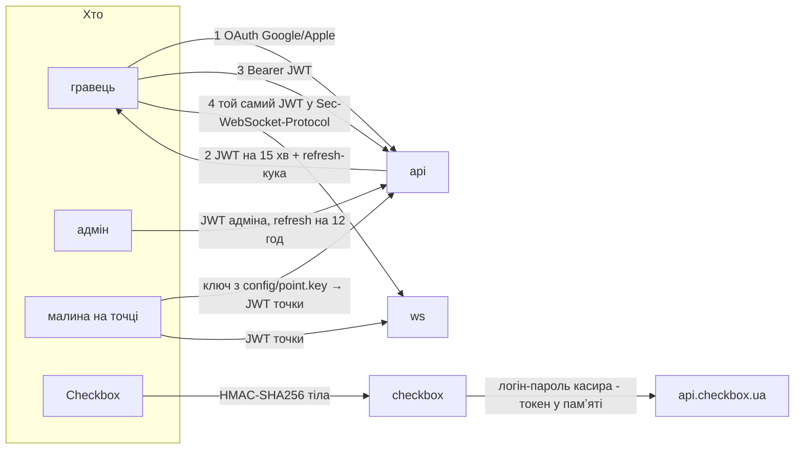

# Сервіси: хто де живе, як спілкується, як доводить, що це він

Стан на 17.09.2026. Повна картина під те, що вже вирішено доками
гейміфікації, адмінки й відео. Перша коротка схема архітектури (серпень,
Vue й Laravel Filament) цим документом замінена й видалена.
Половина з цього ще не написана: що саме заглушка, позначено в §5.

---

## 1. Загальна картина

```mermaid
graph TB
    subgraph edge["Точка (Raspberry Pi, /home/pi/extrovert)"]
        KIOSK["kiosk<br/>pos-native, C+GLES2<br/>dispmanx, без X"]
        UPD["updater<br/>оновлює стек сам"]
        REC["recorder<br/>ffmpeg -c copy (план)"]
        SUP["supervisor"]
        SUP --- KIOSK
        SUP --- UPD
        SUP --- REC
    end

    subgraph cf["Cloudflare: статика й переадресація"]
        CLIENT["client<br/>React SPA, гравець<br/>extrovert.cafe"]
        ADMIN["admin<br/>React + amCharts5"]
        QRR["qr.extrovert.cafe<br/>правило, 302 без коду"]
    end

    STK["QR-наклейка на автоматі<br/>qr.extrovert.cafe?p=1"]

    subgraph pub["Дроплет public (2 vCPU / 4 ГБ)"]
        API["api :3001<br/>REST, JWT, фонові роботи"]
        WS["ws :3002<br/>вебсокет"]
        CB["checkbox :3003<br/>вебхук + опитування ПРРО"]
        OVS["overseer<br/>без вхідних портів"]
        SCHED["scheduler<br/>фонові роботи за розкладом"]
        PG[("Postgres")]
        RD[("Redis")]
        GT["GlitchTip"]
    end

    subgraph ana["Дроплет analysis (1 vCPU / 2 ГБ, без публічних портів)"]
        WRK["worker<br/>детекція 2 fps"]
        DEP["deployer<br/>Playwright → Jetinno<br/>(під питанням)"]
    end

    subgraph r2["Cloudflare R2"]
        R2M["menu + releases<br/>публічний бакет, pos.extrovert.cafe"]
        R2V["video 7 діб, bucket lock"]
        R2E["evidence"]
    end

    subgraph ext["Зовнішні"]
        CBAPI["Checkbox API<br/>api.checkbox.ua"]
        CF["Cloudflare API<br/>тимчасові ключі R2"]
        OAUTH["Google / Apple"]
        MONO["mono pay"]
        NP["Нова Пошта API"]
        TG["Telegram"]
        JET["портал Jetinno"]
    end

    KIOSK -->|"меню з публічного бакета, ETag"| R2M
    KIOSK -->|"wss, JWT точки: ціни, акції, продажі, бонуси"| WS
    KIOSK -->|"телеметрія, JWT точки"| API
    UPD -->|"маніфест і архіви, ETag, Range"| R2M
    REC -->|"тимчасовий доступ, раз на годину"| API
    REC -->|"S3 PUT з тимчасовим ключем"| R2V
    API -->|"temp-access-credentials"| CF
    STK -.->|"скан телефоном"| QRR
    QRR -->|"302, ?p= зберігається"| CLIENT
    CLIENT -->|"REST, Bearer JWT"| API
    CLIENT -->|"wss, той самий JWT"| WS
    ADMIN -->|"REST, JWT адміна"| API
    CBAPI -->|"вебхук, HMAC"| CB
    CB -->|"чеки за датою, раз на хвилину"| CBAPI
    CB --> PG
    API --> PG
    WS -->|"subscribe"| RD
    API -->|"бот підтримки: sendMessage"| TG
    TG -->|"вебхук підтримки, secret_token"| API
    SCHED --> PG
    SCHED -->|"outbox → PUBLISH"| RD
    SCHED -->|"довідник, ТТН, трекінг"| NP
    SCHED -->|"ціни в каталог"| CBAPI
    SCHED -->|"меню точок"| R2M
    DEP -->|"черга деплоїв"| PG
    DEP -.->|"ціни, якщо знадобиться"| JET
    OVS --> PG
    OVS -->|"лише вихідні"| TG
    CLIENT -->|"кнопка Підтримка → t.me"| TG
    WRK -->|"SKIP LOCKED"| PG
    WRK --> R2V
    WRK --> R2E
    CLIENT -->|"логін"| OAUTH
    CLIENT -->|"скіни, крейти"| MONO
    SCHED -.-> GT
    KIOSK -.-> GT
    CLIENT -.-> GT
    ADMIN -.-> GT
    API -.-> GT
    CB -.-> GT
    WS -.-> GT
    WRK -.-> GT
```



---

## 2. Хто де крутиться і чому саме там

| Що | Де | Чому не деінде |
|---|---|---|
| `kiosk`, `updater`, `recorder` | Raspberry Pi на точці | екран і камера фізично тут; запис має пережити обрив звʼязку |
| `client`, фронт `admin` | Cloudflare Workers | статика, нуль обслуговування, близько до користувача |
| `qr.extrovert.cafe` | Cloudflare, правило переадресації, без коду | адреса надрукована на наклейці й не міняється ніколи; куди вона веде — міняємо будь-коли (`urls.md`) |
| `api`, `ws`, `checkbox` | дроплет `public` | мають публічний порт і стан |
| `scheduler` | дроплет `public`, **без вхідних портів** | усе, що робиться за розкладом, а не у відповідь на запит (нижче) |
| `overseer` | дроплет `public`, **без жодного вхідного порту** | лише шле в Telegram; навіть якщо колись читатиме команди, `getUpdates` — теж вихідне зʼєднання |
| `worker` (відео), `deployer` (під питанням) | дроплет `analysis` | нестабільне навантаження **фізично** не має дотягуватись до кіоска (`video.md`); Chromium для Playwright — те саме |
| Postgres, Redis | дроплет `public`, лише петля | керована база відкладена; умови переїзду — `video.md` |
| відео | R2, приватний бакет | вихідний трафік безкоштовний, lifecycle робить ротацію за нас |
| меню точок і релізи малини | R2, **публічний бакет** із доменом `pos.extrovert.cafe` | і те, і те публічне за визначенням: меню висить на екрані, у релізі немає секретів. Cloudflare віддає їх із кеша, з `ETag` і `Range`, тож ні Worker, ні токен не потрібні (`urls.md`) |
| спрайти кавенятка | у коді `client`, static assets Worker'а | їдуть разом зі збіркою; Vite дає файлам хеш у назві, тож новий спрайт — новий файл, а решта лишається в кеші |

**Фронт адмінки — теж на Workers** (17.09.2026). Довгі запити до Postgres і
закешовані агрегати, через які адмінку раніше ставили поруч із базою,
живуть в `api`, а не у фронті. Фронту лишається бути статикою, як і `client`.

**Worker точки більше немає** (18.09.2026). Меню віддає публічний бакет R2 з
власним доменом — статичний файл, який Cloudflare і так кешує, з `ETag` і
`Range`. Кіоску для цін не потрібен ні наш бекенд, ні токен; авторизація
лишилась рівно там, де вона щось захищає: вебсокет, телеметрія і тимчасові
ключі R2 для запису відео.

### Фонові роботи — окремий сервіс `scheduler`

Усе, що робиться **за розкладом, а не у відповідь на запит**, живе в окремому
сервісі (рішення 18.09.2026). Причини прості: такі роботи не мають конкурувати
за процес з живими запитами гравців, їх видно окремо в логах і GlitchTip, і
перезапустити їх можна, не чіпаючи `api`. Блокування — `lock:<job>` у Redis,
курсори — `sync_cursors` у Postgres, тож дві копії сервісу не роблять те саме.

| Робота | Де | Як часто |
|---|---|---|
| публікатор `outbox` → Redis | `scheduler` | безперервно, `SKIP LOCKED` |
| довідник міст і відділень НП | `scheduler` | раз на добу, вночі |
| трекінг відправлень НП | `scheduler` | раз на годину, лише активні |
| деплой цін і акцій: R2, Checkbox | `scheduler` (або `deployer`, якщо знадобиться Playwright) | за чергою (§4) |
| агрегати для дашбордів адмінки | `scheduler` | за розкладом, у кеш |
| опитування чеків Checkbox | `checkbox` | раз на хвилину: там і токен касира, і вся логіка ПРРО (§4) |
| здоровʼя точок і алерти в Telegram | `overseer` | як і було |

---

## 3. Автентифікація: кожна стрілка окремо



### Один токен на обидва бекенди

Уся автентифікація людей і пристроїв зводиться до **одного JWT**, який
приймають і `api`, і `ws` (рішення 17.09.2026). Клієнт тримає один доступ, а
не сесію для REST плюс окремий квиток для вебсокета.

- **Підписує лише `api`** (Ed25519), `ws` лише перевіряє публічним ключем.
  Злам `ws` не дає випускати токени.
- **Access JWT живе 15 хвилин** і лежить у памʼяті застосунку. Claims:
  `sub` (`user:<uuid>`, `admin:<uuid>` або `device:<id>`), `role`, `point`
  для пристрою, `exp`.
- **Refresh-сесія** — httpOnly-кука на `api.extrovert.cafe` і рядок
  `sess:<id>` у Redis: 30 діб для гравця, 12 годин для адміна. Клієнт на
  `extrovert.cafe` і `api` на піддомені — один сайт для `SameSite`, тож кука
  ходить без `SameSite=None`. Вихід чи бан — видалити `sess:<id>`: за ≤15 хв
  доступ зникне сам.

Логін гравця — лише Google/Apple (`gamification_ui.md`), метч за email між
провайдерами; тому `user_identities` окремою таблицею. Пароля в нас немає
взагалі: це свідоме зняття з себе зберігання секретів.

### Вебсокет: JWT у `Sec-WebSocket-Protocol`

Браузер не дає поставити на `WebSocket` заголовок `Authorization`, але дає
перелік підпротоколів — і це заголовок, а не URL:

```js
new WebSocket("wss://ws.extrovert.cafe/v1/me", ["extrovert.v1", "jwt." + accessToken]);
```

- `ws` дістає токен із другого значення, перевіряє й **повертає в
  відповіді лише `extrovert.v1`**. Без повернутого підпротоколу браузер
  закриє зʼєднання; повертати сам токен — значить злити його в заголовки
  відповіді.
- Від чужих очей токен захищає TLS (`wss`), як і будь-який інший
  заголовок. Виграш проти `?token=` у URL у тому, що URL осідають в
  access-логах, історії й `Referer`, а заголовок підпротоколу — ні.
- JWT складається з base64url і крапок — це допустимі символи для
  значення підпротоколу.
- Коли спливає `exp`, `ws` закриває зʼєднання кодом `4401`; клієнт оновлює
  токен і перепідключається. Довге зʼєднання не переживає токен.

### Малина: ключ у файлі, який можна відкликати

Меню й релізи малина бере з публічного бакета без жодного токена. Ключ їй
потрібен рівно для трьох речей: вебсокет подій, телеметрія і тимчасовий
доступ до R2 під відео.

Кіоск і recorder на точці автентифікуються **ключем точки** з
`/home/pi/extrovert/config/point.key` (права `0600`). Не в `config/env`,
не в бінарнику й не в релізі: релізи лежать публічно.

- Ключ — 256 випадкових біт. У базі — лише його хеш (`points.key_hash`): пристрій і точка — один рядок (`db-schema.md` §1).
- Малина обмінює ключ на **JWT точки на 1 годину**
  (`POST /api/v1/points/<point>/token`) і з ним ходить в `api` і `ws`.
- **Відкликання** — кнопка в адмінці: `points.key_revoked_at` і
  `revoked:point:<id>` у Redis. `api` відхиляє наступний запит, `ws` рве
  зʼєднання одразу, не чекаючи кінця години.
- **Ротація без поїздки.** Адмінка випускає новий ключ
  (`devices.next_key_hash`), і малина отримує його у відповіді на черговий
  обмін токена: пише `point.key.new`, робить `fsync` і атомарний `mv`, далі
  ходить уже з новим. Старий ключ гасне, щойно новий спрацював уперше.
- **Якщо ключ украли разом із малиною**, ротацією цього не виправити:
  новий ключ отримав би той, хто тримає старий. Тоді — відкликати, а новий
  ключ покласти на пристрій довіреним шляхом: по SSH деплой-ключем
  (`raspberry-pi.md` §4) або на місці.

### Recorder: тимчасовий доступ до R2

Раз на годину recorder із JWT точки просить у `api` тимчасовий ключ R2.
`api` отримує його в Cloudflare
(`POST /accounts/{id}/r2/temp-access-credentials`): бакет `extrovert-video`,
лише префікс `<point>/`, `object-read-write`, TTL 1 година. Далі recorder
вантажить сегменти звичайним S3 `PUT` з `X-Amz-Security-Token`.

- Постійного ключа R2 на пристрої в коридорі немає.
- Короткий обрив `api` не зупиняє вивантаження: ключ живий до кінця TTL.
- Права «лише запис» R2 не дає, тож ключем можна й читати, й видаляти у
  своєму префіксі. Видаленню й перезапису заважає **bucket lock на 7 діб**
  (§4 `video.md`). Відкликати все разом — відкликати батьківський токен у
  Cloudflare: усі похідні ключі гаснуть одразу.

### Telegram → ми (підтримка)

Бот підтримки наш власний (§4). Telegram шле оновлення вебхуком на
`api`, і єдиний захист там — `secret_token`, який ми задаємо в `setWebhook`:
Telegram вертає його в заголовку `X-Telegram-Bot-Api-Secret-Token` на
кожному запиті, а запити з чужим або без нього ми відкидаємо. Токен самого
бота лежить лише в оточенні `api`.

### Checkbox → ми

`base64(HmacSHA256(key, тіло))`, перевіряти обовʼязково: без цього будь-хто
накрутить собі бонуси підробленими «продажами» (`checkbox.md`). Ключ віддає
сам Checkbox при реєстрації вебхука.

### Ми → Checkbox

Уточнено 15.09.2026: **усі методи — на одному
`api.checkbox.ua`**, окремого домену для товарів немає. Авторизація — логін
і пароль касира в обмін на токен; токен тримаємо **в памʼяті** й
перевипускаємо лише коли прилетіла помилка авторизації, а не за таймером.
Попередня редакція `checkbox.md` (`api.checkbox.in.ua` + окремий
кабінетний токен) була помилкою дослідження.

**Каталог товарів належить організації, а не касиру.** Тестовий касир
бачить ті самі товари з тими самими цінами, що й справжній (перевірено
15.09.2026), тож тестовий логін ізолює чеки, але не ціни. Писати в каталог
з тестовим логіном — усе одно писати в живий каталог.

---

## 4. Потоки даних, які варто розуміти цілком

### Продаж → бонус на екрані → бонус в акаунті

```
Checkbox ─ вебхук (HMAC) ──────────┐
Checkbox ─ опитування раз на хв ───┤
                                   → checkbox:3003, одна транзакція:
                                       insert receipts … on conflict (checkbox_receipt_id) do nothing
                                       → якщо рядок новий: receipt_items + bonus_grants + outbox(sale)
  → публікатор outbox → PUBLISH point:kyiv-01
      → ws → кіоск малює QR
          → гравець сканує → claim → outbox(bonus.claimed) → кіоск прибирає QR
              → авторизація → redeem → users + ledger_entries
                  → outbox(user) → «+80 монет» у чат кавенятка
```

**Задача двох генералів тут розвʼязується не доставкою, а обробкою.** Ні
вебхук, ні опитування не гарантують, що чек прийде рівно раз, — і не мусять.
Обидва шляхи пишуть той самий `insert … on conflict (checkbox_receipt_id) do
nothing`, а бонус і подія створюються лише там, де вставка справді додала
рядок. Хто б не приніс чек першим, другий прихід — no-op, тож бонус не
подвоїться, навіть якщо вебхук і опитування прийшли одночасно. Втратити
подію між базою й Redis не дає `outbox` (`db-schema.md` §0).

**Опитування — раз на хвилину, вікно з перекриттям.**
`GET /api/v1/receipts/search?from_date=…&to_date=…&self_receipts=false`, по
100 на сторінку. `from_date` — курсор із `sync_cursors` мінус 10 хвилин:
чеки, фіскалізовані офлайн чи з розсинхроном годинника, приходять із
запізненням, а повтори й так поглине унікальний ключ. `self_receipts=false`
обовʼязковий: за замовчуванням Checkbox віддає лише чеки того касира, чий
токен, а продає термінал під іншим (`checkbox.md`).

Чек, який опитування принесло вже після двохвилинного вікна QR, пишеться з
бонусом одразу у стані `expired`: показувати QR, по який ніхто не підійде, —
значить віддати бонус наступному в черзі.

### Скан наклейки на автоматі

```
телефон → qr.extrovert.cafe?p=1 → 302 (правило Cloudflare) → extrovert.cafe/?p=1
  → client: p у localStorage, з адресного рядка прибрано
  → після входу: POST /api/v1/me/qr → users.metadata.qr_pos, якщо ще не записано
```

Адреса на наклейці вічна, тому між нею й сайтом стоїть лише переадресація
без коду (`urls.md`). Бонус за покупку — інший QR: його малює кіоск на
екрані з токена події `sale`, і він надрукованим не буває.

### Події кіоска

Кіоск тримає вебсокет на свою точку (`point:<id>`) із JWT точки.

| Подія | Що робить кіоск |
|---|---|
| `menu.deployed` | перечитує меню з публічного бакета, показує, підтверджує в телеметрії (`acked_at`) |
| `promo.deployed` | перечитує контент акції й спрайти, які він використовує |
| `sale` | показує QR бонусу до `expires_at` |
| `bonus.claimed` | прибирає QR: бонус уже забрали на телефон |
| `bonus.expired` | прибирає QR; за `expires_at` кіоск прибирає його й сам, якщо подія загубилась |

Кожна подія несе свій `outbox.id`, і кіоск відкидає повтор. Pub/sub нічого
не зберігає, тож **після кожного (пере)підключення кіоск питає знімок**
(`GET /api/v1/points/<point>/state`: версія меню й активні QR) і лише потім
слухає події. Окремої «стрічки подій» роутом немає: вона дублювала б
вебсокет, а два джерела однієї правди завжди розходяться. Так обрив мережі не лишає на екрані ні старих цін, ні QR, який
уже забрали.

⚠️ **Вебсокет у C на Stretch.** `libcurl` 7.52 зі Stretch вебсокетів не вміє
(зʼявились у 7.86). Варіанти — `libwebsockets` з репозиторію Stretch або
мінімальний клієнт RFC 6455 поверх OpenSSL; вирішується на реалізації.
Контракт подій від цього не залежить.

### Деплой цін і акцій

```
адмінка → api: menu_deployments + цілі (за замовчуванням — усі активні точки)
  → r2:       points/<point>/menu.json у публічний бакет, cache-control 30 с
  → checkbox: ціни в каталог організації (логіка checkbox/scripts/sync-prices.mjs)
  → jetinno:  ціни в портал автомата — під питанням, див. нижче
  → outbox(menu.deployed) на кожну точку → кіоск перечитує → acked_at
```

Статус у кожної цілі свій, тож одна офлайн-малина робить деплой `partial`,
а не проваленим (`db-schema.md` §1).

**Jetinno — під питанням до отримання доступу.** Ймовірно, ціни доведеться
дублювати в портал телеметрії автомата, і API в нього, найпевніше, немає —
тоді це Playwright. Якщо так, деплої переїжджають в окремий контейнер
`deployer` на `analysis`: Chromium на сотні мегабайт не має жити поруч з `api`,
а один деплой на кілька хвилин нікого там не зачепить. Поки доступу немає,
цілі `jetinno` не створюються, а деплой робить `api`.

### Доставка Новою Поштою

Товари за зерна (кава, мерч, принт) їдуть Новою Поштою у відділення або
поштомат. Усе — через Нова Пошта API 2.0: `POST https://api.novaposhta.ua/v2.0/json/`
з `apiKey`, `modelName`, `calledMethod`, `methodProperties`. Ключ — у
бізнес-кабінеті НП, лише в оточенні `api`.

**Довідник — локальна копія, раз на добу вночі** (так і радить документація
НП: довідники оновлювати раз на добу; новий поштомат біля дому гравця інакше
не зʼявиться у виборі).

| Що | Метод | Нотатки |
|---|---|---|
| міста | `Address/getCities` | у `np_cities` |
| відділення й поштомати | `Address/getWarehouses` | у `np_warehouses`; не більше 500 записів на сторінку |
| типи відділень | `Address/getWarehouseTypes` | `TypeOfWarehouseRef` поштомата беремо звідси, а не хардкодимо |

Пошук на чекауті йде по локальній копії: швидко, без ключа НП у браузері,
і чекаут не лягає разом з API НП. Поштомати, у які товар не влазить за
вагою чи габаритами (`PlaceMaxWeightAllowed`, обмеження розмірів із
довідника), для цього товару не показуються. Габарити й вага товарів в
упаковці — `api/data/shop-products.json`: верхні межі, щоб фільтр помилявся
лише в безпечний бік, доки немає замірів реального товару.

**Відправка — з адмінки.** Адмін пакує й створює ТТН (`InternetDocument/save`:
відправник — наш ФОП, платить відправник, вага; для поштомата ще й габарити
місця в `OptionsSeat`). Точний набір полів звірити з документацією НП на
реалізації. Номер ТТН пишеться в `redemptions.np_ttn`, статус стає `shipped`.

**Трекінг — раз на годину**, лише активні відправлення:
`TrackingDocument/getStatusDocuments` пакетом `[{DocumentNumber, Phone}]`.
Код статусу НП (`StatusCode`) мапиться на наш статус таблицею з
документації НП, не за текстом статусу. Кожна зміна — рядок
`redemption_events` + `outbox(order.updated)` → лічильник на кнопці «Мої
замовлення» в застосунку (`gamification_ui.md`).

### Підтримка через Telegram — наш бот

Кнопка «Підтримка» в застосунку відкриває нашого бота. Далі це звичайний
пересилач між Telegram і адмінкою, увесь усередині `api`:

```
гравець → t.me/<бот> → вебхук Telegram (secret_token) → api
  → support_threads + support_messages → розділ «Підтримка» в адмінці
адмін пише відповідь в адмінці → api → Bot API sendMessage → гравець у Telegram
```

**Чому свій, а не готовий** (18.09.2026). Готовий бот тягне власну базу
(MongoDB) і власний спосіб відповідати — staff-групу Telegram; адмінка при
цьому лишається дзеркалом, тобто робота живе у двох місцях. Chatwoot вирішує
це повноцінною скринькою, але це окремий дроплет від 4 ГБ. А самої роботи
тут — один вебхук, дві таблиці й `sendMessage`: написати дешевше, ніж
інтегрувати й доглядати чуже.

Що варто зафіксувати одразу:

- **Вебхук, а не long polling.** `api` і так публічний; polling — це ще один
  процес, який треба тримати живим і не запускати двічі. `setWebhook` з
  `secret_token`, перевірка заголовка — §3.
- **Тред = чат у Telegram.** `support_threads.telegram_chat_id` унікальний,
  кожне повідомлення в обидва боки — рядок `support_messages` з напрямком і
  `telegram_message_id`. Лічильник в адмінці — треди, де останнє слово за
  гравцем.
- **Ідемпотентність.** Telegram повторює вебхук, поки не побачить `200`;
  `update_id` унікальний, тож повтор нічого не подвоює — той самий прийом,
  що й із чеками (`db-schema.md` §0).
- **Вкладення** (фото поламки) не качаємо одразу: зберігаємо `file_id`, а
  коли адмін відкриває тред, `api` бере файл через `getFile` і віддає його
  проксі-роутом. Окреме сховище на старті не потрібне.
- **Хто це пише.** Акаунт у застосунку — Google/Apple, у боті — Telegram,
  спільного ідентифікатора немає. Тому кнопка веде на
  `t.me/<бот>?start=<одноразовий код>`, і бот привʼязує тред до акаунта за
  цим кодом. Без коду (людина знайшла бота сама) тред лишається анонімним.

### Помилки: GlitchTip, кожен у свій проєкт

GlitchTip приймає протокол Sentry, тож кожен компонент шле помилки своїм
SDK у **свій проєкт**: сповіщення, квоти й шум одного не змішуються з
іншими.

| Проєкт | Компонент | Чим |
|---|---|---|
| `api`, `ws`, `checkbox`, `overseer`, `scheduler` | Node-сервіси | `@sentry/node` |
| `worker`, `deployer` | відео, Playwright | SDK своєї мови |
| `client`, `admin` | фронтенди | `@sentry/react`, з source maps зі збірки |
| `pos-native` | кіоск на C | невеликий модуль поверх `libcurl`, що шле подію в store-ендпоїнт |
| `pi-stack` | supervisor, updater | `curl` із подією на відкат і провалений selftest |

Для C свідомо не `sentry-native`: його бекенди краш-дампів (crashpad,
breakpad) важко зібрати під ARMv6 на Stretch, а дампи ще треба
символізувати. Кіоску поки достатньо повідомлення й контексту. Малина
часто офлайн, тому події спершу пишуться в `state/glitchtip/` і
досилаються, щойно зʼявиться мережа. DSN — не секрет, але ліміт подій на
проєкт у GlitchTip ставимо, щоб зациклений кіоск не забив квоту.

### Оновлення точки

`raspberry-pi.md` — окремий документ, бо це вже не архітектура, а
операція з відкатом: діаграма процесів на малині, деплой релізу від коміту
до екрана, перехід на стек. Нутрощі стеку — `pi/stack/README.md`.

### Відео

`video.md` — запис, тимчасові ключі R2, черга через `SKIP LOCKED`, звід події з
чеком за таймстемпом.

---

## 5. Що з цього реально існує

| Компонент | Стан на 18.09.2026 |
|---|---|
| `kiosk` (pos-native) | **працює на залізі**, 60 fps, автозапуск; вебсокета й GlitchTip ще немає |
| `pi/stack` (supervisor + updater) | написано; апдейтер прогнано в Linux-контейнері, **на малині не проганялось** (`raspberry-pi.md` §7) |
| меню й релізи в R2 | бакет є; зробити його публічним і привʼязати домен `pos.extrovert.cafe` — **ще не зроблено**. На домені досі відповідає старий Worker (`/` → 302 на `/p/kyiv-01`): код прибрано з репозиторію, з Cloudflare — ні |
| `qr.extrovert.cafe` | **наклейка надрукована** (`?p=1`), але хоста немає навіть у DNS (NXDOMAIN): скан зараз закінчується помилкою. Потрібні запис `AAAA 100::` і правило переадресації (`urls.md`) |
| `checkbox` | лише перевірка HMAC; запису в Postgres, опитування й outbox **немає** |
| `api` | заглушка: `/healthz` + три роути з `501` |
| `ws` | заглушка: приймає зʼєднання, на Redis **не підписаний** |
| `overseer` | заглушка: порожній `tick()` |
| `scheduler` | не існує |
| `client` | заготовка React + Vite, коду немає |
| `admin` | не існує |
| підтримка | не існує: вебхук Telegram, дві таблиці й екран в адмінці (§4) |
| `worker` (відео), `deployer` | не існують; `deployer` — лише якщо Jetinno потребуватиме Playwright |
| Postgres | **жодної таблиці** — схема описана в `db-schema.md`; міграції на dbmate, після затвердження діаграм |
| сіди контенту (`db/seeds`) | описано (`db-schema.md` §7): JSON на таблицю, `pull` і `apply` по оточеннях; коду й файлів ще немає |
| `checkbox/scripts/sync-prices.mjs` | переписаний під токен касира; порівняння з каталогом **перевірено**, запис (`--apply`) **ще ні** |

Тобто архітектура вище — це карта, а не звіт. Єдина її частина, що працює
на точці щодня, — кіоск.
