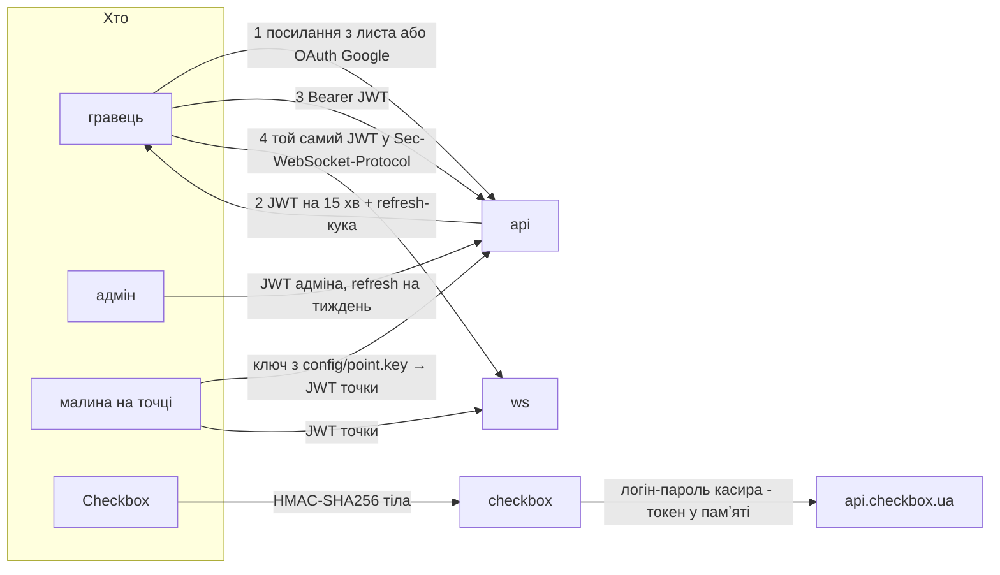

# Сервіси: хто де живе, як спілкується, як доводить, що це він

Стан на 17.09.2026. Повна картина під те, що вже вирішено доками
гейміфікації, адмінки й відео. Перша коротка схема архітектури (серпень,
Vue й Laravel Filament) цим документом замінена й видалена.
Половина з цього ще не написана: що саме заглушка, позначено в §5.

---

## 1. Загальна картина

```mermaid
graph TB
    subgraph edge["Точка (Raspberry Pi, /home/pi/extrovert)"]
        KIOSK["kiosk<br/>C+GLES2<br/>dispmanx, без X"]
        UPD["updater<br/>оновлює стек сам"]
        REC["recorder<br/>ffmpeg -c copy (план)"]
        SUP["supervisor"]
        SUP --- KIOSK
        SUP --- UPD
        SUP --- REC
    end

    subgraph cf["Cloudflare: статика й переадресація"]
        CLIENT["client<br/>React SPA, гравець<br/>extrovert.cafe"]
        ADMIN["admin<br/>React + amCharts5"]
        QRR["qr.extrovert.cafe<br/>воркер, лише 302"]
    end

    STK["QR-наклейка на автоматі<br/>qr.extrovert.cafe?p=1"]

    subgraph pub["Дроплет public (2 vCPU / 4 ГБ)"]
        API["api :3001<br/>REST, JWT, фонові роботи"]
        WS["ws :3002<br/>вебсокет"]
        CB["checkbox :3003<br/>вебхук + опитування ПРРО"]
        OVS["overseer<br/>без вхідних портів"]
        SCHED["scheduler<br/>фонові роботи за розкладом"]
        PG[("Postgres")]
        RD[("Redis")]
        GT["GlitchTip"]
    end

    subgraph ana["Дроплет analysis (1 vCPU / 2 ГБ, без публічних портів)"]
        WRK["worker<br/>детекція 2 fps"]
        DEP["deployer<br/>Playwright → Jetinno<br/>(під питанням)"]
    end

    subgraph r2["Cloudflare R2"]
        R2M["menu + releases<br/>публічний бакет, pos.extrovert.cafe"]
        R2V["video 7 діб, bucket lock"]
        R2E["evidence"]
    end

    subgraph ext["Зовнішні"]
        CBAPI["Checkbox API<br/>api.checkbox.ua"]
        CF["Cloudflare API<br/>тимчасові ключі R2"]
        OAUTH["Google OAuth"]
        MG["Mailgun<br/>листи для входу"]
        MONO["mono pay"]
        NP["Нова Пошта API"]
        TG["Telegram"]
        JET["портал Jetinno"]
    end

    KIOSK -->|"меню з публічного бакета, ETag"| R2M
    KIOSK -->|"wss, JWT точки: ціни, акції, продажі, бонуси"| WS
    KIOSK -->|"телеметрія, JWT точки"| API
    UPD -->|"маніфест і архіви, ETag, Range"| R2M
    REC -->|"тимчасовий доступ, раз на годину"| API
    REC -->|"S3 PUT з тимчасовим ключем"| R2V
    API -->|"temp-access-credentials"| CF
    STK -.->|"скан телефоном"| QRR
    QRR -->|"302, ?p= зберігається"| CLIENT
    CLIENT -->|"REST, Bearer JWT"| API
    CLIENT -->|"wss, той самий JWT"| WS
    ADMIN -->|"REST, JWT адміна"| API
    CBAPI -->|"вебхук, HMAC"| CB
    CB -->|"чеки за датою, раз на хвилину"| CBAPI
    CB --> PG
    API --> PG
    WS -->|"subscribe"| RD
    API -->|"бот підтримки: sendMessage"| TG
    TG -->|"вебхук підтримки, secret_token"| API
    SCHED --> PG
    SCHED -->|"outbox → PUBLISH"| RD
    SCHED -->|"довідник, ТТН, трекінг"| NP
    SCHED -->|"ціни в каталог"| CBAPI
    SCHED -->|"меню точок"| R2M
    DEP -->|"черга деплоїв"| PG
    DEP -.->|"ціни, якщо знадобиться"| JET
    OVS --> PG
    OVS -->|"лише вихідні"| TG
    CLIENT -->|"кнопка Підтримка → t.me"| TG
    WRK -->|"SKIP LOCKED"| PG
    WRK --> R2V
    WRK --> R2E
    CLIENT -->|"логін"| OAUTH
    API -->|"лист для входу"| MG
    CLIENT -->|"скіни, крейти"| MONO
    SCHED -.-> GT
    KIOSK -.-> GT
    CLIENT -.-> GT
    ADMIN -.-> GT
    API -.-> GT
    CB -.-> GT
    WS -.-> GT
    WRK -.-> GT
```



---

## 2. Хто де крутиться і чому саме там

| Що | Де | Чому не деінде |
|---|---|---|
| `kiosk`, `updater`, `recorder` | Raspberry Pi на точці | екран і камера фізично тут; запис має пережити обрив звʼязку |
| `client`, фронт `admin` | Cloudflare Workers | статика, нуль обслуговування, близько до користувача |
| `qr.extrovert.cafe` | Cloudflare Workers, `frontend/qr` — лише 302 | адреса надрукована на наклейці й не міняється ніколи; куди вона веде — міняємо будь-коли, деплоєм воркера (`urls.md`) |
| `api`, `ws`, `checkbox` | дроплет `public` | мають публічний порт і стан |
| `scheduler` | дроплет `public`, **без вхідних портів** | усе, що робиться за розкладом, а не у відповідь на запит (нижче) |
| `overseer` | дроплет `public`, **без жодного вхідного порту** | лише шле в Telegram; навіть якщо колись читатиме команди, `getUpdates` — теж вихідне зʼєднання |
| `worker` (відео), `deployer` (під питанням) | дроплет `analysis` | нестабільне навантаження **фізично** не має дотягуватись до кіоска (`video.md`); Chromium для Playwright — те саме |
| Postgres, Redis | дроплет `public`, лише петля | керована база відкладена; умови переїзду — `video.md` |
| відео, докази, фото зі скарг | R2, приватні бакети | вихідний трафік безкоштовний, lifecycle робить ротацію за нас; перелік бакетів — §2.1 |
| меню точок і релізи малини | R2, **публічний бакет** із доменом `pos.extrovert.cafe` | і те, і те публічне за визначенням: меню висить на екрані, у релізі немає секретів. Cloudflare віддає їх із кеша, з `ETag` і `Range`, тож ні Worker, ні токен не потрібні (`urls.md`) |
| спрайти кавенятка | у коді `client`, static assets Worker'а | їдуть разом зі збіркою; Vite дає файлам хеш у назві, тож новий спрайт — новий файл, а решта лишається в кеші |

**Рантайм — Bun, скрізь, де в нас JavaScript** (20.09.2026). Один інструмент
замість трьох: `bun` запускає сервіси, виконує скрипти й ставить пакети, тож
у монорепо один `bun.lock`, в образі немає npm, а в голові — питання «а це
через node чи через npx». Перевірено при переході: заглушка `api` на fastify
піднімається під Bun без правок, а образ `oven/bun:1-alpine` ставить
залежності лише потрібного воркспейсу (`bun install --filter`).

Що це **не** означає: ми не переписуємо код під `Bun.serve`, `Bun.sql` чи
інші власні API. Сервіси лишаються на fastify, `pg` та `ioredis` — на
звичайному node-сумісному коді, який запуститься й під Node, якщо Bun колись
виявиться глухим кутом. Це рантайм, а не фреймворк.

Де Bun **не** зʼявиться: на малині. Він збирається лише під x64 і arm64, а
там ARMv6 — і саме тому телеметрія й увесь стек точки написані на POSIX sh
(`raspberry-pi.md` §2), а не на JS.

**Фронт адмінки — теж на Workers** (17.09.2026). Довгі запити до Postgres і
закешовані агрегати, через які адмінку раніше ставили поруч із базою,
живуть в `api`, а не у фронті. Фронту лишається бути статикою, як і `client`.

**Worker точки більше немає** (18.09.2026). Меню віддає публічний бакет R2 з
власним доменом — статичний файл, який Cloudflare і так кешує, з `ETag` і
`Range`. Кіоску для цін не потрібен ні наш бекенд, ні токен; авторизація
лишилась рівно там, де вона щось захищає: вебсокет, телеметрія і тимчасові
ключі R2 для запису відео.

### 2.1 Бакети R2 і розмежування оточень

П'ять бакетів, поділені **за призначенням**, бо в них різні строки
зберігання, різні права й різні власники даних:

| Бакет | Що там | Хто пише | Хто читає | Строк |
|---|---|---|---|---|
| `extrovert-pos` | меню точок і релізи кіоска | `scheduler` (меню) і CI (релізи) | будь-хто: публічний домен бакета `pos.extrovert.cafe` | доки не замінять |
| `extrovert-video` | сирі сегменти з камер | малина тимчасовим ключем | `worker` | 7 днів, bucket lock (`video.md`) |
| `extrovert-evidence` | кадри й кліпи підтверджених подій | `worker` | адмінка за підписаним посиланням | без обмеження |
| `extrovert-uploads` | **фото, які надсилає гравець у скарзі** | телефон гравця за підписаним посиланням | адмінка за підписаним посиланням | без обмеження (рішення власника 21.09.2026) |
| `extrovert-backups` | щоденні дампи Postgres | `scheduler` | людина, що відновлює базу | 30 днів (`deploy.md` §2.4) |

Lifecycle на `extrovert-uploads` навмисно немає: скарга піврічної давності
без фото — це слово проти слова, а обсяг тут копійчаний. Окремий бакет
лишається окремим не через строк, а через усе решту — дивись нижче.

Чому фото зі скарг **не** в `extrovert-evidence` (рішення 21.09.2026):
evidence — наші власні кадри з наших камер, вони живуть довго й потрібні
для розбору інцидентів. Фото зі скарги — чужі персональні дані, які прислав
гравець: інше право на видалення й інший шлях
запису — прямий PUT із телефона, а не наш воркер. Складати їх в один бакет
означає одного дня застосувати до них однакову політику — і помилитись або
з відео, або з людиною.

**Оточення розділені іменем бакета.** Суфікс додає `backend/lib/src/r2.js` за
змінною `APP_ENV`:

```
APP_ENV=production → extrovert-uploads        (R2)
APP_ENV=staging    → extrovert-uploads-staging
APP_ENV=local      → extrovert-uploads-dev    (MinIO з docker-compose)
```

Локально це **не R2 взагалі**: у compose піднімається MinIO (профіль
`local`, порти 9100/9101), і на машині розробника не потрібні ключі, якими
можна щось записати в прод. У Cloudflare лишається один комплект бакетів —
продовий.

Три речі, які тримають це разом:

1. **ім'я бакета не пишеться руками** — його дає `bucketFor(purpose)`;
2. **запис у прод-бакет із не-прод оточення кидає помилку.** Обійти можна
   лише явним `R2_ALLOW_PROD=1` — тобто свідомо;
3. **дев-ключі мають перевагу поза продом**: `R2_DEV_*` перекривають
   `R2_*`, як `DATABASE_URL_LOCAL` перекриває `DATABASE_URL`.

> ⚠️ Звідки взялося це правило. 20.09.2026 команда заливки меню, запущена
> «просто перевірити синтаксис», поклала меню в **живий** бакет: у `.env`
> лежав один `R2_BUCKET` і прод-ключі поруч. Нічого не зламалось лише тому,
> що файл виявився тим самим. Уважність такі речі не лікує — лікує те, що
> тепер локальний запуск фізично не бачить прод-бакета.

### Фонові роботи — окремий сервіс `scheduler`

Усе, що робиться **за розкладом, а не у відповідь на запит**, живе в окремому
сервісі (рішення 18.09.2026). Причини прості: такі роботи не мають конкурувати
за процес з живими запитами гравців, їх видно окремо в логах і GlitchTip, і
перезапустити їх можна, не чіпаючи `api`. Блокування — `lock:<job>` у Redis,
курсори — `sync_cursors` у Postgres, тож дві копії сервісу не роблять те саме.

| Робота | Де | Як часто |
|---|---|---|
| публікатор `outbox` → Redis | `scheduler` | безперервно, `SKIP LOCKED` |
| довідник міст і відділень НП | `scheduler` | раз на добу, вночі |
| трекінг відправлень НП | `scheduler` | раз на годину, лише активні |
| деплой цін і акцій: R2, Checkbox | `scheduler` (або `deployer`, якщо знадобиться Playwright) | за чергою (§4) |
| агрегати для дашбордів адмінки | `scheduler` | за розкладом, у кеш |
| покази лотів маркету: Redis → Postgres | `scheduler` | раз на хвилину (§4) |
| дамп Postgres у R2 (`extrovert-backups`) | `scheduler` | раз на добу за UTC; щогодини лише перевірка «чи є сьогоднішній» (`deploy.md` §2.4) |
| опитування чеків Checkbox | `checkbox` | раз на хвилину: там і токен касира, і вся логіка ПРРО (§4) |
| здоровʼя точок і алерти в Telegram | `overseer` | як і було |

---

## 3. Автентифікація: кожна стрілка окремо



### Один токен на обидва бекенди

Уся автентифікація людей і пристроїв зводиться до **одного JWT**, який
приймають і `api`, і `ws` (рішення 17.09.2026). Клієнт тримає один доступ, а
не сесію для REST плюс окремий квиток для вебсокета.

- **Підписує лише `api`** (Ed25519), `ws` лише перевіряє публічним ключем.
  Злам `ws` не дає випускати токени.
- **Access JWT живе 15 хвилин** і лежить у памʼяті застосунку. Claims:
  `sub` (`user:<uuid>`, `admin:<uuid>` або `point:<id>`), `role`, `point`
  для пристрою, `exp`.
- **Refresh-сесія** — httpOnly-кука на `api.extrovert.cafe` і рядок
  `sess:<id>` у Redis. У гравця вона **ковзна**: кожне оновлення токена
  відсуває її кінець на 180 діб від «зараз» — і в Redis, і в `Max-Age`
  куки (22.09.2026; до того — 30 діб від входу, хоч би як часто людина
  грала). Вилогінює лише пів року тиші. Адмінська — так само ковзна, але
  вікно тиждень (24.09.2026; до того — 12 годин від входу й без
  продовження, тобто вхід питали щоранку навіть у того, хто не закривав
  вкладку; захисту це не давало — пароль просто набирали частіше).
- **Кука й CORS.** Клієнт на `extrovert.cafe` і `api` на піддомені — один
  сайт для `SameSite`, тож кука ходить без `SameSite=None`. Але origin
  різні, тож api віддає `Access-Control-Allow-Credentials: true`: клієнт
  шле кожен запит із `credentials: "include"`, і без цього заголовка
  браузер відкидає відповідь цілком. Локально цього не видно — там клієнт
  ходить через проксі Vite з того самого origin; до 22.09.2026 заголовка й
  не було, і в проді не працював би жоден запит.
- **Вихід.** Вихід чи бан — видалити `sess:<id>`: за ≤15 хв доступ зникне
  сам. Видалення акаунта гасить усі сесії гравця разом (`sess:user:<id>`),
  і видалений акаунт сесію вже не оновлює.
- **Обрив ≠ вихід.** Клієнт скидає токен лише тоді, коли `/auth/refresh`
  відповів 401. Мережа, що пропала, чи api посеред деплою — привід
  повторити (стартовий екран каже «немає зв'язку»), а не викинути людину з
  акаунта.

**Safari і «не вилогінювати ніколи».** ITP у Safari стирає все, що пише
скрипт (`localStorage` з access-токеном), після 7 днів без відвідин сайту.
Сесію це не зачіпає: її тримає httpOnly-кука від сервера, і вона живе свій
`Max-Age`. Але, за описом WebKit, із Safari 16.4 куки від сервера, чия
IP-адреса в першій половині не збігається з адресою самого сайту, теж
обрізаються до 7 днів. Сайт віддає Cloudflare, а `api.extrovert.cafe`
дивиться прямо на дроплет, тож ми під це правило, найімовірніше,
потрапляємо: на iPhone людина, що не відкривала гру тиждень, увійде ще раз
через пошту. Лік — проксіювати `api` через Cloudflare (помаранчева хмарка),
щоб обидві адреси були Cloudflare; перед цим перевірити, що Caddy далі
отримує сертифікати, а ws проходить. Застосунок, доданий на головний
екран, під ITP не підпадає.

#### Вхід гравця: посилання на пошту й Google

**Пароля у гравців немає взагалі:** це свідоме зняття з себе зберігання
секретів. Входів два, метч між ними — за підтвердженою поштою, тому
`user_identities` окремою таблицею.

- **Пошта** (22.09.2026) — щоразу лист із посиланням, через HTTP API
  Mailgun (`backend/api/src/mail/`). `POST /auth/email` кладе в
  `login_links` sha256 одноразового токена на 15 хвилин і шле лист.
  Посилання — `https://extrovert.cafe/login#<токен>`: токен у фрагменті не
  їде на сервер воркера й не осідає в логах, а поштові сканери, що
  «перевіряють» посилання GET-запитом, його не витрачають — вхід робить сама
  сторінка, `POST /auth/email/verify`. Нова пошта — новий акаунт (далі
  звичний екран нікнейма й згоди), пошта, що вже є в акаунті, — вхід у
  нього. Вхід стається там, де посилання відкрили, і лист про це каже.
- **Ліміти й трекінг.** Лист раз на хвилину й до п'яти на годину на
  адресу, до двадцяти на годину з однієї IP — інакше форма входу стає
  кнопкою «засипати чужу скриньку». Трекінг кліків Mailgun вимкнений: з ним
  посилання йшло б через їхній редирект-домен.
- **Бонус із кіоска.** Якщо вхід почався на `/b/<токен>`, шлях їде в листі
  (`login_links.next_path`, лише наші шляхи), і після входу застосунок
  повертається туди — навіть якщо лист відкрили на іншому пристрої.
- **Без Mailgun.** Локально посилання пишеться в лог api, у проді
  `/auth/email` відповідає 503.
- **Google** — ще не підключений: кнопка в проді каже «незабаром», у
  dev-збірці веде в девелоперський вхід.
- **Apple відхилено** (22.09.2026). «Sign in with Apple» навіть для вебу
  вимагає Apple Developer Program за $99 на рік, а обов'язковим він був би
  лише для застосунку в App Store (правило 4.8), якого в нас немає.
  Безкоштовна альтернатива «увійти обличчям» — passkeys, вони в `ideas.md`.

**Девелоперські входи в проді не існують.** `/auth/dev`, `/admin/dev-login`,
`/dev/*` і тестова оплата без mono вмикаються однією умовою
(`backend/api/src/env.js`): і `NODE_ENV`, і `APP_ENV` мають бути не
`production`. Образ сам ставить `NODE_ENV=production`, серверний `.env` —
`APP_ENV=production`, тож помилка в одному місці нічого не відкриває.
Колишній перемикач `DEV_TOOLS=1`, який умикав усе це й у проді, прибраний.
У прод-збірці клієнта виклику `/auth/dev` немає зовсім (`import.meta.env.DEV`).
Без `JWT_PRIVATE_KEY` api у проді не стартує: тимчасовий ключ розлогінював
би всіх на кожному рестарті.

**А от адмін заходить поштою й паролем** (20.09.2026). Адмінів двоє-троє, і
піднімати заради них OAuth-застосунок з окремим доменом — більше роботи, ніж
користі; лінк на пошту щоразу теж не варіант, бо тоді пошта стає єдиним
ключем від усього. Тому:

- пароль лежить у `admin_users.password_hash` як `scrypt` у PHC-рядку
  (`scrypt$N=65536,r=8,p=1$<сіль>$<хеш>`) — параметри поруч із хешем, щоб їх
  можна було підняти, не зламавши старі; звіряння — `timingSafeEqual`;
- форми «зареєструватися» немає ніде: адміна заводить і пароль йому ставить
  `scripts/admin.mjs` (`roadmap.md`, крок 0-біс), причому на проді — лише з
  дроплета;
- перебір впирається в лічильник у Redis (`admin:login:fail:<email>`, вікно
  15 хвилин), а не в базу;
- далі все як вище: той самий JWT на 15 хвилин і ковзна refresh-сесія на
  тиждень — кожне оновлення токена відсуває її кінець і в Redis, і в куці;
- вимкнений адмін (`disabled_at`) не заходить і не оновлює сесію, а його
  `sess:admin:<id>` видаляється відразу;
- 2FA лишається відкритим питанням (`roadmap.md` §4).

### Вебсокет: JWT у `Sec-WebSocket-Protocol`

Браузер не дає поставити на `WebSocket` заголовок `Authorization`, але дає
перелік підпротоколів — і це заголовок, а не URL:

```js
new WebSocket("wss://ws.extrovert.cafe/v1/me", ["extrovert.v1", "jwt." + accessToken]);
```

- `ws` дістає токен із другого значення, перевіряє й **повертає в
  відповіді лише `extrovert.v1`**. Без повернутого підпротоколу браузер
  закриє зʼєднання; повертати сам токен — значить злити його в заголовки
  відповіді.
- Від чужих очей токен захищає TLS (`wss`), як і будь-який інший
  заголовок. Виграш проти `?token=` у URL у тому, що URL осідають в
  access-логах, історії й `Referer`, а заголовок підпротоколу — ні.
- JWT складається з base64url і крапок — це допустимі символи для
  значення підпротоколу.
- Коли спливає `exp`, `ws` закриває зʼєднання кодом `4401`; клієнт оновлює
  токен і перепідключається. Довге зʼєднання не переживає токен.

### Малина: ключ у файлі, який можна відкликати

Меню й релізи малина бере з публічного бакета без жодного токена. Ключ їй
потрібен рівно для трьох речей: вебсокет подій, телеметрія і тимчасовий
доступ до R2 під відео.

Кіоск і recorder на точці автентифікуються **ключем точки** з
`/home/pi/extrovert/config/point.key` (права `0600`). Не в `config/env`,
не в бінарнику й не в релізі: релізи лежать публічно.

- Ключ — 256 випадкових біт. У базі — лише його хеш (`points.key_hash`): пристрій і точка — один рядок (`db-schema.md` §1).
- Малина обмінює ключ на **JWT точки на 1 годину**
  (`POST /api/v1/points/<point>/token`) і з ним ходить в `api` і `ws`.
- **Відкликання** — кнопка в адмінці: `points.key_revoked_at` і
  `revoked:point:<id>` у Redis. `api` відхиляє наступний запит, `ws` рве
  зʼєднання одразу, не чекаючи кінця години.
- **Ротація без поїздки.** Адмінка випускає новий ключ
  (`devices.next_key_hash`), і малина отримує його у відповіді на черговий
  обмін токена: пише `point.key.new`, робить `fsync` і атомарний `mv`, далі
  ходить уже з новим. Старий ключ гасне, щойно новий спрацював уперше.
- **Якщо ключ украли разом із малиною**, ротацією цього не виправити:
  новий ключ отримав би той, хто тримає старий. Тоді — відкликати, а новий
  ключ покласти на пристрій довіреним шляхом: по SSH деплой-ключем
  (`raspberry-pi.md` §4) або на місці.

### Recorder: тимчасовий доступ до R2

Раз на годину recorder із JWT точки просить у `api` тимчасовий ключ R2.
`api` отримує його в Cloudflare
(`POST /accounts/{id}/r2/temp-access-credentials`): бакет `extrovert-video`,
лише префікс `<point>/`, `object-read-write`, TTL 1 година. Далі recorder
вантажить сегменти звичайним S3 `PUT` з `X-Amz-Security-Token`.

- Постійного ключа R2 на пристрої в коридорі немає.
- Короткий обрив `api` не зупиняє вивантаження: ключ живий до кінця TTL.
- Права «лише запис» R2 не дає, тож ключем можна й читати, й видаляти у
  своєму префіксі. Видаленню й перезапису заважає **bucket lock на 7 діб**
  (§4 `video.md`). Відкликати все разом — відкликати батьківський токен у
  Cloudflare: усі похідні ключі гаснуть одразу.

### Telegram → ми (підтримка)

Бот підтримки наш власний (§4). Telegram шле оновлення вебхуком на
`api`, і єдиний захист там — `secret_token`, який ми задаємо в `setWebhook`:
Telegram вертає його в заголовку `X-Telegram-Bot-Api-Secret-Token` на
кожному запиті, а запити з чужим або без нього ми відкидаємо. Токен самого
бота лежить лише в оточенні `api`.

### Checkbox → ми

`base64(HmacSHA256(key, тіло))`, перевіряти обовʼязково: без цього будь-хто
накрутить собі бонуси підробленими «продажами» (`checkbox.md`). Ключ віддає
сам Checkbox при реєстрації вебхука.

### Ми → Checkbox

Уточнено 15.09.2026: **усі методи — на одному
`api.checkbox.ua`**, окремого домену для товарів немає. Авторизація — логін
і пароль касира в обмін на токен; токен тримаємо **в памʼяті** й
перевипускаємо лише коли прилетіла помилка авторизації, а не за таймером.
Попередня редакція `checkbox.md` (`api.checkbox.in.ua` + окремий
кабінетний токен) була помилкою дослідження.

**Каталог товарів належить організації, а не касиру.** Тестовий касир
бачить ті самі товари з тими самими цінами, що й справжній (перевірено
15.09.2026), тож тестовий логін ізолює чеки, але не ціни. Писати в каталог
з тестовим логіном — усе одно писати в живий каталог.

---

## 4. Потоки даних, які варто розуміти цілком

### Продаж → бонус на екрані → бонус в акаунті

```
Checkbox ─ вебхук (HMAC) ──────────┐
Checkbox ─ опитування раз на хв ───┤
                                   → checkbox:3003, одна транзакція:
                                       insert receipts … on conflict (checkbox_receipt_id) do nothing
                                       → якщо рядок новий: receipt_items + bonus_grants + outbox(sale)
  → публікатор outbox → PUBLISH point:kyiv-01
      → ws → кіоск малює QR
          → гравець сканує → claim → outbox(bonus.claimed) → кіоск прибирає QR
              → авторизація → redeem → users + ledger_entries
                  → outbox(user) → «+80 монет» у чат кавенятка
```

**Задача двох генералів тут розвʼязується не доставкою, а обробкою.** Ні
вебхук, ні опитування не гарантують, що чек прийде рівно раз, — і не мусять.
Обидва шляхи пишуть той самий `insert … on conflict (checkbox_receipt_id) do
nothing`, а бонус і подія створюються лише там, де вставка справді додала
рядок. Хто б не приніс чек першим, другий прихід — no-op, тож бонус не
подвоїться, навіть якщо вебхук і опитування прийшли одночасно. Втратити
подію між базою й Redis не дає `outbox` (`db-schema.md` §0).

**Опитування — раз на хвилину, вікно з перекриттям.**
`GET /api/v1/receipts/search?from_date=…&to_date=…&self_receipts=false`, по
100 на сторінку. `from_date` — курсор із `sync_cursors` мінус 10 хвилин:
чеки, фіскалізовані офлайн чи з розсинхроном годинника, приходять із
запізненням, а повтори й так поглине унікальний ключ. `self_receipts=false`
обовʼязковий: за замовчуванням Checkbox віддає лише чеки того касира, чий
токен, а продає термінал під іншим (`checkbox.md`).

Чек, який опитування принесло вже після двохвилинного вікна QR, пишеться з
бонусом одразу у стані `expired`: показувати QR, по який ніхто не підійде, —
значить віддати бонус наступному в черзі.

### Скан наклейки на автоматі

```
телефон → qr.extrovert.cafe?p=1 → 302 (воркер frontend/qr) → extrovert.cafe/?p=1
  → client: p у localStorage, з адресного рядка прибрано
  → після входу: POST /api/v1/me/qr → users.metadata.qr_pos, якщо ще не записано
```

Адреса на наклейці вічна, тому між нею й сайтом стоїть лише переадресація:
воркер, у якому немає нічого, крім 302 (`urls.md`). Бонус за покупку — інший QR: його малює кіоск на
екрані з токена події `sale`, і він надрукованим не буває.

### Події кіоска

Кіоск тримає вебсокет на свою точку (`point:<id>`) із JWT точки.

| Подія | Що робить кіоск |
|---|---|
| `menu.deployed` | перечитує меню з публічного бакета, показує, підтверджує в телеметрії (`acked_at`) |
| `promo.deployed` | перечитує контент акції й спрайти, які він використовує |
| `bonus_ready` | показує попап із QR і лишає рядок у панелі до `show_until` |
| `bonus_taken` | прибирає рядок і показує плашку «Бонус отримано» на пару секунд |

Прострочений бонус кіоск прибирає сам: рядок живе `BONUS_TTL_S` від появи,
окремої події на це не треба.

**`bonus_taken` шле застосунок, а не каса** (23.09.2026): телефон, який
отримав бонус, стукає `POST /api/v1/bonus/<токен>/seen`, і api кладе подію
в канал точки. Окремий запит, а не сам перегляд прев'ю: так подія означає
«застосунок справді має бонус», а не «хтось відкрив посилання». Той самий
запит ставить `bonus_grants.claimed_at`, після чого прев'ю відповідає
`available: false` — друга вкладка з тим самим посиланням уже нічого не
покаже, бо й на екрані точки бонуса вже немає.

Кожна подія несе свій `outbox.id`, і кіоск відкидає повтор. Pub/sub нічого
не зберігає, тож **після кожного (пере)підключення кіоск питає знімок**
(`GET /api/v1/points/<point>/state`) і вирівнює по ньому панель: чого в
знімку немає — прибирає, чого бракує — додає.

**Зроблено 24.09.2026** (`backend/api/src/routes/points.js`, `ws.c`,
`bonus.c`). Порядок такий: підписка, потім знімок — знімок ДО підписки
лишив би дірку рівно в ту мить, коли ми ще не слухаємо. У знімку самі лише
активні QR: `claim_token`, код напою, монети й **лишок** часу показу, з
якого кіоск відновлює рядок так, ніби той висів усі ці секунди (включно з
підписом «о котрій нарахували»). Попапа відновлений рядок не показує —
покупка сталась хвилину тому, вітати людину вдруге нема з чим. Версії меню
в знімку немає навмисно: меню кіоск і так перепитує в бакета за розкладом,
і друга копія тієї самої правди просто розійшлася б із першою. Окремої «стрічки подій» роутом немає: вона дублювала б
вебсокет, а два джерела однієї правди завжди розходяться. Так обрив мережі не лишає на екрані ні старих цін, ні QR, який
уже забрали.

**Вебсокет у C на Stretch — зроблено** (`raspberry/kiosk/src/ws.c`, 21.09.2026).
Вибір виявився не між libwebsockets і OpenSSL, а простішим: `libcurl` не
вміє вебсокетів до 7.86, але вміє `CURLOPT_CONNECT_ONLY` — тобто віддає
готове зʼєднання (з TLS для `wss`), а кадри RFC 6455 поверх нього — сотня
рядків. Так на малині не зʼявляється ні нової бібліотеки, ні другої версії
API: `libwebsockets` у Stretch — 2.0 із 2016 року, і той самий код під неї
й під сучасну 4.x на десктопі довелось би писати двічі.

Що вміє клієнт: підписку на `point:<id>` токеном (`Sec-WebSocket-Protocol`,
як у застосунку), перевірку `Sec-WebSocket-Accept`, пінг раз на 25 с із
розривом після хвилини тиші, відкидання повторів за `outbox.id`,
перепідключення з наростанням паузи й розкидом — і миттєве повернення після
1001, бо це викочування нової версії, а не аварія. Токен видає
`bun scripts/point-token.mjs <point>`; кіоск бере його зі `WS_TOKEN` або з
файла `WS_TOKEN_FILE`.

### Що лежить у menu.json

Три ключі: `updated`, `drinks`, `ad` — і більше нічого. Напої беруть із
таблиці `drinks` (активні, у порядку `sort_order`), акцію — з payload
деплоймента.

Бренд у шапці, лінійка стаканів і період опитування раніше їхали тим самим
файлом, а тепер зашиті в кіоск (`raspberry/kiosk/src/config.h`,
`menu.c: CUPS`). Вони не залежать від точки й не мінялись жодного разу, а
нова лінійка стаканів — це однаково новий реліз кіоска, бо інші розміри
малюються інакше. Кожне зайве поле в меню — ще одне місце, де бакет і екран
можуть розійтись.

### Деплой цін і акцій

```
адмінка → api: menu_deployments + цілі (за замовчуванням — усі активні точки)
  → scheduler (робота menu-deploy, раз на 10 с бере чергу):
  → r2:       points/<point>/menu.json у публічний бакет, cache-control 30 с
  → checkbox: ціна філії точки в каталозі — branches_info (checkbox.md)
  → jetinno:  ціни в портал автомата — під питанням, див. нижче
  → outbox(menu.deployed) на кожну точку → кіоск перечитує → acked_at
```

Статус у кожної цілі свій, тож одна офлайн-малина робить деплой `partial`,
а не проваленим (`db-schema.md` §1).

**Ціна в чеку — окрема правда.** Автомат пробиває те, що в нього в прайсі, а
не те, що ми виклали в каталог: у позиції чека своя `price` (`checkbox.md`).
Тому `checkbox` при розборі чека звіряє ціну позиції з чинним деплоєм цієї
точки й розходження шле в `overseer`. Це єдиний спосіб дізнатися, що ціна
до автомата не доїхала, — інакше ми бачили б «деплой успішний» і чеки зі
старою ціною.

**Jetinno — під питанням до отримання доступу.** Ймовірно, ціни доведеться
дублювати в портал телеметрії автомата, і API в нього, найпевніше, немає —
тоді це Playwright. Якщо так, деплої переїжджають в окремий контейнер
`deployer` на `analysis`: Chromium на сотні мегабайт не має жити поруч з `api`,
а один деплой на кілька хвилин нікого там не зачепить. Поки доступу немає,
цілі `jetinno` не створюються, а деплой робить `api`.

### P2P-маркет: які лоти пропонує API

Покупець не гортає весь маркет: API **пропонує** йому кілька лотів — у
прев'ю предмета в Магазині (лоти саме цього предмета) і на екрані
кавенят. Скільки — параметр `limit`: необовʼязковий, від 1 до **10**, за
замовчанням 10; більше 10 обрізається до 10.

**Які саме — зважений рандом** (19.09.2026). З активних лотів — не своїх,
не проданих і не знятих — API бере `limit` штук без повторів, і що нижча
ціна, то більша вага: `вага = ціна^−k`. Ціна в зернах для порівняння
перераховується в монети за курсом `bean_rate`; `k` — параметр
`market_offer_bias` з `backend/api/data/economy.json`, стартово 1: на кожне місце у
відповіді лот удвічі дешевший претендує вдвічі частіше. `k = 0` — чистий
рандом, великий `k` — майже завжди найдешевші. Коли активних лотів не
більше за `limit`, повертаються всі, і вага впливає лише на порядок.

Перевірено симуляцією (19.09.2026, 12 лотів від 10 до 1000 монет, `k = 1`):
частка першого місця збігається з вагою до третього знака, а шанс
потрапити в десятку — від 100 % для найдешевшого до 35 % для
найдорожчого.

Чому не «найдешевші зверху»: тоді одні й ті самі кілька лотів забирали б
усі покази, а лот, дорожчий на монету, не показувався б ніколи. Вага тисне
ціни вниз, а рандом лишає шанс кожному.

Це один запит, без окремого сервісу:

```sql
select l.*
from market_listings l
join user_items ui on ui.id = l.user_item_id
where l.kind = 'item' and ui.item_def_id = $1
  and l.status = 'active' and l.seller_id <> $2
order by -ln(1 - random()) * power(<ціна в монетах>, $3)   -- $3 = k
limit $4;                                                   -- $4 = limit ≤ 10
```

`-ln(U) / вага` — «експоненційні перегони»: `limit` найменших ключів дають
рівно вибірку без повторів з імовірностями, пропорційними вазі. Для
кавенят — те саме без `join`, з `kind = 'plant'`.

**Показ** — лот, який API повернув користувачу в такій відповіді. Не скрол
і не рендер на телефоні: чи домалював клієнт картку, сервер не знає, а що
запропонував — знає точно. Власні лоти продавця (розділ «Виставлені на
продаж») не пропонуються, тож і показами не рахуються. Зате там продавець
бачить лічильник показів кожного свого лота (`GET /api/v1/me/listings`),
із запізненням до хвилини — стільки ж, скільки покази лежать у Redis.

Лічильник не пишеться в Postgres на кожен запит — це було б до 10 оновлень
гарячих рядків на кожне відкриття прев'ю. `api` робить
`HINCRBY market:impressions <listing_id> 1`, а `scheduler` раз на хвилину
атомарно перейменовує ключ (`RENAME` → `market:impressions:flush`) і
переносить накопичене в `market_listings.impressions` одним
`update … from (values …)`. Покази, що прийшли під час перенесення,
падають уже в новий ключ. Упаде Redis — загубиться хвилина показів, а не
угоди.

### Доставка Новою Поштою

Товари за зерна (кава, мерч, принт) їдуть Новою Поштою у відділення або
поштомат. Усе — через Нова Пошта API 2.0: `POST https://api.novaposhta.ua/v2.0/json/`
з `apiKey`, `modelName`, `calledMethod`, `methodProperties`. Ключ — у
бізнес-кабінеті НП, лише в оточенні `scheduler`: `api` працює з локальною
копією довідника й до НП сам не ходить.

**Довідник — локальна копія, раз на добу вночі** (так і радить документація
НП: довідники оновлювати раз на добу; новий поштомат біля дому гравця інакше
не зʼявиться у виборі).

| Що | Метод | Нотатки |
|---|---|---|
| міста | `Address/getCities` | у `np_cities` |
| відділення й поштомати | `Address/getWarehouses` | у `np_warehouses`; не більше 500 записів на сторінку |
| типи відділень | `Address/getWarehouseTypes` | `TypeOfWarehouseRef` поштомата беремо звідси, а не хардкодимо |

Пошук на чекауті йде по локальній копії: швидко, без ключа НП у браузері,
і чекаут не лягає разом з API НП. Поштомати, у які товар не влазить за
вагою чи габаритами (`PlaceMaxWeightAllowed`, обмеження розмірів із
довідника), для цього товару не показуються. Габарити й вага товарів в
упаковці — `backend/api/data/shop-products.json`: верхні межі, щоб фільтр помилявся
лише в безпечний бік, доки немає замірів реального товару.

**Відправка — з адмінки.** Адмін пакує й створює ТТН (`InternetDocument/save`:
відправник — наш ФОП, платить відправник, вага; для поштомата ще й габарити
місця в `OptionsSeat`). Точний набір полів звірити з документацією НП на
реалізації. Номер ТТН пишеться в `redemptions.np_ttn`, статус стає `shipped`.

**Трекінг — раз на годину**, лише активні відправлення:
`TrackingDocument/getStatusDocuments` пакетом `[{DocumentNumber, Phone}]`.
Код статусу НП (`StatusCode`) мапиться на наш статус таблицею з
документації НП, не за текстом статусу. Кожна зміна — рядок
`redemption_events` + `outbox(order.updated)` → лічильник на кнопці «Мої
замовлення» в застосунку (`gamification_ui.md`).

### Підтримка через Telegram — наш бот

Кнопка «Підтримка» в застосунку відкриває нашого бота. Далі це звичайний
пересилач між Telegram і адмінкою, увесь усередині `api`:

```
гравець → t.me/<бот> → вебхук Telegram (secret_token) → api
  → support_threads + support_messages → розділ «Підтримка» в адмінці
адмін пише відповідь в адмінці → api → Bot API sendMessage → гравець у Telegram
```

**Чому свій, а не готовий** (18.09.2026). Готовий бот тягне власну базу
(MongoDB) і власний спосіб відповідати — staff-групу Telegram; адмінка при
цьому лишається дзеркалом, тобто робота живе у двох місцях. Chatwoot вирішує
це повноцінною скринькою, але це окремий дроплет від 4 ГБ. А самої роботи
тут — один вебхук, дві таблиці й `sendMessage`: написати дешевше, ніж
інтегрувати й доглядати чуже.

Що варто зафіксувати одразу:

- **Вебхук, а не long polling.** `api` і так публічний; polling — це ще один
  процес, який треба тримати живим і не запускати двічі. `setWebhook` з
  `secret_token`, перевірка заголовка — §3.
- **Тред = чат у Telegram.** `support_threads.telegram_chat_id` унікальний,
  кожне повідомлення в обидва боки — рядок `support_messages` з напрямком і
  `telegram_message_id`. Лічильник в адмінці — треди, де останнє слово за
  гравцем.
- **Ідемпотентність.** Telegram повторює вебхук, поки не побачить `200`;
  `update_id` унікальний, тож повтор нічого не подвоює — той самий прийом,
  що й із чеками (`db-schema.md` §0).
- **Вкладення** (фото поламки) не качаємо одразу: зберігаємо `file_id`, а
  коли адмін відкриває тред, `api` бере файл через `getFile` і віддає його
  проксі-роутом. Окреме сховище на старті не потрібне.
- **Хто це пише.** Акаунт у застосунку — пошта чи Google, у боті — Telegram,
  спільного ідентифікатора немає. Тому кнопка веде на
  `t.me/<бот>?start=<одноразовий код>`, і бот привʼязує тред до акаунта за
  цим кодом. Без коду (людина знайшла бота сама) тред лишається анонімним.

**Як це зроблено** (22.09.2026). Кнопка «Підтримка» — у шапці, внизу
стартового екрана, у профілі й посилання в документах — веде одразу в бота,
окремого екрана підтримки в застосунку немає. Посилання видає
`POST /support/link`: гостю — `t.me/<бот>`, гравцю — з кодом, що живе
годину в Redis (`support:start:<code>`, `db-schema.md` §5) і гасне після
першого `/start`. Вебхук — `POST /webhook/telegram/support`; у проді `api`
реєструє його сам на старті (ідемпотентно, через `getWebhookInfo`), а
`bun run --filter @extrovert/api support:webhook` показує його стан і
`last_error_message`. Відповідь з адмінки — розділ «Підтримка»:
`/admin/support/threads`, відповідь іде `sendMessage` від імені бота.
Налаштування — три змінні `SUPPORT_BOT_*` в `.env` (`deploy.md` §2): бот
окремий від overseer-а, бо в нього пишуть гравці. Без токена бот мовчить, а
без username кнопка чесно каже, що підтримка ще не підключена.

### Помилки: GlitchTip, кожен у свій проєкт

GlitchTip приймає протокол Sentry, тож кожен компонент шле помилки своїм
SDK у **свій проєкт**: сповіщення, квоти й шум одного не змішуються з
іншими.

**Піднято 24.09.2026.** До цього GlitchTip стояв порожній: контейнер
працював, база `glitchtip` була без жодної таблиці (міграції не виконались
при першому старті), а сервіси нічого не слали — тобто «failed to fetch»
у власника не лишав по собі жодного сліду ніде. Тепер є організація
`extrovert`, девʼять проєктів і DSN на кожен.

**Своїх сервісів це коштувало сто рядків замість SDK** — `lib/errors.js`
шле envelope сам. `@sentry/node` тягне OpenTelemetry з десятком пакетів і
патчить рантайм; на bun із лімітом 512 МБ це погана угода заради «сталась
помилка, ось стек». Є стеля 20 подій на хвилину: зациклений сервіс не має
ні забити квоту, ні влаштувати DDoS збирачу.

**Дивитись помилки — з консолі, не з веба**: `bun scripts/errors.mjs`
(список), `--open <id>` (стек і теги), `--resolve <id>`. Так попросив
власник — у веб-інтерфейс він заглядати не буде, а помилки хтось має
читати щодня.

| Проєкт | Компонент | Чим |
|---|---|---|
| `api`, `ws`, `checkbox`, `overseer`, `scheduler` | Node-сервіси | `lib/errors.js` — **зроблено** |
| `worker`, `deployer` | відео, Playwright | SDK своєї мови |
| `client`, `admin` | фронтенди | `@sentry/react`, з source maps зі збірки |
| `kiosk` | кіоск на C | невеликий модуль поверх `libcurl`, що шле подію в store-ендпоїнт |
| `pi-stack` | supervisor, updater | `curl` із подією на відкат і провалений selftest |

Для C свідомо не `sentry-native`: його бекенди краш-дампів (crashpad,
breakpad) важко зібрати під ARMv6 на Stretch, а дампи ще треба
символізувати. Кіоску поки достатньо повідомлення й контексту. Малина
часто офлайн, тому події спершу пишуться в `state/glitchtip/` і
досилаються, щойно зʼявиться мережа. DSN — не секрет, але ліміт подій на
проєкт у GlitchTip ставимо, щоб зациклений кіоск не забив квоту.

### Оновлення точки

`raspberry-pi.md` — окремий документ, бо це вже не архітектура, а
операція з відкатом: діаграма процесів на малині, деплой релізу від коміту
до екрана, перехід на стек. Нутрощі стеку — `raspberry/pi/stack/README.md`.

### Відео

`video.md` — запис, тимчасові ключі R2, черга через `SKIP LOCKED`, звід події з
чеком за таймстемпом.

---

## 5. Що з цього реально існує

**Прод піднятий 22.09.2026.** На дроплеті крутиться весь стек (postgres,
redis, api, ws, checkbox, scheduler, overseer, caddy, glitchtip), 24
міграції накочені, сертифікати Let's Encrypt узяті, перший дамп бази вже в
R2. На Cloudflare живуть чотири воркери: `extrovert.cafe`,
`admin.extrovert.cafe`, `qr.extrovert.cafe`, `r.extrovert.cafe`. Образи
зібрані й залиті через act з машини розробника — у самому GitHub CI ще не
запускався (`deploy.md` §2.3).

| Компонент | Стан на 22.09.2026 |
|---|---|
| `kiosk` | **працює на залізі** під керованим стеком (з 21.09.2026), 60 fps; вебсокет подій зроблений (`ws.c`), але без токена точки кіоск емулює бонуси; GlitchTip ще немає |
| `raspberry/pi/stack` (supervisor + updater) | написано; апдейтер прогнано в Linux-контейнері, **на малині не проганялось** (`raspberry-pi.md` §7) |
| меню й релізи в R2 | **зроблено 23.09.2026**: воркер `extrovert-pos` видалений, домен `pos.extrovert.cafe` привʼязаний прямо до бакета (`infra/terraform/cloudflare.tf`), кіоск читає `points/<точка>/menu.json`, апдейтер — `releases/pi/manifest.json`. Перший реліз у бакеті є |
| `qr.extrovert.cafe` | **працює**: скан наклейки (`?p=1`) дає 302 на `extrovert.cafe/?p=1` (22.09.2026). Сам параметр `p` застосунок поки не забирає (`urls.md`) |
| Postgres | **24 міграції, 46 таблиць** (dbmate), `schema.sql` комітиться |
| сіди контенту (`db/seeds`) | працюють: `bun run seed:pull` / `seed:apply`, 4 таблиці контенту в JSON |
| `api` | **написаний**: вхід і сесії, кавенятко з доглядом і посадкою, гардероб, чат, магазин, маркет, гаманець, доставка, квізи, репост, скарги |
| `ws` | підписаний на Redis, роздає події гравцям за JWT |
| `client` | **усі екрани з дизайну**, перевірені в браузері (mobile-first) |
| `checkbox` | **вебхук із перевіркою підпису + опитування раз на хвилину**; чек → позиції → бонус → подія для кіоска в одній транзакції. Вебхук зареєстрований і працює з 23.09.2026 (підпис — у заголовку `x-request-signature`) |
| `scheduler` | **написаний**: публікатор outbox, щоденний дамп бази в R2, перенесення показів маркету, довідник і трекінг НП (обидві роботи НП чекають на `NP_API_KEY`) |
| `overseer` | **написаний**: мовчання точок, девʼять перевірок заліза (живлення, картка, монітор, кіоск, диск, флешка, температура, мережа, памʼять) і факт ребуту, помилки вебхука Checkbox, щоденний звіт о 9:00; алерт лише на зміну стану, усі зміни одного обходу — одним повідомленням |
| `lib` | спільна для сервісів: пул Postgres, Redis, outbox, блокування робіт, логер |
| `admin` | **заглушка-фронтенд** на Workers (`frontend/admin/`), дані бере роутом `/admin/overview`. Окремого сервіса в бекенді не має й не потребує: адмінка — це екрани, а не демон |
| підтримка | не існує: вебхук Telegram, дві таблиці й екран в адмінці (§4) |
| `worker` (відео), `deployer` | не існують; `deployer` — лише якщо Jetinno потребуватиме Playwright |
| оплата карткою | не підключена: пачки монет у local зараховуються тестово, у проді роут віддає 501 |
| `backend/checkbox/scripts/sync-prices.mjs` | переписаний під токен касира; порівняння з каталогом **перевірено**, запис (`--apply`) **ще ні** |

### Як воно піднімається локально

```
bun run up                      # postgres, redis, minio (5442 / 6389 / 9100)
docker compose run --rm migrate up
bun scripts/dev-seed.mjs        # гравець, кавенятко, чек, довідник НП
bun --watch backend/api/src/index.js    # :3001
bun backend/ws/src/index.js             # :3002
bun backend/scheduler/src/index.js      # без порту
bun --cwd frontend/client run dev        # :5173
```

Сервіси локально крутяться через `bun`, а не в докері — тому `make up`
піднімає тільки інфраструктуру. Повний стек у контейнерах (як на сервері) —
`docker compose --profile local up -d` без списку сервісів; тоді локальні
`bun --watch` треба зупинити, інакше два api б'ються за :3001.

### Плавна зупинка

Кожен сервіс обробляє SIGTERM через `backend/lib/src/shutdown.js`: спершу перестає
брати нове (http-сервер, петлі робіт), потім закриває те, чим доробляється
поточне (Redis, пул Postgres), і виходить сам. Жорсткий дедлайн усередині
помічника гарантує, що контейнер піде вчасно навіть із зависаючим кроком.

Це не косметика: під час викочування докер надсилає SIGTERM і чекає
`stop_grace_period`. Хто сигнал не обробляє, того на десятій секунді вбиває
SIGKILL — посеред запиту, посеред транзакції, з невзятим із черги
повідомленням, і саме тоді, коли нова версія вже приймає трафік. Фонові
роботи зупиняються так само чесно: `every()` з `backend/lib/src/jobs.js` повертає
асинхронний `stop()`, який чекає, поки поточний прохід допрацює — інакше
лишаються взяте блокування й недописаний курсор.

### Спільний блок у compose

Усі сервіси підмішують якір `x-defaults` (`<<: *defaults`), сервіси на bun —
`x-bun`, який сам розширює `x-defaults`. Якір, а не `extends`: `extends`
не переносить `depends_on`, і це помічають не одразу. Власний ключ сервіса
перебиває спільний — так `migrate` лишається з `restart: "no"`.

Що в спільному блоці й навіщо:

| Обмеження | Навіщо |
|---|---|
| `logging: json-file, 10m × 3` | docker пише логи, поки на диску є місце, і сам їх не чистить. 30 МБ на сервіс — стеля, після якої дроплет не «раптом закінчився» |
| `mem_limit` | запобіжник від витоку, а не бюджет: 768 МБ постгресу й glitchtip, 512 сервісам на bun, 256 редісу. Ліміт ловить один сервіс, що поїхав, замість того щоб OOM-кілер забрав базу |
| `pids_limit: 512` | форк-бомба й витік процесів |
| `init: true` | PID 1 має ховати зомбі й передавати сигнали — інакше зупинка сервіса це завжди 10 секунд і SIGKILL |
| `security_opt: no-new-privileges` | процес не здобуває прав понад ті, що отримав на старті |

**Профіль compose вмикається явно, магії немає.** Сервіси з
`profiles: ["local"]` (MinIO) видно лише тоді, коли в команді є
`--profile local` — його додають `make up` і `bun run up`. Альтернатива —
змінна `COMPOSE_PROFILES=local` в оточенні; у `.env` її навмисно немає, бо
той самий `.env`, скопійований на сервер, підняв би там MinIO поруч із
справжнім R2. На дроплеті профіль не вмикає ніхто, тому `docker compose up`
цих сервісів просто не бачить. Виняток, про який варто знати: назва сервіса
прямо в команді (`docker compose up minio`) вмикає його профіль сама.

Тобто архітектура вище — це карта, а не звіт. Єдина її частина, що працює
на точці щодня, — кіоск.
