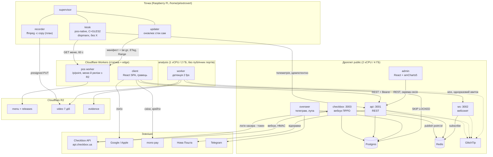
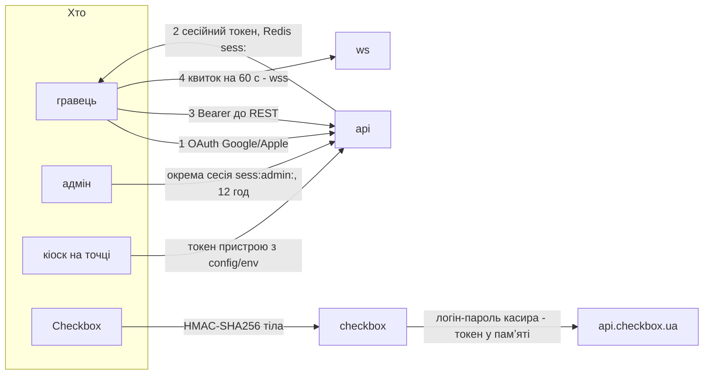

# Сервіси: хто де живе, як спілкується, як доводить, що це він

Стан на 15.09.2026. Повна картина під те, що вже вирішено доками
гейміфікації, адмінки й відео; перша коротка схема (`stack.md`) відтоді в
архіві.
Половина з цього ще не написана: що саме заглушка, позначено в §5.

---

## 1. Загальна картина



---

## 2. Хто де крутиться і чому саме там

| Що | Де | Чому не деінде |
|---|---|---|
| `kiosk`, `updater`, `recorder` | Raspberry Pi на точці | екран і камера фізично тут; запис має пережити обрив звʼязку |
| `pos worker`, `client` | Cloudflare Workers | статика, нуль обслуговування, близько до користувача |
| `api`, `ws`, `checkbox`, `overseer`, `admin` | дроплет `public` | усе, що має публічний порт і потребує стану |
| `worker` (відео) | дроплет `analysis` | нестабільне навантаження **фізично** не має дотягуватись до кіоска (`video.md`) |
| Postgres, Redis | дроплет `public`, лише петля | керована база відкладена; умови переїзду — `video.md` |
| відео, меню, релізи | R2 | вихідний трафік безкоштовний, lifecycle робить ротацію за нас |

`admin` свідомо на `public`, а не на Workers: їй потрібні довгі запити до
Postgres і закешовані агрегати, а не edge-роздача.

---

## 3. Автентифікація: кожна стрілка окремо



### Гравець

Логін лише через Google/Apple (`gamification_ui.md`), метч за email між
провайдерами — тому `user_identities` окремою таблицею, а не двома
колонками в `users`. Пароля в нас немає взагалі; це не спрощення, а
свідоме зняття з себе зберігання секретів.

### Вебсокет

Браузер не дає поставити заголовок на `WebSocket`, а куки через субдомен —
це CORS і SameSite там, де їх не хочеться. Тому `api` видає одноразовий
квиток (`ws:ticket:<uuid>`, 60 с, TTL у Redis), клієнт підставляє його в
URL, `ws` обмінює на `user_id` і одразу видаляє.

### Кіоск

Меню читає публічно (воно й так публічне — висить на екрані). Токен
пристрою потрібен рівно для одного: телеметрії й скарг, тобто запису.
Лежить у `config/env`, переживає оновлення, відкликається зміною на точці —
тому і не вшивається в бінарник.

### Checkbox → ми

`base64(HmacSHA256(key, тіло))`, перевіряти обовʼязково: без цього будь-хто
накрутить собі бонуси підробленими «продажами» (`checkbox.md`). Ключ віддає
сам Checkbox при реєстрації вебхука.

### Ми → Checkbox

Уточнено 15.09.2026: **усі методи — на одному
`api.checkbox.ua`**, окремого домену для товарів немає. Авторизація — логін
і пароль касира в обмін на токен; токен тримаємо **в памʼяті** й
перевипускаємо лише коли прилетіла помилка авторизації, а не за таймером.
Попередня редакція `checkbox.md` (`api.checkbox.in.ua` + окремий
кабінетний токен) була помилкою дослідження.

**Каталог товарів належить організації, а не касиру.** Тестовий касир
бачить ті самі товари з тими самими цінами, що й справжній (перевірено
15.09.2026), тож тестовий логін ізолює чеки, але не ціни. Писати в каталог
з тестовим логіном — усе одно писати в живий каталог.

---

## 4. Потоки даних, які варто розуміти цілком

### Продаж → бонус на екрані → бонус в акаунті

```
Checkbox → вебхук (HMAC) → checkbox:3003
  → receipts + receipt_items (ідемпотентно за checkbox_receipt_id)
  → bonus_grants (claim_token, 2 хв)
  → PUBLISH point:kyiv-01
      → ws → кіоск малює QR
          → гравець сканує → claim (зникає з екрана)
              → авторизація → redeem → wallets + ledger_entries
                  → PUBLISH user:<uuid> → «+80 монет» у чат кавенятка
```
Найтонше місце — не HMAC, а **звірка**: вебхук може не дійти, і тоді
продажу для нас не існувало. Раз на годину `checkbox` тягне
`GET /api/v1/receipts` за період і добирає пропущене (`checkbox.md`).

### Оновлення точки

`raspberry-pi.md` — окремий документ, бо це вже не архітектура, а
операція з відкатом: діаграма процесів на малині, деплой релізу від коміту
до екрана, перехід на стек. Нутрощі стеку — `pi/stack/README.md`.

### Відео

`video.md` — запис, presigned PUT, черга через `SKIP LOCKED`, звід події з
чеком за таймстемпом.

---

## 5. Що з цього реально існує

| Компонент | Стан на 15.09.2026 |
|---|---|
| `kiosk` (pos-native) | **працює на залізі**, 60 fps, автозапуск |
| `pi/stack` (supervisor + updater) | написано; апдейтер прогнано в Linux-контейнері, **на малині не проганялось** (`raspberry-pi.md` §7) |
| `pos worker` | працює, віддає меню з R2; роут релізів `/releases/pi/*` перевірено локально, **на прод не викочено** |
| `checkbox` | лише перевірка HMAC; запису в Postgres і публікації в Redis **немає** |
| `api` | заглушка: `/healthz` + три роути з `501` |
| `ws` | заглушка: приймає зʼєднання, на Redis **не підписаний** |
| `overseer` | заглушка: порожній `tick()` |
| `client` | лише `package.json` і README |
| `admin` | не існує |
| `worker` (відео) | не існує |
| Postgres | **жодної таблиці** — схема описана в `db-schema.md`; міграції на dbmate, після затвердження діаграм |
| `checkbox/scripts/sync-prices.mjs` | переписаний під токен касира; порівняння з каталогом **перевірено**, запис (`--apply`) **ще ні** |

Тобто архітектура вище — це карта, а не звіт. Єдина її частина, що працює
на точці щодня, — кіоск.
